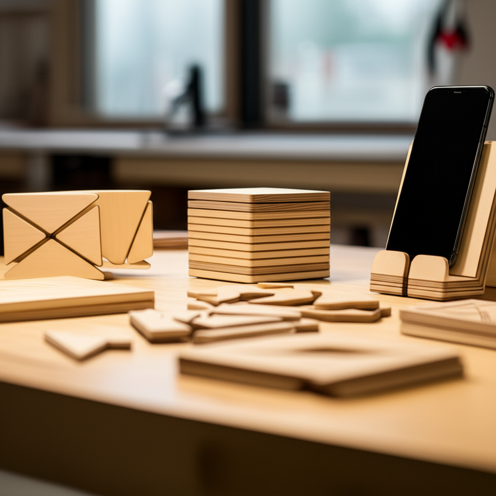

Ahí está, tu flamante máquina CNC, lista para crear maravillas... pero, ¿por dónde empezar? Ese primer paso puede ser intimidante. Miras la máquina, el ordenador, un trozo de madera, y sientes un bloqueo. ¡Tranquilo, es totalmente normal! La mejor forma de romper el hielo es empezar a hacer cosas. Por eso, en este artículo, te voy a guiar a través de **5 proyectos CNC para principiantes para dominar tu máquina**. No necesitas experiencia previa, solo ganas de aprender. Al terminar de leer, no solo tendrás ideas claras y sencillas para empezar, sino que también habrás construido una base sólida de conocimientos prácticos y, lo más importante, la confianza para seguir experimentando y creando proyectos cada vez más complejos. ¡Vamos a ello!

## ¿Por Qué Empezar con Proyectos Sencillos?

Antes de querer fabricar una guitarra eléctrica o un mueble complejo, es fundamental construir una base sólida. Los proyectos sencillos son tus mejores aliados para aprender sin frustración. Piensa en ellos como las primeras lecciones de conducción: no empiezas en una autopista en hora punta, ¿verdad?

Empezar con proyectos básicos te ayuda a:

*   **Controlar la frustración:** Obtener resultados rápidos y visibles te motiva a seguir aprendiendo. Un proyecto que terminas en una hora es una victoria que te impulsa.
*   **Aprender los fundamentos:** Cada proyecto te enseña algo crucial. Aprenderás sobre la **sujeción del material** (cómo fijarlo para que no se mueva), a establecer el **"cero de pieza"** (el punto de origen desde donde la máquina empieza a cortar) y a entender qué hace cada tipo de fresa.
*   **Ahorrar material y dinero:** Es mucho mejor cometer un error en un trozo de MDF o pino barato que en una plancha de nogal o aluminio. Los primeros proyectos son para experimentar y, sí, para equivocarse.

## Los 5 Proyectos CNC para Principiantes para Dominar tu Máquina

Aquí tienes una lista progresiva. Te recomiendo hacerlos en orden, ya que cada uno introduce un nuevo concepto o habilidad.

### 1. Posavasos Personalizados

Este es el proyecto de iniciación por excelencia. Es rápido, útil y te enseña los dos tipos de corte más básicos del mundo CNC.

*   **¿Qué aprenderás?:** La operación de **vaciado** (conocida como *pocketing*), que sirve para vaciar un área, y la operación de **perfilado** (*profiling*), que se usa para cortar el contorno exterior de una pieza. También te familiarizarás con la **fresa de punta plana**, la herramienta más común.
*   **Material ideal:** Madera blanda como el pino, o MDF.
*   **Consejo del Profe:** Empieza con un diseño muy simple, como un cuadrado con tus iniciales grabadas en el centro.

### 2. Un Llavero con tu Nombre

Este proyecto te obliga a trabajar a una escala más pequeña, donde la precisión empieza a ser más importante.

*   **¿Qué aprenderás?:** A usar **fresas en V** (*V-bits*), que son perfectas para grabar texto y detalles finos. Además, descubrirás la importancia de las **pestañas** (*tabs*), pequeños puentes de material que dejas sin cortar para que la pieza final no se suelte y se estropee con la fresa.
*   **Material ideal:** Contrachapado fino o acrílico.
*   **Consejo del Profe:** ¡La sujeción aquí es clave! Al ser una pieza pequeña, es fácil que se mueva. Asegúrate de fijarla bien con prensas o con cinta de doble cara de buena calidad.

### 3. Un Pequeño Cartel de Bienvenida

Con este proyecto subimos un poco el nivel, ya que implica usar más de una herramienta en el mismo trabajo.

*   **¿Qué aprenderás?:** A planificar un trabajo con **múltiples herramientas**. Por ejemplo, usarás una fresa en V para grabar "Bienvenidos" y luego cambiarás a una fresa plana para cortar la forma del cartel. Esto te obligará a ser muy preciso al establecer tu **cero de pieza**.
*   **Material ideal:** Una tabla de madera de roble o pino para un acabado más rústico.
*   **Consejo del Profe:** Apunta las coordenadas de tu "cero de pieza" (X, Y, Z). Así, si tienes que parar la máquina para cambiar de fresa, puedes volver exactamente al mismo punto de origen.

### 4. Organizador de Escritorio Sencillo

Este proyecto es increíblemente práctico y te enseñará sobre la importancia de las dimensiones exactas.

*   **¿Qué aprenderás?:** A crear **vaciados con medidas precisas** para que encajen bolígrafos, clips o tu teléfono móvil. Entenderás la diferencia entre un corte por el interior de una línea, por el exterior o sobre la propia línea, algo fundamental para que las piezas encajen.
*   **Material ideal:** Bambú o contrachapado de abedul, que son estables y tienen un acabado muy limpio.
*   **Consejo del Profe:** Mide los objetos que quieres guardar (el diámetro de un lápiz, el ancho de tu móvil) y añade una pequeña **tolerancia** (unos 0.5 mm extra) en tu diseño para que quepan holgadamente.

### 5. Un Rompecabezas Simple de 4 Piezas

El objetivo final de este proyecto es que las piezas encajen perfectamente entre sí. Es una lección magistral sobre precisión.

*   **¿Qué aprenderás?:** A tener en cuenta el **"kerf"**, que es básicamente el grosor del material que la fresa elimina al cortar. Si no lo compensas en tu diseño, tus piezas tendrán holgura. Este proyecto te fuerza a ser muy meticuloso.
*   **Material ideal:** MDF o contrachapado de 3mm o 6mm.
*   **Consejo del Profe:** Utiliza una fresa de un diámetro pequeño (por ejemplo, 1/8" o 3mm). Esto te permitirá cortar esquinas más cerradas y conseguir un encaje mucho más preciso entre las piezas del rompecabezas.

## Conclusión

Superar el miedo inicial y lanzarse a cortar es el primer gran paso en tu viaje con el CNC. Como has visto, empezar con proyectos sencillos como posavasos o llaveros no solo es divertido, sino que es la estrategia más inteligente para aprender los conceptos fundamentales: el control de la máquina, la función de cada fresa y la importancia de una buena sujeción. Cada pieza que completes, por simple que sea, es una medalla que te cuelgas y una dosis de confianza que te llevas. Recuerda, la clave es practicar, experimentar y no tener miedo a cometer errores. ¡Son la mejor parte del aprendizaje!

Ahora te toca a ti. ¿Cuál de estos proyectos te animas a probar primero? ¡Cuéntamelo en los comentarios!

## Preguntas Frecuentes

### ¿Qué software necesito para empezar estos proyectos?

Necesitarás dos tipos de software. Primero, un programa de **Diseño (CAD/CAM)** para crear tus diseños y decirle a la máquina por dónde cortar; opciones muy buenas para empezar son **Easel** o **Carbide Create**. Segundo, un programa de **Control** (o *sender*) que envía esas instrucciones a tu máquina CNC; uno muy popular y gratuito es **Universal G-code Sender (UGS)**, aunque muchas máquinas ya traen el suyo propio.

### ¿Es muy caro el material para estos proyectos?

¡Para nada! Una de las grandes ventajas de estos proyectos para principiantes es que puedes usar retales o materiales muy económicos. Un tablero de **MDF** o de **pino** de una tienda de bricolaje local es muy asequible y te dará material de sobra para hacer decenas de pruebas y proyectos como los de esta lista.

### ¿Qué es más importante: la velocidad de corte o la profundidad de pasada?

Ambas son cruciales y trabajan juntas. Como principiante, la regla de oro es: **empieza lento y poco profundo**. Es mucho más seguro y mejor para tu máquina y tus fresas hacer varias pasadas superficiales que una sola muy profunda. Una pasada demasiado agresiva puede romper la fresa, forzar los motores o estropear el material. Con la experiencia, aprenderás a encontrar el equilibrio perfecto para cada material.