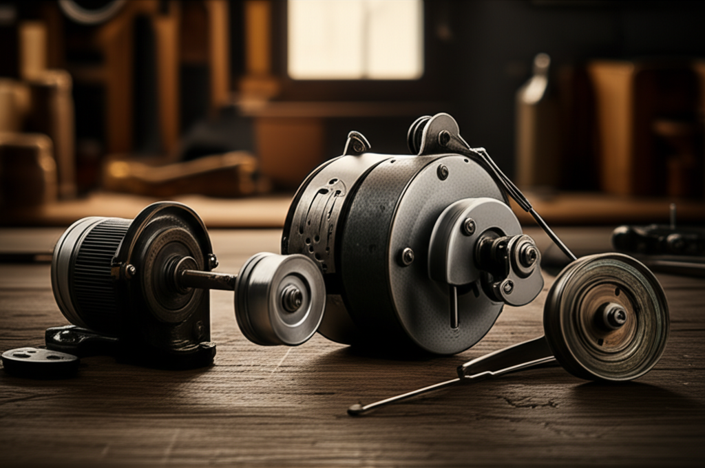

¡Hola, futuros inventores! Seguro que has visto una de esas viejas máquinas de coser de la abuela acumulando polvo en un rincón. Quizás hasta has pensado en tirarla. ¡Detente! Dentro de esa carcasa se esconde un verdadero tesoro para tus proyectos caseros: su motor. Muchos principiantes se sienten intimidados al ver un montón de cables y piezas, sin saber por dónde empezar. No te preocupes, para eso estoy aquí. En este tutorial, vamos a explorar juntos la **anatomía de un motor de costura para proyectos DIY**. Te prometo que al terminar de leer, no solo entenderás cada una de sus partes, sino que verás ese "viejo trasto" como el corazón de tu próximo gran invento. ¡Vamos a desarmar el misterio!

## ¿Por Qué un Motor de Máquina de Coser es un Tesoro para el Inventor?

Antes de abrir el capó, tienes que saber por qué estos motores son tan codiciados en el mundo del "Hazlo Tú Mismo" (DIY). No es casualidad que veas tantos proyectos en internet usándolos. Sus ventajas son perfectas para quienes empiezan:

*   **Alto Torque a Bajas Revoluciones:** "Torque" es simplemente la **fuerza de giro**. Estos motores tienen mucha fuerza incluso cuando giran despacio, lo que es ideal para tareas como un pequeño taladro de banco, una lijadora de disco o incluso una bobinadora.
*   **Control de Velocidad Incluido:** ¡Vienen con su propio pedal! Ese pedal no es un simple interruptor de encendido/apagado, es un **controlador de velocidad variable**. Esto te ahorra tener que comprar o construir uno, ¡un gran plus!
*   **Compactos y Robustos:** Están diseñados para durar y para encajar en espacios pequeños, lo que los hace perfectos para proyectos de taller donde el espacio es limitado.
*   **Fáciles de Conseguir:** Se encuentran en mercados de pulgas, tiendas de segunda mano o quizás en tu propio desván, ¡a menudo gratis o muy baratos!

## Desentrañando la Anatomía de un Motor de Costura para Proyectos DIY

Muy bien, ¡manos a la obra! Imagina que tienes el conjunto de motor y pedal sobre tu mesa. Aunque parezca un enredo de cables, en realidad es un sistema muy simple. Vamos a dividirlo en sus componentes principales.

### El Corazón: El Motor Universal

La pieza central, normalmente un cilindro metálico de color negro o gris, es un **motor universal**. Se llama así porque puede funcionar tanto con corriente alterna (la que tienes en los enchufes de casa) como con corriente continua.

Dentro de él, las piezas más importantes son el **rotor** (la parte que gira) y las **escobillas de carbón**. Estas escobillas son pequeños bloques de carbón que hacen contacto con el rotor para pasarle la electricidad. Son piezas de desgaste, pero son fáciles y baratas de reemplazar.

### El Cerebro: El Pedal de Control de Velocidad

¡Esta es la joya de la corona! El pedal es tu interfaz para controlar el motor. Al presionarlo, no solo enciendes el motor, sino que **regulas cuánta electricidad le llega**.

La mayoría de los pedales antiguos funcionan con un **reóstato**, que es como un grifo para la electricidad. Cuanto más presionas, más "abres el grifo" y más rápido gira el motor. Los más modernos pueden usar componentes electrónicos como un TRIAC, pero el principio es el mismo: **controlar la potencia**. ¡Nunca tires el pedal!

### Los Nervios: El Cableado y los Conectores

El cableado suele ser muy sencillo. Verás un cable principal que va al enchufe de la pared. Este cable se divide para alimentar tanto el motor como una pequeña bombilla que iluminaba la zona de costura (puedes quitarla sin problemas). El pedal se intercala en el circuito que va hacia el motor para poder regularlo. ¡No hay más misterio!

## Las Piezas Clave que Debes Identificar

Ahora que conoces la teoría, vamos a identificar las piezas prácticas que usarás en tus proyectos. Coge tu motor y busca lo siguiente:

1.  **El Motor:** Evidente, ¿verdad? Es el cuerpo principal. Fíjate en el eje que sobresale por un lado. Esa es la parte que girará y a la que conectarás tus herramientas.
2.  **La Polea:** Es la pequeña rueda (a menudo con una ranura) que está en el eje del motor. Originalmente, aquí iba una correa de goma que movía la máquina de coser. ¡Puedes usarla para tus propios sistemas de poleas!
3.  **El Pedal:** Tu controlador de velocidad. Identifícalo y asegúrate de que el cable esté en buen estado.
4.  **El Soporte de Montaje:** Casi todos los motores vienen con una escuadra metálica con agujeros. ¡Esto es oro puro! Es el soporte que te permitirá atornillar el motor firmemente a la base de tu proyecto.

## Conclusión

¡Felicidades! Acabas de realizar una "autopsia" teórica a un motor de máquina de coser. Como has visto, no hay nada que temer. Has aprendido que su valor reside en su **motor universal** con buen torque y, sobre todo, en su **pedal de control de velocidad** que ya viene incluido. Saber identificar sus partes clave como la polea y el soporte de montaje es el primer paso para desbloquear un mundo de posibilidades en tu taller. Ya no tienes un simple motor viejo, sino una herramienta potente y versátil lista para dar vida a tus ideas.

¿Qué proyecto se te ocurre hacer con un motor de costura? ¡Cuéntame tus ideas en los comentarios y empecemos a inventar juntos!

## Preguntas Frecuentes

### ¿Puedo usar este motor para un taladro de banco casero?
¡Sí! Es una de las aplicaciones más populares. Tiene la fuerza (torque) suficiente para perforar madera y plásticos blandos. Solo recuerda que no está diseñado para funcionar de forma continua durante horas. Es perfecto para trabajos cortos y proyectos de hobby.

### ¿Qué pasa si mi motor no tiene pedal? ¿Puedo controlarlo?
Sí, pero requerirá un poco más de trabajo. Necesitarías un **"controlador de velocidad para motor universal"**, que puedes comprar por internet. Estos dispositivos te permitirán regular la velocidad con una perilla. Sin embargo, si estás empezando, te recomiendo encarecidamente que busques un conjunto que incluya su pedal original.

### ¿Es peligroso trabajar con estos motores?
Como con cualquier aparato que se enchufa a la pared, la seguridad es lo primero. El principal riesgo es un cortocircuito por cables pelados o en mal estado. Antes de enchufar nada, **revisa visualmente todos los cables**. No toques ninguna parte metálica del motor mientras esté en funcionamiento y trabájalo sobre una superficie seca y no conductora, como un trozo de madera. Usando el sentido común, es un proyecto muy seguro.
Este artículo es parte de nuestra guía principal: **['La Historia de Mi Taller: Cómo Construí un Torno para Construir un Taladro'](../la-historia-de-mi-taller-como-construi-un-torno-para-construir-un-taladro/)**.

## También Te Podría Interesar

Explora otros temas en nuestro blog:
- **Descubre todo sobre [Torno](/tags/torno/)**
- **Descubre todo sobre [Proyectos CNC](/tags/proyectos-cnc/)**
