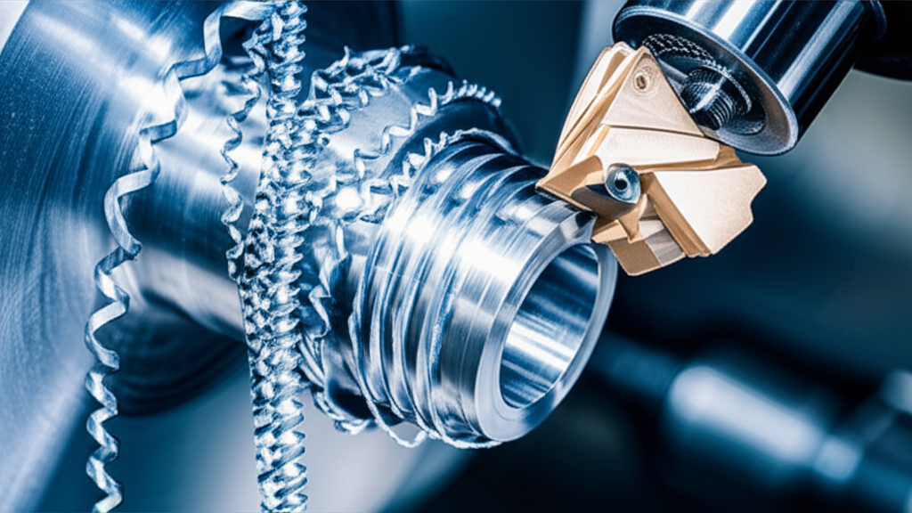

# Guía Definitiva de Materiales CNC para Principiantes

¡Bienvenido al apasionante mundo del mecanizado CNC! Si estás dando tus primeros pasos, comprender qué **materiales CNC** son adecuados para tu proyecto es fundamental.  Esta guía te proporcionará una base sólida para elegir los materiales correctos y evitar frustraciones.  Aprenderás sobre las propiedades de diferentes materiales y cómo su comportamiento afecta el proceso de mecanizado.

## Maderas: El Material CNC para Principiantes

Las maderas son un excelente punto de partida para aprender a usar una máquina CNC. Son relativamente fáciles de trabajar, asequibles y ofrecen una amplia variedad de acabados.  Desde maderas blandas como el pino, perfectas para proyectos de aprendizaje, hasta maderas duras como el roble o la caoba, para trabajos más detallados, la elección depende de tu proyecto y nivel de experiencia.  Recuerda considerar el grano de la madera y su dirección para evitar astillas o roturas durante el corte.  Un buen consejo es siempre usar una broca afilada y ajustar la velocidad de avance de tu máquina CNC en función de la dureza de la madera que estés utilizando.

### Tipos de Madera y sus Aplicaciones en CNC

* **Madera blanda (pino, abeto):** Ideal para proyectos de aprendizaje, prototipos y piezas de gran tamaño. Fáciles de cortar, pero menos resistentes.
* **Madera dura (roble, nogal, cerezo):** Ofrecen un acabado más limpio y duradero, perfectas para proyectos más exigentes. Requieren una configuración más precisa de la máquina CNC.
* **Contrachapado:** Excelente para piezas que requieren estabilidad dimensional, aunque requiere una mayor atención a la dirección del grano.
* **MDF (Medium Density Fiberboard):** Un material compuesto liso y uniforme, ideal para acabados pintados o grabados.

## Metales: Un Reto para el Maestro Tornero Digital

Trabajar con **materiales CNC** metálicos requiere más experiencia y una máquina CNC más robusta. El aluminio es una buena opción para empezar, ya que es relativamente fácil de mecanizar, ligero y disponible en diferentes aleaciones.  El acero, aunque más desafiante, ofrece una mayor durabilidad y resistencia.  Recuerda que el mecanizado de metales genera mucho calor y requiere refrigeración adecuada para evitar daños a la herramienta y a la pieza.  La elección del material dependerá del proyecto, la resistencia requerida y tu experiencia.  Para metales, invertir en brocas de carburo de tungsteno es esencial para obtener buenos resultados.

## Plásticos y Acrílicos: Versatilidad en tus Materiales CNC

Los plásticos y acrílicos ofrecen una gran versatilidad en el mecanizado CNC.  Son fáciles de cortar y permiten crear piezas con formas complejas y detalles finos.  El acrílico, por ejemplo, es transparente y permite crear piezas con un acabado elegante.  El PVC y otros plásticos de ingeniería ofrecen diferentes niveles de resistencia y propiedades, ideales para aplicaciones específicas.  Recuerda ajustar la velocidad de corte y el avance para evitar que el plástico se derrita o se queme durante el proceso.

En resumen, la elección de tus **materiales CNC** depende del proyecto, tu presupuesto y tu nivel de experiencia.  Esta guía te ofrece un punto de partida para que puedas explorar el mundo del mecanizado CNC con confianza.  Recuerda siempre leer las especificaciones de tu máquina CNC y seguir las recomendaciones del fabricante para obtener los mejores resultados. ¡A mecanizar!
