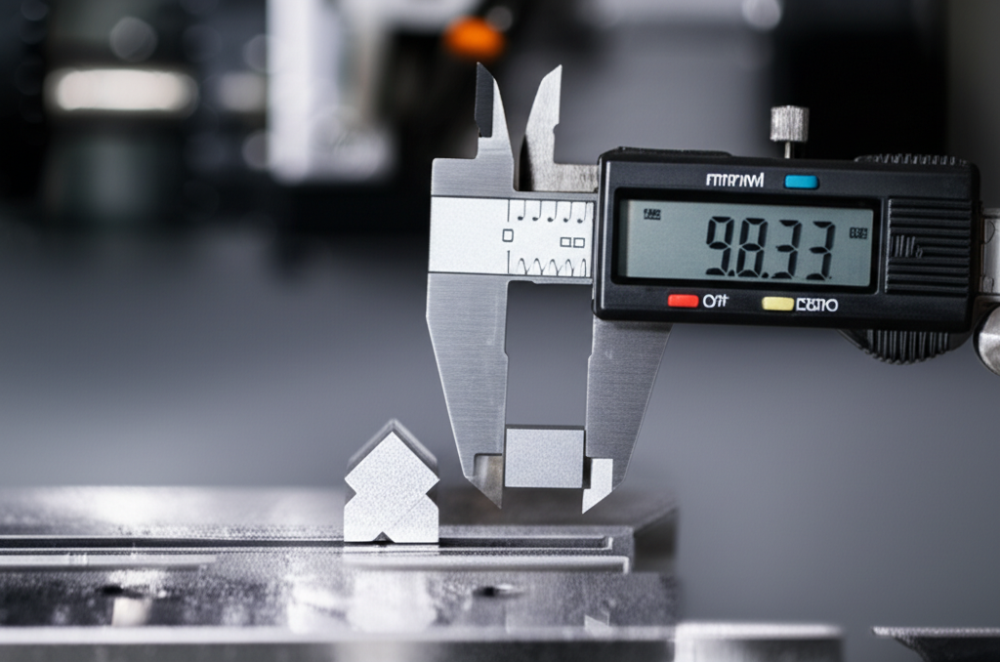

## Introducción

¿Alguna vez has diseñado una pieza perfecta en tu ordenador, la has enviado a tu máquina CNC con toda la ilusión del mundo, y el resultado ha sido... decepcionante? Un círculo que parece un óvalo, un cuadrado con los lados desiguales o medidas que simplemente no cuadran por una décima de milímetro. ¡Tranquilo, es un problema más común de lo que crees! La causa casi siempre es la misma: una calibración incorrecta de los ejes. En este tutorial te enseñaré **cómo calibrar los ejes de tu CNC para máxima precisión**, un proceso fundamental que transformará la calidad de tus trabajos. Olvídate de la frustración y prepárate para devolverle a tu máquina la exactitud que necesita. Al final de esta guía, sabrás exactamente qué hacer para que tus piezas salgan perfectas.

## ¿Por Qué es Tan Importante Calibrar tu CNC?

Antes de coger las herramientas, es crucial que entiendas el "porqué". Imagina que tienes una guitarra. Si no la afinas, por muy bien que sepas tocar, la música sonará mal. Con tu CNC pasa exactamente lo mismo. La calibración es el proceso de "afinar" tu máquina para que sus movimientos en el mundo digital se correspondan perfectamente con sus movimientos en el mundo real.

Calibrar correctamente tu máquina te traerá beneficios inmediatos:

*   **Precisión absoluta:** Las piezas tendrán las medidas exactas de tu diseño. Un círculo será un círculo perfecto.
*   **Calidad de acabados:** Un movimiento preciso evita vibraciones o desviaciones que empeoran la superficie del material.
*   **Ahorro de material y tiempo:** Evitarás tener que repetir trabajos por errores de medida, ahorrando material y horas de frustración.
*   **Salud de la máquina:** Aseguras que los motores y la mecánica trabajan como deben, sin forzarse.

En resumen, **la calibración es el pilar sobre el que se construye la calidad** de todo lo que fabriques.

## Herramientas Básicas que Necesitarás

No te asustes, no necesitas un laboratorio de la NASA. Las herramientas son sencillas y probablemente ya tengas alguna.

*   **Calibrador digital (o pie de rey):** Esta será tu herramienta estrella. Es como una regla de altísima precisión que nos permitirá medir con exactitud los movimientos de la máquina.
*   **Una regla metálica de buena calidad:** Útil para medir distancias más largas con una referencia fiable.
*   **Ordenador con el software de control de tu CNC:** Ya sea que uses GRBL, Mach3, UCCNC o cualquier otro, lo necesitarás para enviar comandos a la máquina y ajustar los parámetros.
*   **Lápiz y papel (o un bloc de notas digital):** Fundamental para apuntar las medidas y hacer un cálculo muy simple.

## Guía Paso a Paso: Cómo Calibrar los Ejes de tu CNC para Máxima Precisión

¡Vamos al lío! El proceso es el mismo para los ejes X e Y. El eje Z es similar, pero lo veremos al final. Sigue estos pasos con calma y verás qué fácil es.

### Paso 1: Entiende el Concepto Clave - "Pasos por Milímetro"

Este es el único término técnico que necesitas dominar, y es muy fácil. Tu máquina CNC no entiende de "milímetros" o "pulgadas". Su cerebro (la controladora) solo entiende de **"pasos"**, que son los pequeños impulsos eléctricos que envía a los motores para que giren una diminuta fracción.

La calibración consiste en decirle al software de control **cuántos de esos "pasos" necesita dar el motor para que el eje se mueva exactamente 1 milímetro** en la realidad. Este valor se conoce como **`steps/mm`** (pasos por milímetro). Nuestro objetivo es encontrar el número mágico correcto para cada eje.

### Paso 2: La Prueba de Movimiento (Empecemos con el Eje X)

1.  Enciende tu CNC y llévala a su posición de inicio (`homing`).
2.  Coloca una regla metálica a lo largo del eje que vas a medir (el eje X).
3.  Usa los controles manuales del software para mover el cabezal hasta que el borde de la fresa o del puntero láser esté alineado perfectamente con el cero de la regla.
4.  Una vez alineado, **pon a cero las coordenadas** de tu software para ese eje (busca un botón que diga "Zero X" o similar).
5.  Ahora, introduce un comando para mover el eje X una distancia conocida y fácil de medir. Por ejemplo, **150 mm**.
6.  Cuando la máquina se detenga, usa tu **calibrador digital** para medir con la máxima precisión posible la distancia REAL que se ha movido, desde el cero de la regla hasta la posición final de la fresa.
7.  Anota ambos valores: la **distancia ordenada** (150 mm) y la **distancia real medida** (por ejemplo, 149.2 mm).

### Paso 3: La Fórmula Mágica (¡No te asustes!)

Aquí es donde ajustamos todo. Necesitas saber cuál es tu valor actual de `steps/mm` para el eje X. Este valor está en la configuración de tu software (en GRBL se consulta con el comando `$$`, en Mach3 está en `Config > Motor Tuning`). Anótalo.

La fórmula es:

**Nuevo Valor (steps/mm) = (Valor Actual de steps/mm) x (Distancia Ordenada / Distancia Medida Real)**

Veamos un ejemplo con los datos de antes:

*   **Valor Actual de steps/mm:** Supongamos que era `80.00`
*   **Distancia Ordenada:** `150 mm`
*   **Distancia Medida Real:** `149.2 mm`

**Cálculo:**
Nuevo Valor = 80 x (150 / 149.2)
Nuevo Valor = 80 x 1.00536
**Nuevo Valor = 80.42**

### Paso 4: Actualiza tu Software y Repite el Proceso

1.  Ve a la configuración de tu software e introduce este **Nuevo Valor (80.42)** en el parámetro de `steps/mm` para el eje X. Guarda los cambios.
2.  **¡Verifica!** Repite el Paso 2. Mueve de nuevo 150 mm y mide. La distancia real ahora debería ser exacta o casi perfecta. Si no lo es, puedes repetir el cálculo para afinar aún más.
3.  **Repite todo el proceso** (Pasos 2, 3 y 4) para el **eje Y**.
4.  Para el **eje Z**, el proceso es el mismo, pero en vertical. Puedes usar bloques de galgas o un bloque de material de altura conocida para medir el desplazamiento.

## Conclusión

¡Lo has conseguido! Calibrar los ejes de tu CNC puede parecer intimidante, pero como has visto, es un proceso lógico y sencillo. Recuerda los puntos clave: la calibración es fundamental para la precisión, todo se reduce a comparar una distancia ordenada con una distancia real, y la fórmula de "pasos por milímetro" es tu mejor aliada para corregir cualquier desviación. No tengas miedo de experimentar y ajustar tu máquina. Dar este paso te permitirá obtener resultados profesionales y sacar el máximo partido a tu inversión. Ahora estás un paso más cerca de dominar tu CNC.

¿Cuál ha sido tu mayor desafío al calibrar tu CNC? ¡Comparte tu experiencia en los comentarios y ayudémonos entre todos!

## Preguntas Frecuentes

### ¿Con qué frecuencia debo calibrar mi CNC?
Como regla general, es una buena práctica revisar la calibración cada pocos meses. Sin embargo, debes hacerlo obligatoriamente si notas alguna imprecisión en tus piezas, después de realizar un mantenimiento importante (como cambiar una correa o un motor) o si has movido físicamente la máquina.

### ¿Qué pasa si mi medida real es MAYOR que la distancia que ordené?
¡No te preocupes, es normal! La fórmula funciona perfectamente en ambos casos. Si ordenaste mover 150 mm y la máquina se movió 151 mm, el resultado de la fórmula te dará un valor de `steps/mm` más bajo que el original. Esto simplemente significa que tu máquina estaba dando "demasiados pasos" por cada milímetro, y el cálculo lo corregirá.

### ¿Este método de calibración sirve para cualquier tipo de CNC?
Sí, el principio fundamental de medir y corregir los "pasos por milímetro" es universal para la gran mayoría de máquinas CNC de hobby y profesionales que utilizan motores paso a paso (steppers). Esto incluye routers, cortadoras láser e incluso impresoras 3D. Lo único que cambia es el lugar específico dentro de tu software de control (GRBL, Mach3, UCCNC, etc.) donde tienes que introducir el nuevo valor.