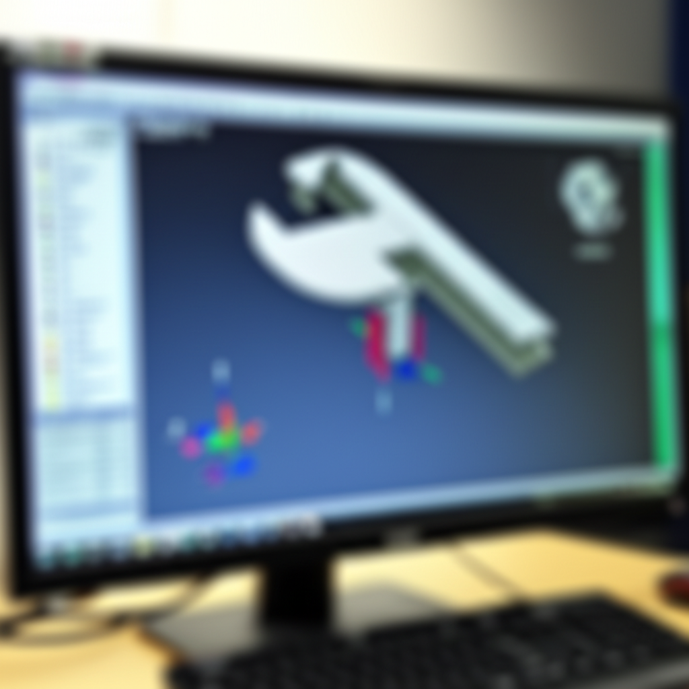

Bienvenido al emocionante mundo del mecanizado CNC!  Configurar tu software CNC por primera vez puede parecer abrumador, pero con un enfoque paso a paso, te aseguro que es un proceso alcanzable y gratificante. Este artículo te guiará a través del proceso, desde la instalación hasta la generación de tu primer código G. No te preocupes si te sientes un poco perdido al principio; al final de este tutorial, tendrás una base sólida para comenzar tu aventura en el CNC.

## Instalación del Software CAM

El primer paso es la instalación del software CAM (Computer-Aided Manufacturing).  Existen numerosas opciones disponibles, desde software gratuito y de código abierto hasta paquetes profesionales con un amplio rango de funciones.  **Investiga y elige el software que mejor se adapte a tus necesidades y presupuesto**.  La mayoría de los programas ofrecen tutoriales y documentación en línea; aprovéchalos al máximo.  Recuerda que la instalación correcta es fundamental para evitar problemas posteriores. Sigue atentamente las instrucciones del fabricante.  

Una vez instalado,  revisa la configuración inicial del software.  Esto puede incluir:

* **Configuración de la unidad de medida:** Asegúrate de que el software esté configurado en milímetros o pulgadas, según tu máquina.  Un error aquí puede resultar en piezas desastrosamente incorrectas.
* **Selección del postprocesador:** El postprocesador traduce el código de mecanizado generado por el CAM en el código G específico para tu controlador CNC.  **Es crucial que selecciones el postprocesador correcto para tu máquina.**  Un postprocesador incorrecto generará un código G ilegible para tu controlador, causando errores o incluso daños a tu máquina.
* **Definición de la máquina:** Introduce las especificaciones de tu máquina CNC, como el recorrido de los ejes X, Y y Z, el tipo de husillo y sus límites de velocidad. Esta información es esencial para que el software genere trayectorias seguras y eficientes.

## Conexión con tu Máquina CNC

Una vez configurado el software CAM, necesitas conectar tu máquina. Este paso dependerá de tu sistema específico, pero generalmente implica:

* **Conexión física:** Conectar el ordenador al controlador CNC mediante un cable, generalmente USB o Ethernet.
* **Configuración del puerto:** En el software CAM, especificar el puerto COM o la dirección IP a través del cual te comunicarás con el controlador.
* **Pruebas de conexión:** Antes de ejecutar ningún programa, realiza pruebas para verificar que la conexión es estable y que el software puede comunicarse correctamente con la máquina.  Un simple comando de prueba, como mover un eje un pequeño desplazamiento, puede ser muy útil.

## Generando tu Primer Código G

Con el software instalado y la máquina conectada, estás listo para generar tu primer código G.  **Empieza con un proyecto sencillo**.  Un bloque de material simple con una operación de fresado básico es ideal para tus primeras pruebas.

* **Importación del diseño:** Importa tu diseño CAD (Computer-Aided Design) al software CAM.
* **Definición de la estrategia de mecanizado:** Selecciona las herramientas, velocidades de corte y profundidades de pasada apropiadas para tu material.
* **Simulación:** Antes de ejecutar el código G en tu máquina, **siempre simula la trayectoria**.  Esto te permitirá identificar cualquier error en el programa antes de causar daños a tu pieza o a la máquina.
* **Generación del código G:** Una vez que estés satisfecho con la simulación, genera el código G.
* **Transferencia del código G:** Transfiere el código G a tu máquina CNC a través del método que hayas configurado.

##  Primeros Pasos y Resolución de Problemas

Recuerda que la práctica hace al maestro. No tengas miedo de experimentar y cometer errores.  **La paciencia es clave en el mecanizado CNC**.  Si encuentras algún problema, revisa la documentación de tu software y la de tu máquina.  También existen numerosos foros y comunidades en línea donde puedes encontrar ayuda de otros usuarios.

¡Enhorabuena! Has dado tus primeros pasos en la configuración de tu software CNC.  Con práctica y perseverancia, te convertirás en un experto en el mecanizado CNC. Sigue explorando las capacidades de tu software y disfruta del proceso creativo.