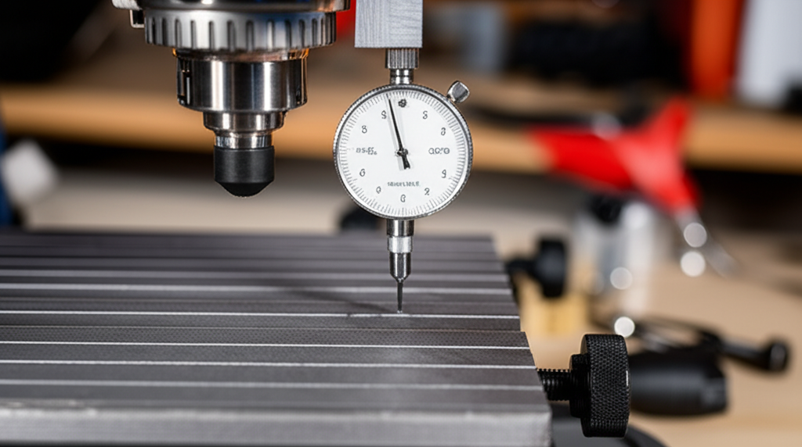

¿Tus grabados salen con profundidades irregulares? ¿Las fresas finas se rompen sin motivo aparente? Uno de los culpables más comunes, y a menudo pasado por alto, es una cama de trabajo desnivelada. En el mundo de las fresadoras CNC de escritorio como la popular 3018, tener una superficie perfectamente plana es fundamental para obtener resultados precisos y profesionales.

Alinear o nivelar la cama (también conocido como *tramming* o aplanado del *spoilboard*) asegura que la fresa mantenga una distancia constante a la superficie de trabajo en todo el recorrido de los ejes X e Y. En esta guía te enseñaremos dos métodos efectivos para nivelar la cama de tu CNC 3018, desde una solución rápida y sencilla hasta la técnica definitiva para un acabado perfecto.

## ¿Por Qué es Crucial Nivelar la Cama de tu CNC 3018?

Imagina que tu fresadora es un artista dibujando sobre un lienzo. Si el lienzo está arrugado y lleno de bultos, el lápiz no podrá trazar líneas uniformes. Lo mismo ocurre con tu CNC. Una cama desnivelada causa problemas como:

*   **Cortes Inconsistentes:** La fresa cortará más profundo en las zonas bajas y apenas rozará las zonas altas, arruinando proyectos de grabado o V-Carving.
*   **Rotura de Fresas:** Especialmente con fresas de detalle (menores a 1mm), una variación inesperada en la altura puede ejercer demasiada presión y romper la herramienta.
*   **Mal Acabado Superficial:** En operaciones de planeado, una cama desnivelada dejará surcos y marcas visibles.
*   **Desperdicio de Material:** Un proyecto fallido por una mala nivelación significa tener que empezar de nuevo, consumiendo más material y tiempo.

Afortunadamente, solucionar este problema está a tu alcance.

## Herramientas y Materiales Necesarios

No necesitas un taller de maquinaria industrial para hacer esto. Dependiendo del método que elijas, necesitarás:

### Herramientas Básicas
*   Tu fresadora CNC 3018 ensamblada y funcionando.
*   Ordenador con software de control (Candle/GRBL Control, UGS, etc.).
*   Llaves Allen (las que vienen con el kit).
*   Una fresa (preferiblemente una de punta plana o una fresa en V).
*   Un trozo de papel de oficina.

### Para un Nivelado Avanzado (Método de Aplanado)
*   Una fresa de aplanado (*spoilboard surfacing bit*).
*   Una tabla de MDF para usar como cama de sacrificio (*spoilboard*).
*   Tornillos para fijar el MDF a la cama de aluminio.
*   Gafas de seguridad.

## Guía Paso a Paso para Nivelar tu Cama

Te presentamos dos métodos con diferente nivel de precisión y complejidad. ¡Elige el que mejor se adapte a tus necesidades!

### Método 1: El Truco del Papel (Rápido y Sencillo)

Este método es ideal para una verificación rápida o si no tienes una fresa de aplanado. Se basa en usar una hoja de papel como galga improvisada para medir la distancia entre la fresa y la cama en diferentes puntos.

1.  **Preparación:** Asegúrate de que no haya nada sobre la cama de trabajo. Monta una fresa en el husillo (no es necesario que sea una en particular, pero una puntiaguda facilita la detección). Conecta tu CNC al ordenador y abre tu software de control.
2.  **Busca la Primera Esquina:** Usando los controles manuales, mueve el cabezal a una de las esquinas de la cama, por ejemplo, la frontal izquierda.
3.  **Calibra la Altura (Eje Z):** Coloca la hoja de papel sobre la cama, justo debajo de la fresa. Baja el eje Z en incrementos muy pequeños (0.1mm) hasta que sientas una ligera fricción al mover el papel. La fresa debe "atrapar" el papel, pero aún debes poder deslizarlo con un poco de resistencia.
4.  **Anota el Cero:** En tu software de control, pon a cero el eje Z (`G92 Z0` o usando el botón correspondiente). ¡Este es tu punto de referencia!
5.  **Revisa las Otras Esquinas:** Levanta el eje Z unos milímetros para moverte con seguridad. Sin cambiar el cero de Z, desplaza la fresa a las otras tres esquinas de la cama (frontal derecha, trasera derecha, trasera izquierda) y al centro.
6.  **Verifica la Fricción:** En cada nuevo punto, baja el eje Z de vuelta a `Z=0` y comprueba la fricción del papel.
    *   **Si el papel se mueve libremente:** Esa esquina está más baja que tu punto de referencia.
    *   **Si el papel no se puede mover o la fresa choca:** Esa esquina está más alta.

Para corregir las diferencias, puedes colocar pequeñas calzas (trozos de papel de aluminio, cinta adhesiva) debajo de las patas de la CNC o debajo de los soportes de la cama de trabajo hasta que la fricción del papel sea uniforme en todos los puntos.

### Método 2: Aplanado con Fresa (El Acabado Profesional)

Este es el método definitivo y el más recomendado. Consiste en usar la propia fresadora para mecanizar una superficie de sacrificio (spoilboard), garantizando que sea perfectamente paralela al recorrido del cabezal.

1.  **Instala la Cama de Sacrificio:** Corta una pieza de MDF a la medida de tu área de trabajo y fíjála firmemente a la cama de aluminio de tu 3018. Asegúrate de que los tornillos queden avellanados (por debajo de la superficie) para que la fresa no choque con ellos.
2.  **Monta la Fresa de Aplanado:** Cambia la fresa por una específica para aplanar superficies. Estas fresas tienen un diámetro mayor y un fondo plano, diseñadas para remover material de forma eficiente y dejar un acabado liso.
3.  **Crea el G-Code:** En tu software CAM preferido (o usando un generador de código online), crea una operación de "Cajeado" o "Planeado" (*Pocket* o *Face*) que cubra toda la superficie del MDF.
    *   **Profundidad de corte:** Usa una profundidad muy pequeña, entre 0.2mm y 0.5mm. El objetivo es solo "rozar" la superficie para eliminar los puntos altos.
    *   **Superposición (*Stepover*):** Utiliza una superposición de entre 40% y 60% para evitar dejar surcos.
4.  **Establece el Origen:** Mueve la fresa a la esquina donde comenzará el mecanizado. Baja el eje Z hasta que la fresa toque la superficie del MDF y establece ese punto como tu origen X, Y y Z.
5.  **¡A Fresar!** Ponte las gafas de seguridad. Enciende el husillo a una velocidad media-alta y ejecuta el programa de G-code. Verás cómo la fresadora recorre toda la superficie, eliminando una finísima capa de material.
6.  **Disfruta de tu Cama Perfecta:** Una vez finalizado el trabajo, tendrás una cama de sacrificio perfectamente plana y paralela a los ejes de tu máquina, lista para cualquier proyecto con la máxima precisión.

## Conclusión: La Base para un Trabajo de Calidad

Dedicar tiempo a nivelar la cama de tu fresadora 3018 no es una tarea opcional, es una inversión directa en la calidad de tus proyectos. Ya sea con el rápido truco del papel o con el aplanado profesional del MDF, este paso eliminará una enorme fuente de frustración y te permitirá sacar el máximo partido a tu máquina.

Ahora que tu cama está perfectamente nivelada, notarás una mejora inmediata en la consistencia de tus grabados y la precisión de tus cortes.

¿Tienes alguna duda o quieres compartir tus resultados? ¡Déjanos un comentario abajo!