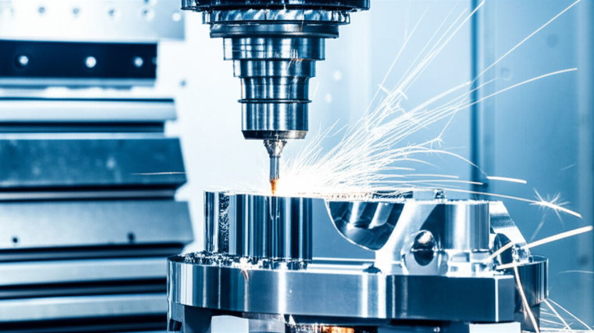

Las fresadoras CNC han revolucionado la industria manufacturera, llevando la precisión y la eficiencia a niveles que antes eran inimaginables. Si alguna vez te has preguntado cómo se fabrican las piezas de alta precisión para un coche, un avión o incluso un implante médico, es muy probable que una de estas máquinas haya estado involucrada.

En esta guía completa, desglosaremos todo lo que necesitas saber sobre las fresadoras CNC, desde su funcionamiento básico hasta sus componentes y aplicaciones más sorprendentes.

## ¿Qué es Exactamente una Fresadora CNC?

Una fresadora CNC (Control Numérico Computarizado) es una máquina-herramienta automatizada que utiliza herramientas de corte giratorias para eliminar material de una pieza de trabajo y darle una forma específica. Es un proceso de **fabricación sustractiva**: empiezas con un bloque sólido de material (como metal, plástico o madera) y "esculpes" la pieza deseada eliminando el exceso.

La parte "CNC" es la clave. A diferencia de las fresadoras manuales, que requieren que un operario controle constantemente los movimientos, una fresadora CNC sigue un conjunto de instrucciones preprogramadas desde un ordenador. Esto garantiza una precisión, repetibilidad y complejidad asombrosas en cada corte.

## La Magia Detrás del Movimiento: ¿Cómo Funciona?

El proceso de mecanizado en una fresadora CNC puede parecer complejo, pero se puede dividir en cuatro pasos fundamentales:

1.  **Diseño (CAD):** Todo comienza con una idea. El diseño de la pieza se crea utilizando software de Diseño Asistido por Computadora (CAD), como Autodesk Fusion 360, SolidWorks o AutoCAD. El resultado es un modelo digital en 2D o 3D.

2.  **Programación (CAM):** A continuación, el modelo CAD se importa en un software de Fabricación Asistida por Computadora (CAM). Este programa traduce el diseño en un lenguaje que la máquina puede entender, llamado **Código G**. El Código G es una serie de coordenadas y comandos que le dicen a la fresadora exactamente a dónde moverse, a qué velocidad y cuándo activar o desactivar el husillo.

3.  **Configuración (Setup):** Antes de ejecutar el programa, el operario debe preparar la máquina. Esto incluye fijar firmemente el bloque de material (la pieza de trabajo) en la mesa de la fresadora y cargar la herramienta de corte adecuada (la fresa) en el husillo. También se establece el "punto cero" o punto de origen, que sirve como referencia para todos los movimientos del Código G.

4.  **Ejecución:** Con todo listo, el operario carga el Código G en el controlador de la máquina y pulsa "start". La fresadora CNC ejecutará el programa de forma autónoma, moviendo la herramienta de corte a lo largo de los ejes X, Y y Z (y a veces más) para eliminar material y crear la pieza final con una precisión de micras.

## Anatomía de una Fresadora CNC: Sus Partes Clave

Para entender realmente una fresadora, es útil conocer sus componentes principales:

*   **Bancada y Columna:** Es el esqueleto de la máquina, la estructura principal que proporciona rigidez y estabilidad para soportar todas las demás partes y absorber las vibraciones durante el mecanizado.
*   **Husillo (Spindle):** Es el corazón de la fresadora. Se trata de un eje que gira a altas velocidades (miles de RPM) y sujeta la herramienta de corte. La potencia y velocidad del husillo determinan en gran medida la capacidad de la máquina.
*   **Mesa de Trabajo:** La superficie plana donde se sujeta la pieza de trabajo. Se mueve a lo largo de los ejes X e Y para posicionar el material debajo de la herramienta de corte.
*   **Herramienta de Corte (Fresa):** La herramienta que realiza el corte real. Vienen en innumerables formas y tamaños, cada una diseñada para un tipo específico de material y operación (desbaste, acabado, ranurado, etc.).
*   **Ejes de Movimiento (X, Y, Z):** Son los sistemas de guías y tornillos (generalmente de bolas) que permiten el movimiento preciso en tres dimensiones. El eje X es el movimiento longitudinal (izquierda-derecha), el eje Y es el transversal (adelante-atrás) y el eje Z es el vertical (arriba-abajo). Las máquinas más avanzadas pueden tener ejes adicionales (A, B, C) para rotaciones.
*   **Controlador CNC:** El cerebro de la operación. Es el ordenador que lee el Código G, lo interpreta y envía las señales eléctricas a los motores para controlar cada movimiento con precisión.

## Tipos de Fresadoras CNC: No Todas Son Iguales

Aunque el principio de funcionamiento es el mismo, las fresadoras CNC vienen en varias configuraciones, adaptadas a diferentes necesidades:

*   **Fresadoras Verticales:** El husillo está orientado verticalmente. Son las más comunes, especialmente en talleres pequeños y para trabajos de uso general. Son ideales para operaciones en la cara superior de la pieza.
*   **Fresadoras Horizontales:** El husillo está orientado horizontalmente. Son más robustas y se utilizan para mecanizar piezas más grandes y pesadas. La orientación horizontal facilita la evacuación de virutas.
*   **Fresadoras de Puente (Gantry):** Para piezas de trabajo extremadamente grandes, como moldes para la industria automotriz o componentes aeroespaciales. En estas, la pieza permanece estática mientras un puente que contiene el husillo se mueve sobre ella.
*   **Fresadoras de 5 Ejes:** Además de los tres ejes lineales (X, Y, Z), tienen dos ejes rotativos. Esto permite a la herramienta de corte aproximarse a la pieza desde cualquier ángulo, posibilitando la creación de geometrías increíblemente complejas en una sola configuración.

## Aplicaciones: ¿Dónde Vemos su Trabajo?

La versatilidad de la fresadora CNC la hace indispensable en una amplia gama de industrias:

*   **Aeroespacial:** Fabricación de componentes estructurales, soportes y piezas de motor con tolerancias extremadamente estrictas.
*   **Automoción:** Producción de bloques de motor, moldes para piezas de plástico y prototipos de nuevos diseños.
*   **Medicina:** Creación de implantes personalizados (cadera, rodilla), prótesis e instrumental quirúrgico de alta precisión.
*   **Electrónica:** Mecanizado de carcasas, disipadores de calor y placas de circuito impreso (PCB).
*   **Ebanistería y Arte:** Tallas de madera complejas, fabricación de muebles de diseño y creación de esculturas.

## Conclusión: Un Mundo de Posibilidades a tu Alcance

La fresadora CNC es mucho más que una máquina; es una puerta de entrada a la fabricación de precisión. Combina la fuerza bruta del corte de metal con la delicadeza del control digital, permitiendo a ingenieros, diseñadores y creadores convertir sus ideas digitales en objetos físicos tangibles con una fidelidad asombrosa.

Entender sus fundamentos no solo es fascinante, sino que es esencial para cualquiera que quiera adentrarse en el mundo de la fabricación moderna, la creación de prototipos o la industria 4.0.