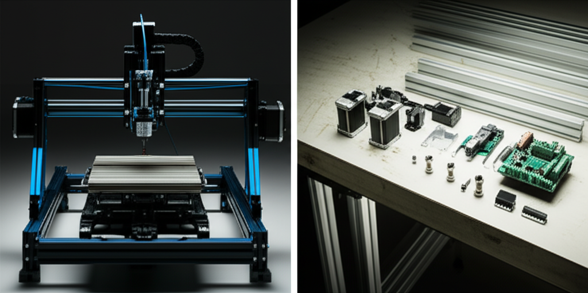

## Introducción

El sueño de tener una máquina CNC en tu taller está ahí, ¿verdad? Ves todos esos proyectos increíbles en internet y piensas: "¡Yo quiero hacer eso!". Pero de repente, te topas con la primera gran pregunta, una que define tu camino como creador: ¿debería construir mi propia máquina o comprar una ya hecha? Esta duda puede paralizar a cualquiera. No te preocupes, es el primer gran rito de iniciación. En este artículo, vamos a desglosar el dilema de **Construir vs Comprar: La Filosofía de un Maker**, no para decirte qué hacer, sino para darte la claridad que necesitas. Al final, tendrás una brújula para elegir el camino que mejor se alinee con tu espíritu de inventor.

## La Ruta del Comprador: Rapidez y Confianza

Imagina esto: una caja llega a tu puerta, la abres, sigues unas instrucciones de montaje (relativamente) sencillas y, en cuestión de horas o un par de días, tienes una máquina funcional lista para cortar. Este es el camino del comprador. Es la ruta directa hacia la fabricación.

**Ventajas de comprar una CNC:**

*   **Puesta en marcha rápida:** El objetivo es hacer piezas, no construir la máquina que hace las piezas. Comprar te permite empezar a crear proyectos mucho antes.
*   **Soporte técnico y garantía:** Si algo sale mal, tienes una empresa a la que llamar o escribir. Esa red de seguridad es invaluable cuando estás empezando y cada error parece un desastre.
*   **Fiabilidad probada:** Estas máquinas han sido diseñadas, probadas y refinadas. Sabes que, si sigues las indicaciones, funcionará como se espera.

El principal inconveniente suele ser el **coste inicial**, que puede ser más alto, y una **menor capacidad de personalización**. La máquina es lo que es, y modificarla puede ser complicado o anular la garantía.

## La Senda del Constructor: Aprendizaje y Personalización

Ahora, imagina otro escenario: una mesa llena de perfiles de aluminio, tornillos, cables, motores y placas electrónicas. No tienes una máquina, tienes un rompecabezas. Este es el camino del constructor. Es una inmersión total en la tecnología.

**Ventajas de construir tu propia CNC:**

*   **Conocimiento absoluto:** Cuando termines, no habrá un solo tornillo o cable que no entiendas. Serás capaz de repararla, mejorarla y ajustarla con total confianza. ¡Tú la creaste!
*   **Personalización infinita:** ¿Necesitas un área de trabajo más grande? ¿Quieres que sea capaz de cortar aluminio? ¿Quieres añadir un láser? Puedes diseñarla desde el principio para que se adapte perfectamente a tus sueños.
*   **El orgullo del "Hecho por Mí":** La satisfacción de ver moverse por primera vez una máquina que ensamblaste pieza por pieza es una recompensa en sí misma.

Los inconvenientes son evidentes: requiere **mucho tiempo**, paciencia, investigación y una alta tolerancia a la frustración. Es muy probable que cometas errores en el camino.

## Construir vs Comprar: La Filosofía de un Maker Puesta a Prueba

Aquí está la clave de todo. La decisión no es sobre qué es "mejor" en abstracto, sino sobre **qué tipo de maker quieres ser en este momento**. Para descubrirlo, hazte estas dos preguntas fundamentales:

### ### ¿Tu objetivo principal es el **RESULTADO**?

Si tu meta es empezar a vender productos, crear prototipos para un invento o simplemente fabricar objetos lo antes posible, tu recurso más valioso es el tiempo. En este caso, **comprar una máquina CNC es la decisión más lógica**. Te permite centrarte en el diseño (CAD) y la estrategia de mecanizado (CAM), que ya son un mundo por sí solos.

### ### ¿Tu objetivo principal es el **PROCESO**?

Si te fascina la mecánica, la electrónica y la resolución de problemas, si la idea de entender las tripas de la tecnología te emociona más que el objeto final, entonces **construir tu propia CNC es tu aventura**. El aprendizaje que obtendrás no tiene precio. Cada problema será una lección, y el resultado final será una máquina y un conocimiento que son verdaderamente tuyos.

## El Punto Medio: Los Kits de Montaje

¡Espera, hay una tercera vía! Los kits de montaje son la opción perfecta para quienes quieren un poco de ambos mundos. Empresas como SainSmart, Shapeoko o Workbee ofrecen kits donde te envían todas las piezas necesarias y unas instrucciones detalladas.

*   **Aprendes a montarla:** Entenderás cómo funciona, pero con una guía clara que minimiza la frustración.
*   **Compatibilidad garantizada:** Sabes que todas las piezas han sido elegidas para funcionar juntas.
*   **Comunidad y soporte:** Estos kits suelen tener grandes comunidades de usuarios dispuestas a ayudar.

Es una forma fantástica de ganar confianza y conocimiento sin la incertidumbre de empezar desde un folio en blanco.

## Conclusión

Al final del día, la elección entre construir y comprar tu primera CNC no se trata de dinero o dificultad, sino de tu filosofía personal como maker. Si tu pasión es crear objetos y ver tus ideas materializadas rápidamente, **comprar** te pondrá en el camino correcto. Si tu pasión es el conocimiento, el reto y el proceso de creación en sí mismo, **construir** será una de las experiencias más gratificantes de tu vida. Ambos caminos son válidos y emocionantes. Lo importante es dar el primer paso.

¿Y tú, qué camino te llama más la atención? ¿Eres del equipo "Comprar" o del equipo "Construir"? ¡Comparte tu elección en los comentarios!

## Preguntas Frecuentes

### ¿Es mucho más barato construir una CNC desde cero?
No necesariamente. Si buscas componentes de alta calidad para tener buena precisión, el coste puede ser muy similar al de una máquina comercial de entrada. El ahorro real suele venir si reciclas piezas o usas componentes más económicos, pero esto puede comprometer la calidad. El verdadero "valor" de construir es el conocimiento que adquieres.

### Si construyo mi CNC y algo no funciona, ¿qué hago?
¡Bienvenido al club! La clave del mundo maker es la comunidad. Foros online, grupos de Facebook y miles de tutoriales en YouTube están llenos de gente que ha enfrentado los mismos problemas. Investiga, pregunta y no te rindas. ¡No estás solo en esto!

### Soy un principiante total, ¿comprar una máquina me garantiza que no tendré problemas?
No. Comprar una máquina elimina los problemas relacionados con el *montaje y la compatibilidad de piezas*. Sin embargo, la curva de aprendizaje para usarla sigue ahí. Aún tendrás que aprender sobre software de diseño (CAD), software de control (CAM), elegir las fresas correctas, definir velocidades de corte y hacer el mantenimiento. La aventura del aprendizaje existe en ambos caminos.
Este artículo es parte de nuestra guía principal: **['La Historia de Mi Taller: Cómo Construí un Torno para Construir un Taladro'](../la-historia-de-mi-taller-como-construi-un-torno-para-construir-un-taladro/)**.

## También Te Podría Interesar

Explora otros temas en nuestro blog:
- **Descubre todo sobre [Torno](/tags/torno/)**
- **Descubre todo sobre [Proyectos CNC](/tags/proyectos-cnc/)**
