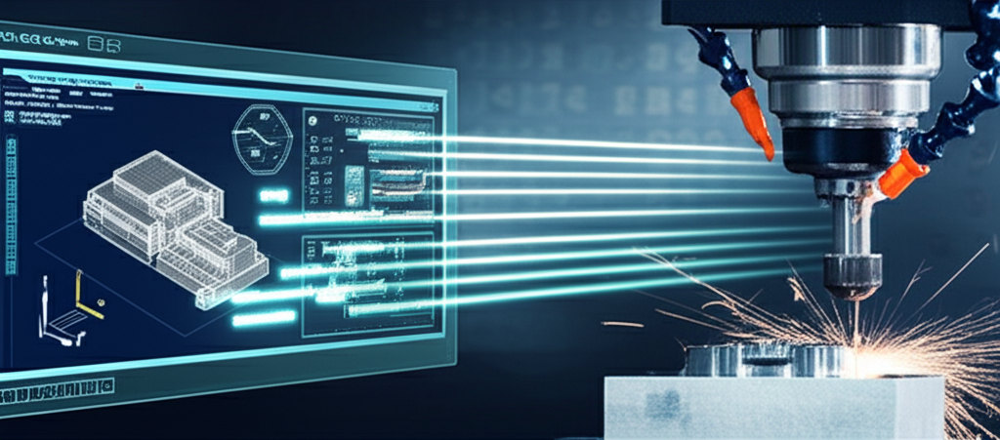

Si tu máquina CNC es la fuerza bruta, el software es sin duda el cerebro. Sin el programa adecuado, tu impresionante equipo de fresado, corte láser o torneado no es más que un costoso pisapapeles. Pero el término "software CNC" es increíblemente amplio y puede resultar confuso para quienes se inician en este mundo.

En esta guía definitiva, desglosaremos el ecosistema del software CNC. Entenderás los diferentes tipos, cómo trabajan juntos y, lo más importante, qué factores debes considerar para elegir el más adecuado para tus proyectos.

## ¿Qué es Exactamente el Software CNC?

En pocas palabras, el **software CNC es el conjunto de programas que te permite pasar de una idea en tu cabeza a un objeto físico fabricado por una máquina**. Este proceso se divide generalmente en tres etapas fundamentales, cada una con su propio tipo de software especializado: el diseño, la estrategia de mecanizado y el control de la máquina.

Imagina que quieres fabricar un posavasos de madera con un logo grabado. El flujo de trabajo del software sería algo así:

1.  **Diseñas** la forma y el logo del posavasos en un programa.
2.  **Defines** cómo la fresa de la máquina debe moverse para cortar y grabar ese diseño.
3.  **Envías** esas instrucciones a la máquina para que las ejecute.

Cada uno de estos pasos utiliza un tipo de software diferente. Veámoslos en detalle.

## Los 3 Tipos de Software CNC que Debes Conocer

El corazón del flujo de trabajo CNC se compone de tres pilares: CAD, CAM y el software de Control.

### 1. Software CAD (Diseño Asistido por Computadora)

Todo comienza con un diseño. El software CAD es tu lienzo digital. Aquí es donde creas los modelos 2D o 3D de la pieza que quieres fabricar.

*   **Función principal:** Crear la geometría del diseño. Dibujar vectores (2D) o modelar sólidos y superficies (3D).
*   **Salida:** El resultado de un programa CAD suele ser un archivo en formatos como `.DXF`, `.DWG`, `.SVG` (para 2D) o `.STEP`, `.STL`, `.IGES` (para 3D).
*   **Ejemplos populares:**
    *   **Autodesk Fusion 360:** Muy popular por integrar CAD, CAM y más en un solo paquete.
    *   **SolidWorks:** Un estándar en la industria para el diseño mecánico 3D.
    *   **Inkscape:** Una excelente opción gratuita para el diseño vectorial 2D (ideal para grabados y cortes de perfil).
    *   **AutoCAD:** El clásico para el dibujo técnico en 2D y 3D.

### 2. Software CAM (Fabricación Asistida por Computadora)

Una vez que tienes tu diseño, necesitas un traductor. El software CAM toma tu archivo CAD y lo convierte en instrucciones que la máquina CNC pueda entender. Estas instrucciones se conocen como **G-Code (Código G)**.

El CAM es el estratega: aquí defines qué herramienta usarás, la velocidad de corte, la profundidad de cada pasada y la trayectoria que seguirá la herramienta para lograr el diseño final.

*   **Función principal:** Generar las trayectorias de la herramienta (toolpaths) y exportarlas como G-Code.
*   **Salida:** Un archivo de texto con extensión `.nc`, `.tap`, `.gcode`, que contiene las coordenadas y comandos para la máquina.
*   **Ejemplos populares:**
    *   **Fusion 360 (Módulo CAM):** La integración con su CAD lo hace extremadamente eficiente.
    *   **Vectric Aspire / VCarve:** Muy intuitivo y potente, especialmente para el trabajo en madera con routers CNC.
    *   **Easel:** Un software CAM basado en web, muy sencillo y perfecto para principiantes.
    *   **Mastercam:** Un software industrial de alta gama con capacidades muy avanzadas.

> **Nota:** Muchos programas modernos son soluciones **CAD/CAM integradas**. Esto significa que puedes diseñar y generar el G-Code en el mismo software, lo que agiliza enormemente el flujo de trabajo. Fusion 360 y Vectric Aspire son ejemplos perfectos de esto.

### 3. Software de Control (Controlador o Emisor de G-Code)

Este es el último eslabón de la cadena. El software de control es la interfaz directa con tu máquina CNC. Su única misión es tomar el archivo G-Code que generaste con el CAM y enviar las señales eléctricas precisas a los motores para que se muevan tal y como indican las instrucciones.

*   **Función principal:** Leer el G-Code línea por línea y controlar el movimiento de los ejes de la máquina en tiempo real.
*   **Salida:** Movimiento físico de la máquina.
*   **Ejemplos populares:**
    *   **GRBL (Universal Gcode Sender / Candle):** GRBL es un firmware de código abierto muy popular para placas basadas en Arduino que controlan máquinas CNC de hobby. UGS y Candle son interfaces para comunicarse con él.
    *   **Mach3 / Mach4:** Un estándar de la industria durante años para controlar una amplia variedad de máquinas CNC, generalmente a través de un puerto paralelo o una controladora externa.
    *   **LinuxCNC:** Una solución de código abierto extremadamente potente y flexible que se ejecuta en el sistema operativo Linux.

## ¿Cómo Elegir el Software CNC Adecuado?

La elección del "mejor" software depende entièrement de tus necesidades. Aquí tienes los factores clave a considerar:

*   **Tu Nivel de Experiencia:** Si eres principiante, busca soluciones integradas y sencillas como **Easel** o **Carbide Create**. Si tienes más experiencia, un paquete como **Fusion 360** o la suite de **Vectric** te ofrecerá más potencia.
*   **El Tipo de Trabajo:** ¿Haces principalmente grabados 2D en madera? **VCarve** es fantástico. ¿Diseñas piezas mecánicas complejas en 3D? **Fusion 360** o **SolidWorks** son tus aliados.
*   **Tu Presupuesto:** Existen opciones gratuitas y de código abierto muy capaces como **Inkscape** (CAD), **FreeCAD** (CAD/CAM) y **LinuxCNC** (Control). Las soluciones de pago suelen ofrecer una mejor experiencia de usuario, soporte técnico y funciones más avanzadas.
*   **Compatibilidad:** Asegúrate de que el software es compatible con tu sistema operativo (Windows, macOS, Linux) y, lo más importante, con el hardware y firmware de tu máquina CNC (por ejemplo, una máquina que usa GRBL necesita un emisor compatible con GRBL).
*   **Comunidad y Soporte:** Un software con una gran comunidad de usuarios y buenos tutoriales en YouTube es un recurso invaluable, especialmente cuando estás aprendiendo.

## Conclusión: El Ecosistema lo es Todo

Entender que el software CNC no es una sola cosa, sino un ecosistema de herramientas (CAD, CAM y Control) que trabajan en conjunto, es el primer paso para dominar tu máquina.

No te sientas abrumado por la cantidad de opciones. Comienza con una solución sencilla y, a medida que tus habilidades y proyectos crezcan, podrás explorar herramientas más potentes. El viaje de aprendizaje es parte de la diversión en el mundo del CNC.

¿Cuál es tu software CNC favorito y por qué? ¡Déjanos un comentario y comparte tu experiencia con la comunidad!