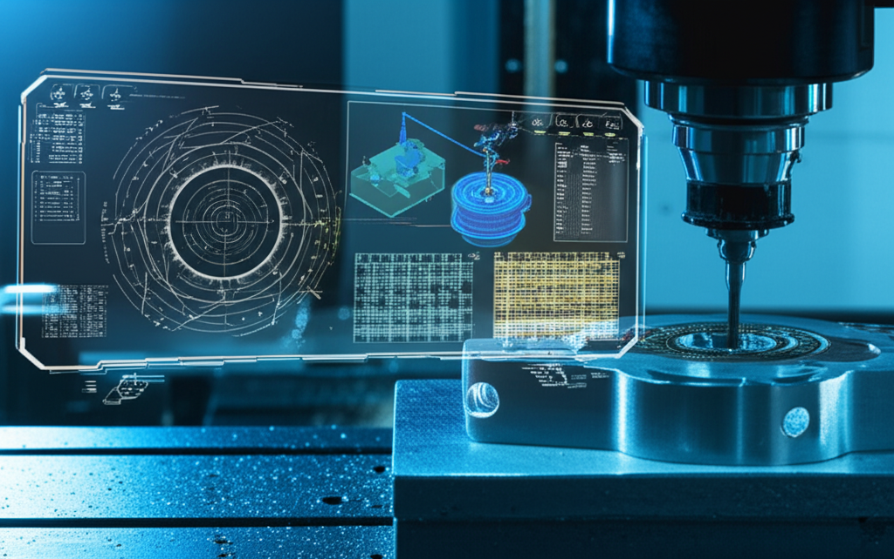

El universo del mecanizado CNC es fascinante, pero el software que lo impulsa puede parecer un laberinto para los no iniciados. Tienes una idea brillante, una máquina CNC lista para trabajar, pero ¿cómo conviertes ese concepto en una pieza física? La respuesta está en una cadena de tres eslabones de software: **CAD, CAM y el Software de Control**.

Entender esta "santísima trinidad" es fundamental para cualquier operario, diseñador o aficionado al CNC. En esta guía completa, desglosaremos cada componente, explicaremos su función y mostraremos cómo colaboran para dar vida a tus proyectos.

## La Trinidad del Software CNC: El Flujo de Trabajo Esencial

Imagina el proceso como una línea de producción digital con tres especialistas:

1.  **El Arquitecto (CAD):** Dibuja los planos digitales del objeto.
2.  **El Estratega de Producción (CAM):** Convierte esos planos en un plan de fabricación detallado.
3.  **El Operario de la Máquina (Control):** Ejecuta el plan de fabricación en la máquina CNC.

Cada uno de estos roles es desempeñado por un tipo específico de software. Veamos cada uno en detalle.

## 1. CAD (Diseño Asistido por Computadora): Donde Nace la Idea

Todo proyecto CNC comienza con un diseño. El software **CAD** es tu lienzo digital, la herramienta donde creas un modelo 2D o 3D preciso de la pieza que quieres fabricar. Es el equivalente moderno de la mesa de dibujo de un ingeniero.

### ¿Qué hace exactamente?

El software CAD te permite dibujar formas geométricas, extruirlas en tres dimensiones, ensamblar múltiples partes y acotar cada detalle con una precisión milimétrica. El resultado final es un archivo digital (como .STEP, .STL, .DWG o .DXF) que representa visual y matemáticamente tu objeto.

### Funciones Clave del Software CAD
*   **Dibujo 2D:** Creación de bocetos y perfiles planos.
*   **Modelado 3D:** Construcción de modelos sólidos o de superficie.
*   **Ensamblajes:** Unión de múltiples piezas para ver cómo encajan y funcionan juntas.
*   **Documentación:** Generación de planos técnicos y acotaciones para la fabricación.

### Ejemplos de Software CAD Populares
*   **Profesional:** Autodesk Fusion 360, SolidWorks, Siemens NX, Catia.
*   **Gratuito / Hobbyist:** FreeCAD, Tinkercad (para principiantes), Onshape (versión gratuita).

## 2. CAM (Fabricación Asistida por Computadora): El Puente entre Diseño y Máquina

Una vez que tienes tu modelo 3D en el software CAD, la máquina CNC todavía no sabe qué hacer con él. Necesita instrucciones paso a paso, un lenguaje que entienda. Aquí es donde entra en juego el software **CAM**.

El software CAM toma tu archivo CAD y actúa como un estratega. Tú le dices qué herramientas usarás, la velocidad de corte y el tipo de material. El CAM calcula las trayectorias de herramienta más eficientes (conocidas como *toolpaths*) para mecanizar la pieza.

El resultado final de este proceso es un archivo de texto que contiene **Código G**.

### El Proceso CAM Desglosado
1.  **Importación:** Se carga el modelo CAD en el software CAM.
2.  **Configuración del Trabajo (Setup):** Se define el bloque de material en bruto (stock), el punto cero de la pieza (origen) y la orientación.
3.  **Selección de Herramientas:** Se elige de una biblioteca las fresas, brocas u otras herramientas que se usarán.
4.  **Definición de Estrategias:** Se seleccionan las operaciones de mecanizado (desbaste, acabado, contorneado, taladrado) y el software calcula las trayectorias de la herramienta.
5.  **Simulación:** Se ejecuta una simulación virtual para verificar que las trayectorias son correctas, no hay colisiones y el resultado es el esperado.
6.  **Post-procesado:** El software traduce las trayectorias a Código G, un lenguaje estandarizado de coordenadas y comandos que la mayoría de las máquinas CNC entienden.

### Ejemplos de Software CAM
*   **Integrado (CAD/CAM):** Autodesk Fusion 360 (muy popular por combinar ambos), Mastercam, SolidWorks CAM.
*   **Dedicado:** Vectric Aspire (excelente para madera y rotulación), MeshCAM, SprutCAM.

## 3. Software de Control: El Cerebro de la Operación

Ya tienes tu Código G. Ahora necesitas un programa que lo lea y lo traduzca en señales eléctricas para mover los motores de la máquina CNC. Ese es el trabajo del **software de control**, también conocido como intérprete de Código G.

Este software es la interfaz directa con tu máquina. Te permite cargar el archivo de Código G, establecer el punto cero real en tu material, mover manualmente los ejes de la máquina (jogging) y, por supuesto, iniciar, pausar y detener el trabajo de mecanizado.

### Responsabilidades Clave del Software de Control
*   **Interpretación de Código G:** Lee cada línea del código y la convierte en una acción específica (mover el eje X, encender el husillo, etc.).
*   **Control en Tiempo Real:** Envía pulsos eléctricos precisos a los drivers de los motores para ejecutar los movimientos.
*   **Interfaz de Usuario (UI):** Proporciona una visualización del estado de la máquina, las coordenadas actuales y los controles manuales.

### Ejemplos de Software de Control
*   **Profesional / Industrial:** Fanuc Control, Siemens Sinumerik, Haas Control (suelen venir integrados en la propia máquina).
*   **Hobbyist / DIY:** Mach3/Mach4, GRBL (y sus interfaces como UGS - Universal Gcode Sender), LinuxCNC.

## El Flujo de Trabajo Completo: De la Pantalla a la Viruta

Para consolidar todo, aquí está el flujo de trabajo completo en una secuencia simple:

**Idea** → **Software CAD** (Creas el modelo 3D) → **Software CAM** (Generas el Código G) → **Software de Control** (Ejecutas el código en la máquina) → **Pieza Final**

## Conclusión: El Ecosistema que Impulsa tu Creatividad

Comprender la relación entre CAD, CAM y el software de control es dejar de ver el CNC como una caja negra y empezar a dominar el proceso de principio a fin. Cada pieza del software es un eslabón indispensable en la cadena que transforma tus ideas digitales en objetos físicos y tangibles.

Al dominar este ecosistema, no solo fabricarás piezas, sino que optimizarás tus diseños, mejorarás tus tiempos de mecanizado y abrirás la puerta a proyectos cada vez más complejos y ambiciosos.

¿Qué software utilizas en tu día a día? ¡Comparte tu combinación de CAD/CAM/Control favorita en los comentarios!