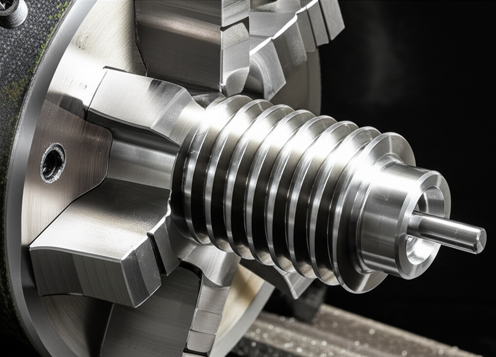

# Domina el Roscado en el Torno: La Guía Definitiva para Principiantes y Expertos

El roscado en el torno es una técnica esencial en el mecanizado, permitiendo la creación de roscas precisas y funcionales en una amplia variedad de piezas.  Ya seas un principiante que busca entender los fundamentos o un experto buscando perfeccionar sus habilidades, esta guía exhaustiva te proporcionará todo lo que necesitas saber.

## Tipos de Roscas

Antes de comenzar, es crucial comprender los diferentes tipos de roscas que puedes crear en un torno:

* **Roscas métricas:**  El sistema más común, definido por el paso y el diámetro nominal.
* **Roscas Whitworth (BSP):** Utilizadas principalmente en aplicaciones británicas y otras partes del mundo.
* **Roscas UNC y UNF:** Roscas de pulgada utilizadas en Estados Unidos y otros países.
* **Roscas trapezoidales:** Diseñadas para transmitir grandes fuerzas axiales.
* **Roscas de sierra:** Utilizadas para aplicaciones de fijación donde se requiere una alta resistencia al aflojamiento.

Cada tipo de rosca tiene sus propias características y dimensiones específicas, que debes considerar al seleccionar la herramienta y la configuración de la máquina.

## Herramientas para Roscar

El éxito en el roscado depende en gran medida de las herramientas que utilizas.  Las opciones más comunes incluyen:

* **Placas de roscar:**  Ofrecen versatilidad y precisión, permitiendo crear diferentes tipos de roscas con un solo portaherramientas.
* **Tarrajas y machuelos:**  Una opción más tradicional, ideal para roscas simples y trabajos de menor precisión.  Requieren más habilidad manual.
* **Herramientas de roscado CNC:**  Permite la automatización del proceso, logrando una alta precisión y repetitividad.

La elección de la herramienta dependerá del tipo de rosca, el material de la pieza y la precisión requerida.

## Cálculos y Configuraciones

Para roscar con precisión, necesitas realizar los cálculos correctos para la alimentación axial y la velocidad de rotación del torno.  Estos cálculos varían dependiendo del tipo de rosca y las características de la máquina.  A menudo, se utilizan las siguientes fórmulas:

* **Avance por revolución (APR):**  Este valor determina el desplazamiento axial de la herramienta por cada revolución del husillo.
* **Velocidad de corte (Vc):**  La velocidad a la que la herramienta corta el material.

Muchas máquinas CNC permiten el cálculo automático de estos parámetros, simplificando el proceso.

## Proceso de Roscado paso a paso

1. **Preparación de la pieza:** Asegúrate de que la pieza esté correctamente sujeta en el torno y que la superficie donde se realizará el roscado esté mecanizada con precisión.
2. **Selección de la herramienta y configuración:**  Elige la herramienta adecuada para el tipo de rosca y configura la máquina según los cálculos realizados.
3. **Roscado:** Realiza el roscado de forma lenta y cuidadosa, prestando atención a la alimentación y la velocidad de corte.
4. **Inspección:**  Verifica la calidad de la rosca con un calibrador de roscas para asegurar que cumple con las especificaciones.

## Solución de Problemas Comunes

* **Roscas dañadas:**  Esto puede ser debido a una velocidad de corte incorrecta, una mala configuración de la herramienta o un material inadecuado.
* **Roscas incompletas:**  Verifica el avance axial y la profundidad de corte.
* **Vibraciones:**  Asegúrate de que la pieza esté firmemente sujeta y que la herramienta esté bien afilada.

## Consejos para un Roscado Perfecto

* Utiliza lubricante para reducir la fricción y mejorar la calidad de la rosca.
* Asegúrate de que la herramienta esté afilada correctamente.
* Practica con piezas de desecho antes de trabajar con piezas finales.

## Conclusión

El roscado en el torno puede parecer complejo al principio, pero con la práctica y la comprensión de los principios fundamentales, puedes lograr roscas perfectas cada vez. Esta guía proporciona una base sólida para ayudarte en tu camino hacia el dominio de esta técnica esencial en el mecanizado.  Recuerda que la práctica es clave para perfeccionar tus habilidades. ¡Así que ponte manos a la obra y comienza a crear roscas precisas y funcionales!