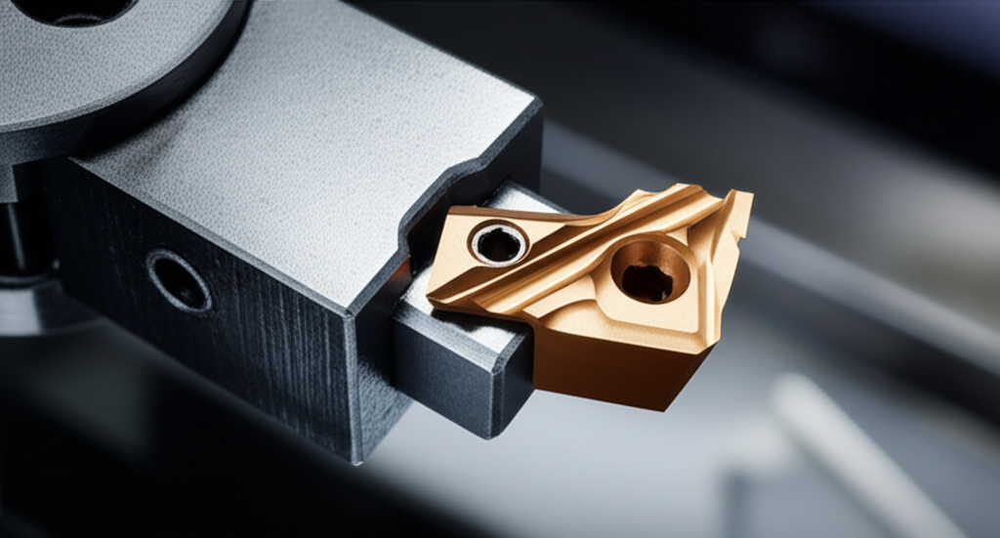

# Domina el Roscado en Torno: Guía Definitiva para Principiantes

¿Alguna vez has intentado hacer una rosca en tu torno y te has encontrado con una pieza dañada o un resultado impreciso?  El roscado puede parecer intimidante al principio, pero con la técnica adecuada, es un proceso gratificante que abre un mundo de posibilidades en tus proyectos de bricolaje. Esta guía te ayudará a superar los obstáculos más comunes y a crear roscas perfectas.

## Elegir la Herramienta Correcta: La Clave del Éxito

Uno de los errores más comunes de los principiantes es intentar roscar con una herramienta inadecuada.  Imagina intentar cortar un pastel con un cuchillo de mantequilla: el resultado sería un desastre.  Lo mismo ocurre con el roscado.  Necesitas una plaquita o herramienta de roscar específica para el tipo de rosca que quieres crear (métrica, Whitworth, etc.) y el material que estás trabajando (acero, aluminio, etc.).  Investiga las especificaciones de tu herramienta y asegúrate de que sea compatible con tu torno y el material.  La calidad de la herramienta influye directamente en la calidad del roscado.

## Calcular los Pasos y Configurar el Torno: Precisión es la Palabra Clave

Calcular correctamente el paso de la rosca es fundamental. Un paso incorrecto significa una rosca defectuosa.  Afortunadamente, existen calculadoras online y tablas que te ayudarán a determinar el número de vueltas por pulgada o milímetro, según el tipo de rosca.  Una vez que tengas este dato, deberás configurarlo en tu torno con precisión. Esto implica ajustar la alimentación longitudinal del carro del torno según el paso calculado.  No tengas miedo de hacer pruebas con piezas de desecho para familiarizarte con el proceso antes de trabajar con tu pieza final.

## Evitar Errores Comunes: Consejos para un Roscado Perfecto

Un error común es aplicar demasiada presión al roscar.  La herramienta debe cortar el material, no forzarlo.  Una presión excesiva puede romper la herramienta, dañar la pieza o generar una rosca irregular.  Recuerda lubricar la herramienta y la pieza con un aceite de corte adecuado. Esto reducirá la fricción, el calor y la probabilidad de errores. Mantén una velocidad de corte apropiada para el material y la herramienta utilizada. Una velocidad demasiado alta puede quemar el material, mientras que una velocidad demasiado baja puede provocar que la herramienta se atasque.

## Conclusión: ¡A Roscar se Aprende Haciendo!

Dominar el roscado en torno requiere práctica y paciencia.  Recuerda elegir la herramienta correcta, calcular con precisión los pasos y configurar tu torno adecuadamente.  No te desanimes si tus primeros intentos no son perfectos.  La clave está en entender los principios básicos, experimentar y aprender de tus errores.  Para tu próximo proyecto, intenta roscar una pieza simple, como una tuerca o un perno, para consolidar tus conocimientos.  ¡El camino hacia la maestría en el torno comienza con un paso a la vez!