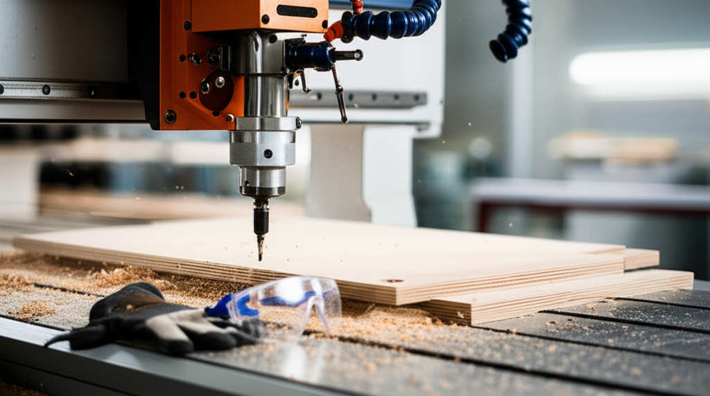

# Guía Completa de la Fresadora CNC para Novatos

Bienvenido al mundo del mecanizado CNC! Esta guía te ayudará a comprender los fundamentos de las fresadoras CNC y a comenzar tus primeros proyectos.  Cubriremos desde los conceptos básicos hasta la realización de proyectos simples.

## 1. Introducción a las Fresadoras CNC

* **¿Qué es una fresadora CNC?**  Explicación sencilla del concepto y sus capacidades.  Incluir imágenes o un breve video.
* **Tipos de Fresadoras CNC:**  Distintas opciones disponibles (tamaño, tipo de control, etc.).  Ejemplos y sus aplicaciones.
* **Componentes Principales:**  Descripción de los elementos clave (ejes X, Y, Z, husillo, controlador, software, etc.).  Imágenes con etiquetas para cada componente.

## 2. Seguridad en el Mecanizado CNC

* **Precauciones esenciales:**  Uso de protección ocular, auditiva y respiratoria.  Vestimenta adecuada.
* **Manejo seguro de herramientas:**  Cambio de fresas, alineación y sujeción correcta.
* **Emergencias:**  Procedimientos en caso de accidentes o fallos del equipo.
* **Conocimiento de los límites de la máquina:** Importancia de configurar correctamente los límites de trabajo.

## 3. Software y Diseño CAD/CAM

* **Software CAD:**  Introducción a programas de diseño asistido por computadora (ej. Fusion 360, AutoCAD, Tinkercad).  Enlaces a tutoriales o recursos adicionales.
* **Software CAM:**  Introducción a programas de fabricación asistida por computadora (ej. Fusion 360 CAM, VCarve Pro).  Generación de trayectorias de herramienta (toolpaths).
* **Creación de un diseño simple:**  Tutorial paso a paso para diseñar una pieza básica (ej. un bloque rectangular).

## 4. Preparación y Configuración de la Fresadora CNC

* **Conexión e instalación:**  Explicación de cómo conectar la máquina, el software y la computadora.
* **Calibración:**  Proceso de calibración de los ejes y la herramienta.  Una correcta calibración es fundamental para obtener resultados precisos.  Si tienes una fresadora 3018, asegúrate de que la cama esté perfectamente nivelada antes de comenzar; puedes consultar nuestro tutorial sobre cómo nivelar la cama de tu fresadora 3018 [aquí](/tutorial-nivelar-cama-fresadora-3018).
* **Sujeción de la pieza:**  Métodos seguros para sujetar la pieza a mecanizar (sargentos, mordazas, vacío).
* **Selección y cambio de herramientas:**  Explicación de diferentes tipos de fresas y su aplicación.  La elección correcta de la fresa es crucial para el éxito del proyecto.  Para principiantes,  es recomendable conocer las fresas más importantes para empezar.  Puedes consultar nuestra guía sobre las 5 fresas más importantes para principiantes [aquí](/Las-5-Fresas-Mas-Importantes-para-Empezar).

## 5. Primer Proyecto:  [Ejemplo de Proyecto Simple]

* **Diseño en CAD:**  Descargar los archivos CAD o seguir un tutorial para crear el diseño.
* **Generación de toolpath en CAM:**  Instrucciones paso a paso para generar el código G.
* **Mecanizado:**  Proceso detallado para mecanizar la pieza en la fresadora CNC.  Incluir fotos del proceso.
* **Resultados y Posibles Problemas:**  Análisis de los resultados y soluciones a posibles problemas.

Antes de empezar con tus proyectos,  es fundamental elegir el software CAD/CAM adecuado.  Si estás buscando opciones gratuitas, te recomendamos que consultes nuestra guía sobre Software CAD/CAM gratuito para tu Fresadora [aquí](/Software-CAD-CAM-Gratuito-para-tu-Fresadora), donde analizamos varias opciones y sus limitaciones.  Una vez que tengas el software, puedes empezar a crear tus diseños.

Una vez que te sientas cómodo con los fundamentos, puedes intentar un proyecto más desafiante, como crear un grabado en acrílico.  Nuestro tutorial paso a paso te guiará a través del proceso completo: [enlace al artículo satélite](/Tutorial-Tu-Primer-Grabado-en-Acrilico-con-una-Fresadora-CNC).

## 6.  Mantenimiento Básico de la Fresadora CNC

* **Limpieza:**  Mantenimiento regular para evitar problemas.
* **Lubricación:**  Importancia de lubricar los componentes móviles.
* **Revisiones:**  Inspecciones periódicas de los componentes.

## 7.  Recursos Adicionales

* **Enlaces a foros y comunidades:**  Foros online para resolver dudas y compartir experiencias.
* **Enlaces a tutoriales:**  Videos y tutoriales adicionales.
* **Libros recomendados:**  Libros relevantes sobre mecanizado CNC.

## Conclusión

¡Felicidades por dar tus primeros pasos en el mundo del mecanizado CNC! Recuerda que la práctica es clave.  No tengas miedo de experimentar y aprender de tus errores. ¡Diviértete creando!