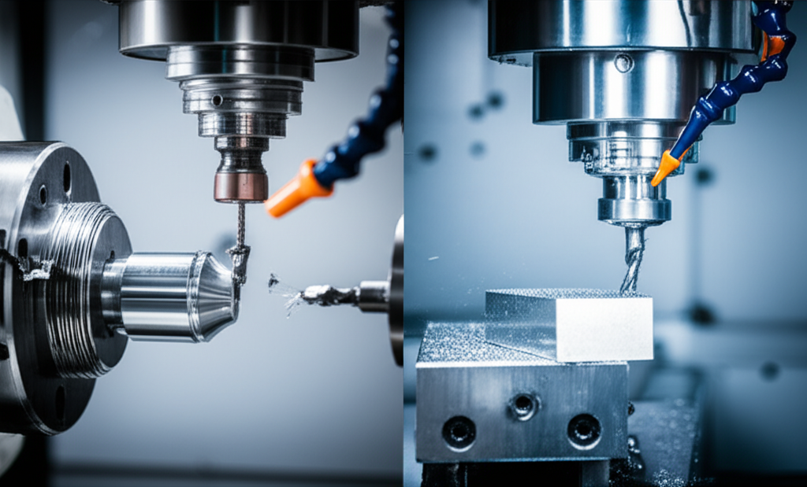

# Guía Completa sobre Diferencias clave entre torno y fresadora CNC

El mundo del mecanizado CNC puede parecer abrumador para los principiantes.  Dos máquinas clave, el torno CNC y la fresadora CNC, a menudo causan confusión.  Esta guía completa desglosa las diferencias clave entre ambas, ayudándote a comprender sus capacidades y aplicaciones para que puedas elegir la herramienta adecuada para tu proyecto.

## ¿Qué es un Torno CNC?

Un torno CNC es una máquina herramienta que utiliza una herramienta rotatoria para cortar material de una pieza de trabajo cilíndrica que también rota.  Imagina una herramienta que "corta" la pieza mientras gira.  La pieza de trabajo se sujeta en un mandril y gira sobre su eje, mientras que la herramienta se mueve en un plano paralelo a ese eje para generar diferentes formas.

**Aplicaciones comunes del torno CNC:**

* **Fabricación de piezas cilíndricas:** Ejes, pernos, engranajes, etc.
* **Creación de roscas:** Interna y externa.
* **Torneado de precisión:**  Para crear piezas con tolerancias muy ajustadas.
* **Mecanizado de superficies curvas:**  Creando formas complejas a partir de un cilindro.

**Ventajas del torno CNC:**

* **Alta precisión:**  Capaz de producir piezas con tolerancias muy pequeñas.
* **Alta eficiencia:**  Automatiza el proceso de torneado, reduciendo el tiempo de fabricación.
* **Repetibilidad:**  Produce piezas idénticas de forma consistente.

**Limitaciones del torno CNC:**

* **Limitado a piezas cilíndricas:** No es ideal para piezas con geometrías complejas que no sean esencialmente cilíndricas.
* **Dificultad para realizar operaciones complejas de mecanizado:**  Las operaciones son principalmente en un plano.

## ¿Qué es una Fresadora CNC?

Una fresadora CNC es una máquina herramienta que utiliza una herramienta rotatoria para cortar material de una pieza de trabajo estacionaria.  A diferencia del torno, la herramienta se mueve en múltiples ejes (X, Y y Z) para crear una variedad de formas.  La pieza de trabajo se fija en una mesa y permanece estática mientras la herramienta esculpe la forma deseada.

**Aplicaciones comunes de la fresadora CNC:**

* **Fabricación de piezas con formas complejas:**  Desde simples bloques hasta formas tridimensionales intrincadas.
* **Ranurado, taladrado y fresado:**  Una amplia gama de operaciones de mecanizado.
* **Grabado y escultura:**  Creación de detalles finos y relieves.
* **Corte de metales y otros materiales:**  Una herramienta versátil para diferentes materiales.

**Ventajas de la fresadora CNC:**

* **Versatilidad:**  Capacidad para realizar una gran variedad de operaciones de mecanizado en múltiples planos.
* **Precisión:**  Produce piezas con alta precisión y detalles finos.
* **Automatización:**  Aumenta la eficiencia y la productividad.

**Limitaciones de la fresadora CNC:**

* **Mayor costo inicial:** Generalmente más caras que los tornos CNC.
* **Mayor complejidad de programación:**  Requiere un conocimiento más profundo de programación CNC.

## Tabla comparativa: Torno CNC vs Fresadora CNC

| Característica        | Torno CNC                      | Fresadora CNC                    |
|-----------------------|---------------------------------|-----------------------------------|
| **Movimiento de la herramienta** | Paralelo al eje de rotación     | Múltiples ejes (X, Y, Z)           |
| **Movimiento de la pieza** | Rota                             | Estática                          |
| **Forma de la pieza** | Principalmente cilíndrica      | Variada, formas complejas         |
| **Aplicaciones comunes** | Ejes, pernos, roscas           | Piezas complejas, grabados        |
| **Precisión**           | Alta                             | Alta                             |
| **Costos**              | Generalmente menor              | Generalmente mayor                 |
| **Complejidad**         | Menor                            | Mayor                            |

## Conclusión

Tanto el torno CNC como la fresadora CNC son herramientas esenciales en el mecanizado moderno. La elección entre ambas depende en gran medida de la geometría de la pieza y las operaciones de mecanizado requeridas.  Comprender las diferencias clave entre estos dos tipos de máquinas es crucial para cualquier principiante que desee adentrarse en el fascinante mundo del mecanizado CNC.  Recuerda que la práctica y la experiencia son fundamentales para dominar el uso de estas potentes máquinas.