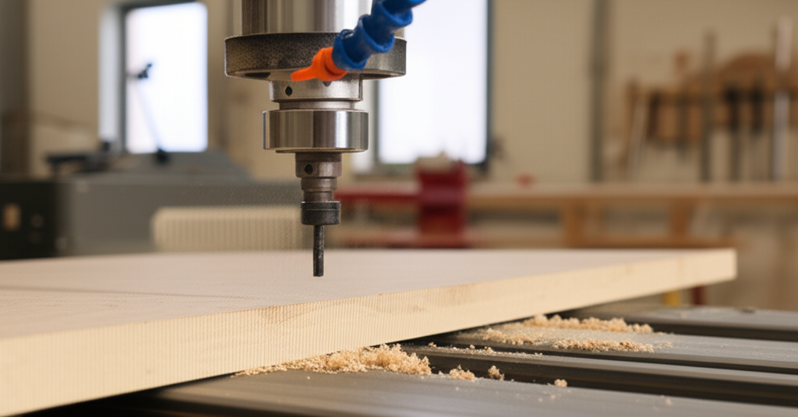

# Guía de materiales CNC para empezar

Esta guía proporciona una introducción completa a los diferentes materiales que puedes trabajar con una máquina CNC, enfocándose en las propiedades, ventajas y desventajas de cada uno para principiantes.  Elegir el material correcto es crucial para obtener resultados exitosos.

## Tipos de Materiales CNC

Las máquinas CNC pueden trabajar una amplia variedad de materiales, pero algunos son más comunes que otros para principiantes.  Estos incluyen:

### 1. Madera:

* **Tipos:** Madera blanda (pino, abeto, cedro), madera dura (roble, cerezo, nogal), contrachapado, MDF (Medium Density Fiberboard), aglomerado.
* **Ventajas:** Fácil de trabajar, relativamente barata, variedad de acabados disponibles, buena estética.
* **Desventajas:** Puede ser susceptible a la humedad,  puede astillarse o quemarse si la velocidad de corte es incorrecta, requiere afilado frecuente de las herramientas.
* **Aplicaciones:** Modelos, figuras, cajas, grabados, prototipos.

### 2. Plásticos:

* **Tipos:** Acrílico (plexiglás), PVC, polietileno (PE), polipropileno (PP), ABS, PETG.
* **Ventajas:** Durabilidad, variedad de colores y acabados, resistente a la humedad y a los productos químicos (dependiendo del tipo), facilidad de limpieza.
* **Desventajas:** Algunos plásticos pueden producir humos tóxicos al ser cortados, requieren herramientas específicas para su procesamiento, pueden ser más costosos que la madera.
* **Aplicaciones:** Señalización, piezas funcionales, prototipos, carcasas.

#### 2.1 Acrílico (Plexiglás):

* **Ventajas:** Transparente, brillante, resistente a los impactos, fácil de pulir.
* **Desventajas:** Puede rayarse fácilmente, se derrite con facilidad si la velocidad de corte o la potencia son demasiado altas.


#### 2.2 PVC:

* **Ventajas:** Económico, resistente, fácil de encontrar.
* **Desventajas:** Puede liberar gases tóxicos durante el corte, requiere herramientas específicas para evitar daños.


### 3. Metales:

* **Tipos:** Aluminio, acero, latón, cobre.
* **Ventajas:** Alta durabilidad, resistencia, precisión en el mecanizado.
* **Desventajas:** Requiere herramientas de corte especiales (brocas de metal duro),  genera calor durante el corte, puede ser costoso y difícil de trabajar para principiantes.  Requiere equipo de seguridad adicional.
* **Aplicaciones:** Piezas mecánicas, herramientas, joyería.

#### 3.1 Aluminio:

* **Ventajas:** Ligero, fácil de mecanizar en comparación con otros metales.
* **Desventajas:** Puede ser más caro que otros materiales, requiere refrigeración durante el corte para evitar el sobrecalentamiento.


### Consideraciones adicionales:

* **Grosor del material:**  Influye en la velocidad de corte y la profundidad de pasada.
* **Tipo de herramienta:**  Las herramientas deben ser adecuadas para el material que se está trabajando.
* **Velocidad de corte:**  Una velocidad de corte incorrecta puede provocar astillamiento, quemaduras o roturas de la herramienta.
* **Profundidad de pasada:**  Determina la profundidad de corte en cada pasada de la herramienta.
* **Refrigeración:** Para ciertos materiales, especialmente metales, es necesaria la refrigeración para evitar el sobrecalentamiento.
* **Seguridad:** Siempre use equipo de protección personal (EPP) adecuado, como gafas de seguridad, máscara antipolvo y guantes.


##  Conclusión:

La elección del material dependerá del proyecto, tu presupuesto y tu experiencia.  Comenzar con materiales como madera blanda o acrílico es una buena opción para principiantes, ya que son fáciles de trabajar y relativamente económicos.  A medida que ganes experiencia, puedes explorar materiales más complejos.  Recuerda siempre priorizar la seguridad y la correcta configuración de tu máquina CNC.
```