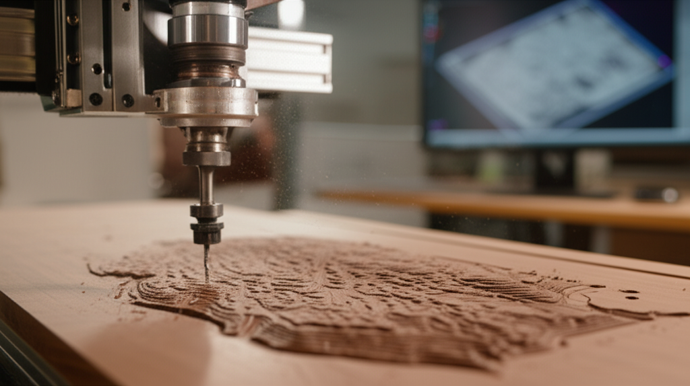

La fresadora es, sin lugar a dudas, una de las máquinas herramienta más versátiles e importantes en el mundo de la fabricación. Si alguna vez te has preguntado cómo se crean piezas metálicas con formas complejas, desde el molde para una botella de plástico hasta un componente de un motor de Fórmula 1, la respuesta casi siempre involucra a una fresadora.

En este artículo, vamos a desglosar todo lo que necesitas saber sobre esta fascinante máquina, poniendo especial énfasis en su versión más moderna y potente: la fresadora CNC.

## ¿Qué es Exactamente una Fresadora?

En esencia, una fresadora es una máquina herramienta que utiliza una herramienta de corte giratoria, llamada **fresa**, para eliminar material de una pieza de trabajo. Este proceso se conoce como **mecanizado por arranque de viruta**.

Imagina un escultor que, en lugar de un cincel y un martillo, utiliza un taladro de altísima precisión que puede moverse en múltiples direcciones para dar forma a un bloque de material. La fresadora opera bajo un principio similar: la pieza de trabajo se sujeta firmemente a una mesa móvil, mientras que la fresa gira a gran velocidad. Al mover la mesa (o el cabezal de la fresa), la herramienta va "comiendo" el material sobrante hasta obtener la geometría deseada.

La principal diferencia con un torno es que, en el fresado, **la herramienta de corte gira y la pieza permanece estática o se mueve linealmente**, mientras que en el torneado, la pieza de trabajo gira y la herramienta de corte se desplaza.

## Partes Clave de una Fresadora CNC

Aunque existen muchos tipos, la mayoría de las fresadoras CNC comparten una estructura y componentes fundamentales:

*   **Bancada o Base:** Es la estructura que soporta toda la máquina, proporcionando estabilidad y amortiguando las vibraciones durante el mecanizado.
*   **Mesa de Trabajo:** La superficie donde se sujeta firmemente la pieza a mecanizar. En las máquinas CNC, esta mesa puede moverse en los ejes X e Y.
*   **Columna:** La estructura vertical que soporta el cabezal.
*   **Husillo (Spindle):** Es el corazón de la máquina. Es el eje que sujeta y hace girar la fresa a miles de revoluciones por minuto (RPM).
*   **Cabezal:** Contiene el husillo y el motor que lo acciona. En muchas fresadoras, el cabezal puede moverse verticalmente (eje Z).
*   **Fresa (Herramienta de Corte):** La herramienta que realiza el corte. Existen infinidad de tipos de fresas según el material a cortar y la operación a realizar (planear, ranurar, contornear, etc.).
*   **Controlador CNC (Control Numérico por Computadora):** El cerebro de la máquina. Interpreta las instrucciones de un programa (generalmente en **código G**) y traduce esos comandos en movimientos precisos de los ejes y en la velocidad de giro del husillo.

## ¿Cómo Funciona el Proceso de Fresado CNC?

El proceso de fresado CNC transforma un diseño digital en un objeto físico siguiendo estos pasos:

1.  **Diseño (CAD):** Todo comienza con un modelo 3D de la pieza, creado en un software de Diseño Asistido por Computadora (CAD).
2.  **Programación (CAM):** Este modelo 3D se importa a un software de Fabricación Asistida por Computadora (CAM). Aquí, el programador define las estrategias de mecanizado: qué herramientas usar, las velocidades de corte, las trayectorias de la herramienta, etc. El software CAM genera el código G.
3.  **Preparación (Setup):** El operario de la máquina monta la pieza de trabajo en la mesa, instala la fresa correcta en el husillo y establece el "punto cero" o punto de referencia desde el cual la máquina comenzará a trabajar.
4.  **Ejecución:** El operario carga el código G en el controlador CNC y pulsa el botón de inicio. La máquina ejecuta el programa de forma autónoma, moviendo los ejes y la herramienta con una precisión micrométrica para mecanizar la pieza.

## Tipos de Fresadoras

Las fresadoras se pueden clasificar principalmente por la orientación de su husillo:

### Fresadora Vertical

El husillo está orientado verticalmente. Son las más comunes en talleres y son ideales para trabajos como planeado de superficies, creación de cavidades (cajeras) y contorneado.

### Fresadora Horizontal

El husillo está orientado horizontalmente. Son más robustas y se utilizan para trabajos más pesados, como el mecanizado de ranuras largas o el corte de engranajes. Las virutas caen por gravedad, lo que mejora la evacuación.

### Fresadora Universal

Combina las capacidades de ambas, ya que su cabezal puede girar para trabajar tanto en posición vertical como horizontal, ofreciendo una flexibilidad máxima.

## ¿Para Qué Sirve una Fresadora? Aplicaciones Reales

La versatilidad de la fresadora CNC la hace indispensable en casi cualquier sector industrial. Aquí tienes algunos ejemplos:

*   **Industria Aeroespacial:** Fabricación de componentes estructurales de alta precisión para aviones y cohetes.
*   **Sector Automotriz:** Creación de moldes de inyección de plástico, matrices para estampar chapa y mecanizado de bloques de motor.
*   **Medicina:** Producción de implantes personalizados (prótesis de cadera, implantes dentales) e instrumental quirúrgico.
*   **Prototipado Rápido:** Creación de prototipos funcionales de un nuevo producto antes de pasar a la producción en masa.
*   **Fabricación de Moldes y Matrices:** Es la aplicación por excelencia. Casi cualquier objeto de plástico que uses ha salido de un molde fabricado en una fresadora.
*   **Arte y Joyería:** Creación de diseños complejos y personalizados en madera, metales preciosos o resinas.

## Conclusión: Precisión y Potencia al Servicio de la Creación

La fresadora ha evolucionado desde una máquina manual y robusta hasta convertirse en un centro de mecanizado CNC de alta tecnología, capaz de crear casi cualquier forma imaginable con una precisión asombrosa. Es una herramienta que no solo corta metal, sino que da forma a las ideas y materializa la innovación.

Ahora que conoces los fundamentos de qué es una fresadora y su inmenso potencial, estás listo para explorar en más detalle los tipos de fresas, las operaciones de mecanizado y los secretos para sacarle el máximo partido a esta increíble máquina.

## Explora el Hub de Contenido

Este artículo es parte de nuestra guía completa sobre el tema. Continúa aprendiendo con nuestros otros posts:

- **[Qué es una Fresadora y Para Qué Sirve: La Guía Definitiva](../como-nivelar-la-cama-de-tu-fresadora-3018/)**
- **[Qué es una Fresadora CNC y Cómo Funciona: Guía Completa](../las-5-herramientas-de-fresado-mas-importantes-para-empezar/)**
