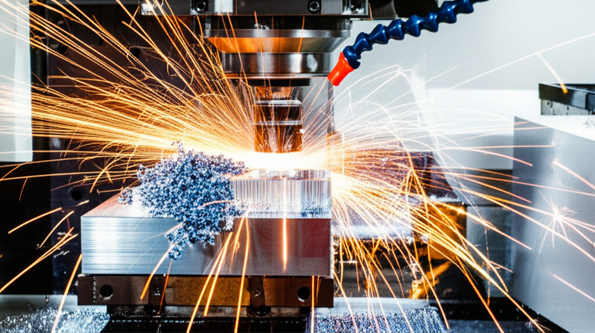

El fresado CNC es una de las tecnologías más importantes y versátiles en la industria de la fabricación moderna. Desde la creación de prototipos rápidos hasta la producción en masa de piezas de alta precisión, las fresadoras controladas por ordenador han revolucionado la forma en que damos forma a los materiales.

Si eres nuevo en el mundo del mecanizado o simplemente quieres entender mejor esta increíble tecnología, has llegado al lugar correcto. En esta guía completa, desglosaremos todo lo que necesitas saber sobre las fresadoras CNC.

## ¿Qué es Exactamente una Fresadora CNC?

Una **fresadora CNC (Control Numérico por Computadora)** es una máquina-herramienta que utiliza controles computarizados y herramientas de corte giratorias para eliminar material de una pieza de trabajo y darle una forma específica. A diferencia del fresado manual, donde un operario controla los movimientos de la máquina mediante volantes, una fresadora CNC sigue un programa informático predefinido.

Este proceso se conoce como **fabricación sustractiva**, ya que "sustrae" o elimina material de un bloque sólido (conocido como *blank* o pieza en bruto) para revelar la pieza final. Puede trabajar con una amplia gama de materiales, incluyendo:

*   Metales (aluminio, acero, titanio, latón)
*   Plásticos (ABS, policarbonato, nylon)
*   Madera y compuestos
*   Espumas y ceras para modelado

## El Proceso de Fresado CNC: Paso a Paso

El viaje desde una idea digital hasta una pieza física sigue un flujo de trabajo bien definido. Aquí están los pasos clave:

1.  **Diseño Asistido por Ordenador (CAD):** Todo comienza con un modelo 2D o 3D de la pieza deseada. Este diseño se crea utilizando software CAD como Autodesk Fusion 360, SolidWorks o CATIA.

2.  **Fabricación Asistida por Ordenador (CAM):** El modelo CAD se importa a un software CAM. Este software traduce el diseño en un conjunto de instrucciones que la fresadora puede entender. Genera las trayectorias de la herramienta y crea el **Código G** (G-Code), el lenguaje de programación que dirige los movimientos, la velocidad del husillo y otras funciones de la máquina.

3.  **Configuración de la Máquina (Setup):** Antes de ejecutar el programa, un operario debe preparar la fresadora. Esto incluye:
    *   Fijar firmemente la pieza en bruto a la mesa de trabajo.
    *   Cargar la herramienta de corte correcta (fresa) en el husillo.
    *   Establecer el punto de origen de la pieza (el punto cero de los ejes X, Y y Z) para que la máquina sepa dónde empezar.

4.  **Ejecución del Programa:** Con todo listo, el operario carga el Código G en el control de la CNC y pulsa el botón de inicio. La máquina ejecuta el programa de forma autónoma, moviendo la herramienta de corte con precisión para mecanizar la pieza según las especificaciones del diseño.

## Componentes Clave de una Fresadora CNC

Aunque existen muchos tipos y tamaños, la mayoría de las fresadoras CNC comparten estos componentes fundamentales:

*   **Bancada y Columna:** Es la estructura principal que soporta todos los demás componentes y proporciona rigidez para resistir las fuerzas del mecanizado.
*   **Husillo (Spindle):** Es el corazón de la máquina. Un motor hace girar el husillo a altas velocidades, y es aquí donde se sujeta la herramienta de corte.
*   **Mesa de Trabajo:** La superficie donde se monta la pieza de trabajo. Se mueve a lo largo de los ejes X e Y.
*   **Ejes de Movimiento:** Servomotores o motores paso a paso controlan el movimiento preciso a lo largo de los ejes X (izquierda-derecha), Y (adelante-atrás) y Z (arriba-abajo).
*   **Cambiador Automático de Herramientas (ATC):** Muchas fresadoras modernas tienen un carrusel que almacena múltiples herramientas. El ATC puede cambiar automáticamente las fresas durante un programa, permitiendo operaciones complejas sin intervención humana.
*   **Sistema de Control (CNC):** El "cerebro" de la máquina. Es un ordenador industrial que lee el Código G e interpreta las instrucciones para controlar los motores, el husillo y el refrigerante.

## Tipos de Fresadoras CNC por Número de Ejes

La capacidad de una fresadora se define a menudo por su número de ejes, que determina la complejidad de las piezas que puede fabricar.

### Fresadoras de 3 Ejes
Son las más comunes. La herramienta de corte se mueve en los ejes X, Y y Z. Son perfectas para piezas prismáticas, taladrado, ranurado y contorneado en superficies planas.

### Fresadoras de 4 Ejes
Añaden un eje de rotación (generalmente llamado eje A) a la configuración de 3 ejes. Esto permite mecanizar los lados de una pieza sin necesidad de volver a montarla manualmente, ideal para grabados en cilindros o piezas con características laterales.

### Fresadoras de 5 Ejes
Son la cúspide de la tecnología de fresado. Además de los ejes X, Y y Z, tienen dos ejes de rotación (A y B, o B y C). Esto permite que la herramienta de corte se acerque a la pieza desde prácticamente cualquier ángulo. Son esenciales para fabricar geometrías extremadamente complejas, como álabes de turbinas o implantes médicos, en una sola configuración.

## Ventajas del Fresado CNC

¿Por qué es tan dominante esta tecnología? Las razones son claras:

*   **Precisión y Repetibilidad:** Las máquinas CNC pueden producir miles de piezas idénticas con tolerancias muy ajustadas, algo imposible de lograr manualmente.
*   **Complejidad:** Permiten la creación de formas y geometrías que serían inviables con métodos tradicionales.
*   **Eficiencia:** Una vez programadas, las máquinas pueden funcionar de forma continua con una supervisión mínima, aumentando la productividad y reduciendo los costes de mano de obra.
*   **Seguridad:** El proceso automatizado mantiene al operario alejado de la herramienta de corte en movimiento, reduciendo el riesgo de accidentes.

El fresado CNC es una tecnología fascinante que combina la creatividad del diseño digital con el poder de la ingeniería mecánica. Entender sus fundamentos es el primer paso para aprovechar todo su potencial en tus propios proyectos o en tu carrera profesional.

## Explora el Hub de Contenido

Este artículo es parte de nuestra guía completa sobre el tema. Continúa aprendiendo con nuestros otros posts:

- **[¿Qué es una Fresadora CNC y Cómo Funciona? Guía Completa](../como-nivelar-la-cama-de-tu-fresadora-3018/)**
- **[Qué es una Fresadora y Para Qué Sirve: La Guía Definitiva](../las-5-herramientas-de-fresado-mas-importantes-para-empezar/)**
