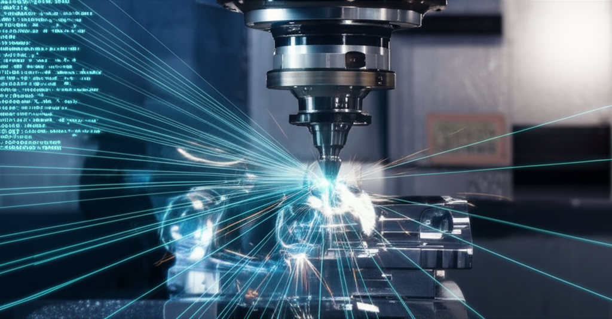

Si alguna vez te has preguntado cómo una máquina CNC sabe exactamente dónde cortar, taladrar o fresar, la respuesta se encuentra en un lenguaje de programación con décadas de historia: el **Código G**. Aunque pueda parecer un conjunto de letras y números crípticos, es el idioma universal que permite a los humanos comunicar instrucciones precisas a la maquinaria controlada por ordenador.

Piénsalo como una receta de cocina muy detallada. Cada línea de código es un paso específico que le dice a la máquina qué herramienta usar, a qué velocidad moverse y qué trayectoria seguir. Sin el código G, nuestros diseños digitales (CAD) nunca podrían convertirse en objetos físicos.

## El Idioma Universal de la Fabricación CNC

El Código G, formalmente conocido como **RS-274**, es el lenguaje de programación más común para el Control Numérico Computarizado (CNC). Su función principal es dictar tres aspectos clave del movimiento de una máquina:

1.  **La trayectoria de la herramienta.**
2.  **La velocidad del movimiento.**
3.  **La secuencia de las operaciones.**

Cada línea de código, llamada "bloque", contiene una o más órdenes que la controladora de la máquina CNC lee y ejecuta en secuencia. Es un lenguaje estandarizado, lo que significa que un código escrito para una fresadora tendrá una estructura muy similar al de un torno o una impresora 3D, aunque existan "dialectos" o variaciones específicas para cada fabricante.

## Anatomía de una Línea de Código G

Una línea típica de código G está compuesta por "palabras", que son una letra seguida de un número. Cada letra tiene un significado específico.

Veamos un bloque de ejemplo: `G01 X100 Y50 F200;`

*   **G01**: Este es el comando principal. `G` se refiere a un comando de movimiento (Geométrico). `01` especifica un movimiento de interpolación lineal (moverse en línea recta).
*   **X100 Y50**: Estas son las coordenadas del eje. Le dice a la máquina que se mueva al punto con coordenada X=100 mm y Y=50 mm.
*   **F200**: Define la velocidad de avance (`Feed Rate`). En este caso, 200 mm por minuto.
*   **;**: El punto y coma marca el final del bloque (en muchos controladores es opcional).

## Comandos G y M: Las Órdenes Fundamentales

Los comandos en este lenguaje se dividen principalmente en dos categorías: Códigos G y Códigos M.

### Códigos G (Códigos Geométricos)

Son los más comunes y controlan el movimiento de la máquina y cómo se mueve.

*   **G00 (Movimiento Rápido):** Mueve la herramienta a la máxima velocidad posible desde el punto actual al punto especificado. Se usa para posicionamiento, no para cortar.
*   **G01 (Interpolación Lineal):** Mueve la herramienta en línea recta a una velocidad de avance (`F`) definida. Es el comando principal para el mecanizado.
*   **G02 (Interpolación Circular Horaria):** Crea un arco en el sentido de las agujas del reloj.
*   **G03 (Interpolación Circular Antihoraria):** Crea un arco en sentido contrario a las agujas del reloj.
*   **G90 (Coordenadas Absolutas):** Interpreta todas las coordenadas como posiciones absolutas con respecto al origen de la pieza (G54, G55, etc.).
*   **G91 (Coordenadas Incrementales):** Interpreta las coordenadas como distancias relativas desde la posición actual.

### Códigos M (Códigos Misceláneos)

Controlan funciones auxiliares de la máquina que no están relacionadas con el movimiento de los ejes.

*   **M03 (Activar Husillo en Sentido Horario):** Enciende el motor principal (spindle).
*   **M05 (Detener Husillo):** Apaga el motor principal.
*   **M08 (Activar Refrigerante):** Abre la válvula del líquido refrigerante.
*   **M09 (Detener Refrigerante):** Cierra la válvula del líquido refrigerante.
*   **M30 (Fin del Programa):** Finaliza el programa y resetea la máquina.

## Ejemplo Práctico: Dibujando un Cuadrado con Código G

Para entenderlo mejor, veamos un programa simple que cortaría un cuadrado de 50x50 mm.

gcode
G21 G90 G17 ; Establecer unidades en mm, coordenadas absolutas, plano XY
G54 ; Usar el sistema de coordenadas de trabajo 1
M03 S1200 ; Encender el husillo a 1200 RPM

G00 Z5 ; Moverse rápidamente 5mm por encima de la pieza
G00 X0 Y0 ; Ir a la esquina de inicio (0,0)

G01 Z-2 F100 ; Bajar la herramienta 2mm en la pieza a 100mm/min
G01 X50 F200 ; Cortar una línea hasta X=50
G01 Y50 ; Cortar una línea hasta Y=50
G01 X0 ; Cortar una línea hasta X=0
G01 Y0 ; Cortar una línea de vuelta al inicio

G00 Z5 ; Levantar la herramienta
M05 ; Apagar el husillo
M30 ; Fin del programa

## ¿Cómo se Genera el Código G? El Rol del Software CAM

Aunque es posible escribir código G a mano para operaciones simples, para piezas complejas sería una tarea titánica y propensa a errores. Aquí es donde entra el **software CAM (Computer-Aided Manufacturing)**.

El flujo de trabajo moderno es:
1.  **CAD (Computer-Aided Design):** Se crea un modelo 2D o 3D de la pieza.
2.  **CAM (Computer-Aided Manufacturing):** Se importa el modelo CAD. En el software CAM, se definen las herramientas, las estrategias de mecanizado (desbaste, acabado), las velocidades y los avances.
3.  **Post-procesado:** El software CAM utiliza un "post-procesador" específico para tu máquina para traducir las estrategias de mecanizado a un archivo de código G optimizado.
4.  **Control CNC:** Este archivo `.nc` o `.tap` se carga en el software de control de la máquina CNC, que lo lee y ejecuta las órdenes.

## Conclusión: El Código G no es tan Intimidante como Parece

El código G es la columna vertebral de la fabricación CNC. Es el puente esencial entre la idea digital y el objeto físico. Aunque los programas CAM automatizan su creación, entender los fundamentos del código G te da un control mucho mayor sobre el proceso de mecanizado. Te permite depurar errores, optimizar operaciones y, en definitiva, convertirte en un operario CNC mucho más competente.

La próxima vez que veas una máquina CNC moverse con una precisión asombrosa, recuerda las líneas de código G que guían cada uno de sus movimientos.

## Explora el Hub de Contenido

Este artículo es parte de nuestra guía completa sobre el tema. Continúa aprendiendo con nuestros otros posts:

- **[Software CNC: La Guía Definitiva para Entender CAD, CAM y Control](../disenando-tu-primera-pieza-2d-en-un-software-cad-gratuito/)**
- **[Software CNC: La Guía Definitiva para Entender y Elegir el Correcto](../de-modelo-3d-a-g-code-tu-primer-proyecto-cam/)**
- **[Software CNC: La Guía Completa para Elegir el Mejor en 2024](../los-5-mejores-programas-de-control-cnc-para-grbl/)**
