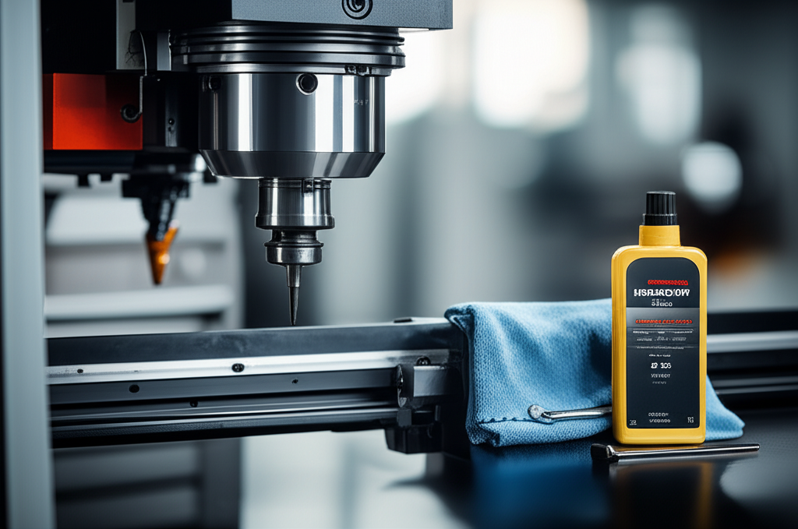

## Introducción

¿Alguna vez has encendido tu fresadora CNC y has escuchado un ruido extraño que te ha helado la sangre? Ese miedo a que algo caro y complejo se rompa es muy común cuando empezamos. Pensamos en reparaciones costosas, tiempo perdido y proyectos parados. Pero, ¿y si te dijera que la mejor "reparación" es la que nunca tienes que hacer? Aquí es donde entra en juego la magia del cuidado constante. En esta **Guía de Mantenimiento Preventivo para tu Fresadora CNC**, vamos a desglosar, paso a paso y sin palabras raras, cómo puedes cuidar tu máquina para que te dure años y funcione siempre con la máxima precisión. Al terminar de leer, tendrás una lista de tareas clara y la confianza para convertirte en el mejor amigo de tu fresadora.

## ¿Por Qué es Tan Importante el Mantenimiento Preventivo?

Muchos principiantes ven el mantenimiento como una tarea aburrida que les quita tiempo de fabricar piezas. ¡Gran error! Piénsalo como la revisión médica de tu máquina. Unos minutos al día o a la semana pueden ahorrarte miles de euros y muchísimos dolores de cabeza.

El mantenimiento preventivo no es solo para "evitar que se rompa", sus beneficios van mucho más allá:

*   **Prolonga la vida útil:** Una máquina bien cuidada es una máquina que dura mucho más tiempo. Es una inversión que proteges.
*   **Mantiene la precisión:** La suciedad, la falta de lubricación y las piezas sueltas son los peores enemigos de la precisión. Un buen mantenimiento asegura que tus cortes sean siempre exactos.
*   **Ahorra dinero:** Prevenir una avería es muchísimo más barato que repararla. Cambiar un filtro a tiempo es mejor que cambiar un **husillo** (el motor que hace girar la fresa) quemado.
*   **Aumenta la seguridad:** Una máquina con cables pelados, fugas de líquido o piezas mal ajustadas es un riesgo para ti y para tu taller.

## Tu Checklist Diario: 5 Minutos que Marcan la Diferencia

Esta rutina es tan importante como tomarte el café por la mañana. No te llevará más de 5 minutos y es la primera línea de defensa para tu fresadora. Hazlo siempre al final de tu jornada de trabajo.

1.  **Limpieza general:** ¡Fuera **virutas**! Las virutas (los restos de material que se generan al cortar) son el enemigo público número uno. Usa una brocha, un aspirador de taller o aire comprimido (con cuidado de no meter la suciedad en sitios delicados) para quitar todas las virutas de la mesa de trabajo, las guías y los recovecos.
2.  **Revisar el nivel de refrigerante:** El refrigerante (también llamado taladrina) es el líquido que enfría la herramienta y la pieza. Asegúrate de que el nivel en el depósito es el correcto. Trabajar sin él puede destruir tus fresas y dañar la pieza.
3.  **Inspección visual rápida:** Echa un vistazo general. ¿Ves algún cable suelto? ¿Alguna manguera con fugas? ¿Algo que no estaba ahí ayer? Detectar estos problemas a tiempo es clave.
4.  **Vaciar el recolector de virutas:** Si tu máquina tiene un sistema de recolección, vacíalo. Empezar el día con el cubo lleno es empezar con mal pie.

## Mantenimiento Semanal: Profundizando un Poco Más

Una vez a la semana, dedícale un poco más de cariño a tu máquina. Aquí nos pondremos un poco más "técnicos", pero no te asustes, es muy sencillo.

*   **Limpieza a fondo de guías y husillos de bolas:** Las **guías lineales** son los raíles por los que se mueven los ejes (X, Y, Z) de tu máquina. Los **husillos de bolas** son los tornillos largos que convierten el giro de los motores en movimiento lineal. Estas dos partes deben estar impecables y bien lubricadas. Pasa un trapo limpio que no suelte pelusa para quitar cualquier resto de suciedad o refrigerante viejo.
*   **Lubricación de puntos clave:** ¡Este paso es VITAL! Tu máquina tiene varios **puntos de engrase**. Son pequeños conectores (a menudo llamados "alemites") donde se inyecta grasa o aceite. Consulta el manual de tu máquina para saber:
    *   **Dónde** están estos puntos.
    *   **Qué tipo** de lubricante usar (¡usar el incorrecto puede ser desastroso!).
    *   **Con qué frecuencia** hacerlo.
*   **Revisar y limpiar filtros:** Tu máquina puede tener filtros para el aire comprimido o para el sistema de refrigerante. Un filtro sucio obliga a la máquina a trabajar más y puede causar fallos. Límpialos o cámbialos según las indicaciones del fabricante.

## Guía de Mantenimiento Preventivo para tu Fresadora CNC: Tareas Mensuales

Cada mes, es hora de hacer una revisión un poco más profunda. Esto asegura que los componentes que no se ven a diario también están en buen estado.

### Tareas Mensuales

*   **Inspección de correas:** Si tu máquina usa correas para mover los ejes o el husillo, comprueba su tensión y busca signos de desgaste o grietas. Una correa floja provoca pérdida de precisión y una rota para la producción por completo.
*   **Limpieza del tanque de refrigerante:** Con el tiempo, en el fondo del tanque de refrigerante se acumulan virutas finas y aceite. Vacíalo, límpialo a fondo y rellénalo con refrigerante nuevo. Esto mejora la refrigeración y evita malos olores.
*   **Revisión de la nivelación:** Comprueba con un nivel de precisión que la máquina sigue perfectamente horizontal. Una máquina desnivelada puede sufrir torsiones en su estructura y perder precisión a largo plazo.

## Conclusión

Como has visto, el mantenimiento preventivo no es una ciencia oculta, sino una serie de hábitos sencillos que marcan una enorme diferencia. Cuidar tu fresadora CNC es cuidar tu inversión, tu tiempo y la calidad de tu trabajo. Incorporar estas rutinas diarias, semanales y mensuales te dará la tranquilidad de saber que tu máquina está siempre lista para funcionar al 100%. No lo veas como una tarea, sino como parte del oficio de ser un operador CNC responsable y profesional.

¿Qué tarea de mantenimiento te da más respeto o sobre cuál tienes más dudas? ¡Cuéntamelo en los comentarios y te ayudo a resolverlas!

## Preguntas Frecuentes

### ¿Qué pasa si me salto la limpieza diaria un par de veces?

Aunque un día no parezca grave, las virutas acumuladas pueden compactarse en las guías lineales o en los husillos de bolas. Esta acumulación puede causar atascos, forzar los motores y, lo más importante, reducir drásticamente la precisión de tus cortes. La limpieza diaria es el hábito más importante que puedes adquirir.

### ¿Puedo usar cualquier tipo de aceite o grasa para lubricar?

¡Absolutamente no! Cada máquina está diseñada para funcionar con lubricantes específicos. Usar una grasa demasiado espesa o un aceite demasiado líquido puede ser tan malo como no lubricar. Consulta **siempre** el manual del fabricante de tu fresadora para saber exactamente qué producto usar. Es la única fuente fiable.

### ¿Necesito herramientas especiales para hacer este mantenimiento?

Para la mayoría de las tareas descritas (limpieza, inspección visual, rellenar niveles), no necesitas nada especial más allá de brochas, trapos y un aspirador de taller. Para la lubricación y ajustes, normalmente te bastará con un buen juego de llaves Allen, llaves fijas y una pistola de engrase. El manual de tu máquina especificará si se requiere alguna herramienta particular.

## Explora el Hub de Contenido

Este artículo es parte de nuestra guía completa sobre el tema. Continúa aprendiendo con nuestros otros posts:

- **[Tutorial: Cómo Calibrar los Ejes de tu CNC para Máxima Precisión](../como-calibrar-los-ejes-de-tu-cnc-para-maxima-precision/)**
- **[Solución de Problemas Comunes: Pasos Perdidos y Vibraciones en tu CNC](../solucion-de-problemas-comunes-pasos-perdidos-y-vibraciones/)**
