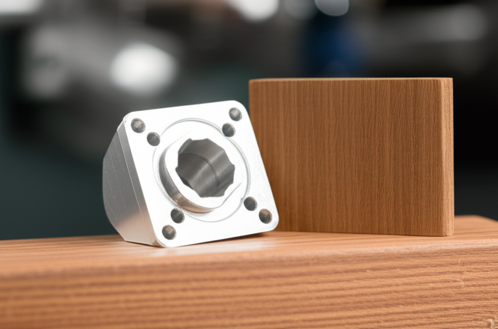

Seguramente has oído hablar del término "CNC" en contextos de fabricación, diseño o incluso en el mundo del bricolaje avanzado. Pero, ¿qué significa realmente y por qué ha revolucionado la forma en que creamos objetos? El Control Numérico por Computadora (CNC) es mucho más que una simple máquina; es el puente entre una idea digital y un objeto físico preciso.

En esta guía completa, desglosaremos todo lo que necesitas saber sobre el CNC, desde sus conceptos básicos hasta su funcionamiento interno y sus aplicaciones en el mundo real.

## ¿Qué es Exactamente el Control Numérico por Computadora (CNC)?

**CNC** son las siglas de **Control Numérico por Computadora**. En esencia, es un proceso de fabricación automatizado en el que un software de computadora preprogramado dicta el movimiento de las herramientas y maquinaria de una fábrica.

Imagina que en lugar de girar manivelas y palancas manualmente para cortar o dar forma a un material, una computadora lee un conjunto de instrucciones (un código) y ejecuta esos movimientos con una precisión y repetibilidad que un humano difícilmente podría igualar. Este proceso puede controlar una amplia variedad de máquinas complejas, desde fresadoras y tornos hasta cortadoras láser y impresoras 3D.

## El Proceso CNC: Del Diseño a la Pieza Real en 3 Pasos

El viaje desde un concepto en tu mente hasta una pieza terminada sigue un flujo de trabajo claro y definido.

1.  **Diseño Asistido por Computadora (CAD):** Todo comienza con un modelo digital. Utilizando software CAD como AutoCAD, Fusion 360 o SolidWorks, se crea un diseño 2D o 3D de la pieza final. Este archivo es el plano digital.

2.  **Fabricación Asistida por Computadora (CAM):** El archivo CAD por sí solo no le dice a la máquina cómo moverse. Aquí es donde entra el software CAM. Este programa traduce el modelo CAD a un lenguaje que la máquina CNC puede entender, llamado **Código G**. El software CAM genera las trayectorias de la herramienta, calcula las velocidades de corte y crea el programa de instrucciones paso a paso.

3.  **Mecanizado CNC:** Finalmente, el Código G se carga en el controlador de la máquina CNC. La máquina interpreta este código y comienza el proceso de mecanizado. Mueve la herramienta de corte (o el cabezal láser, extrusor, etc.) a lo largo de los ejes (X, Y, Z y a veces más) para cortar, taladrar, tallar o dar forma al material en bruto (como un bloque de metal, madera o plástico) hasta que coincida exactamente con el diseño CAD original.

## Anatomía de una Máquina CNC: ¿Cómo Funciona por Dentro?

Aunque existen muchos tipos de máquinas CNC, la mayoría comparte componentes fundamentales que trabajan en conjunto para lograr la magia.

### El Controlador: El Cerebro de la Operación
Es la computadora a bordo que lee el Código G y traduce esas instrucciones en señales eléctricas que se envían a los motores para controlar el movimiento y la velocidad de la máquina.

### El Lenguaje: Código G y Código M
El **Código G (Código Geométrico)** es el lenguaje principal del CNC. Le dice a la máquina *dónde* moverse. Por ejemplo, `G01 X10 Y5 F200` podría significar "muévete en línea recta a la coordenada X=10, Y=5 a una velocidad de 200 mm/min". El **Código M (Código Misceláneo)** controla funciones auxiliares de la máquina, como encender o apagar el husillo (`M03`), activar el refrigerante (`M08`) o cambiar de herramienta.

### La Estructura Mecánica: Los Ejes del Movimiento
La mayoría de las máquinas CNC operan en un sistema de coordenadas cartesiano.
*   **Eje X:** Movimiento de izquierda a derecha.
*   **Eje Y:** Movimiento de adelante hacia atrás.
*   **Eje Z:** Movimiento de arriba hacia abajo.

Las máquinas más avanzadas pueden tener ejes adicionales (A, B, C) que permiten la rotación para mecanizar piezas mucho más complejas.

### El Cabezal: La Herramienta en Acción
Este es el "músculo" de la máquina. Dependiendo del tipo de CNC, puede ser:
*   Un **husillo (spindle)** que gira una fresa o broca a altas velocidades.
*   Un **cabezal láser** para cortar o grabar.
*   Un **cuchillo** para cortar tela o vinilo.
*   Un **extrusor** en una impresora 3D.

## Ventajas Clave de la Tecnología CNC

El uso generalizado del CNC no es casualidad. Ofrece beneficios transformadores para la fabricación:

*   **Precisión y Repetibilidad:** Las máquinas CNC pueden producir miles de piezas idénticas con tolerancias increíblemente ajustadas, algo imposible de lograr a mano.
*   **Eficiencia y Velocidad:** Una vez programadas, las máquinas pueden funcionar 24/7 con una supervisión mínima, aumentando drásticamente la producción.
*   **Complejidad:** Permite la creación de geometrías complejas y diseños intrincados que serían extremadamente difíciles o imposibles de fabricar con métodos tradicionales.
*   **Seguridad:** El operador está alejado de la herramienta de corte, lo que reduce significativamente el riesgo de accidentes.
*   **Flexibilidad:** Cambiar de la producción de una pieza a otra es tan simple como cargar un nuevo programa de Código G, lo que permite una prototipado rápido y una producción de bajo volumen rentable.

## Conclusión: El Futuro es Preciso y Automatizado

El Control Numérico por Computadora ha dejado de ser una tecnología exclusiva de las grandes industrias para convertirse en una herramienta accesible para talleres pequeños, artistas y aficionados. Es la columna vertebral de la fabricación moderna, permitiendo una transición fluida desde la creatividad digital hasta la realidad tangible.

Entender qué es el CNC y cómo funciona es el primer paso para apreciar la precisión, la potencia y el potencial que se esconde detrás de casi todos los productos bien diseñados que usamos en nuestro día a día.