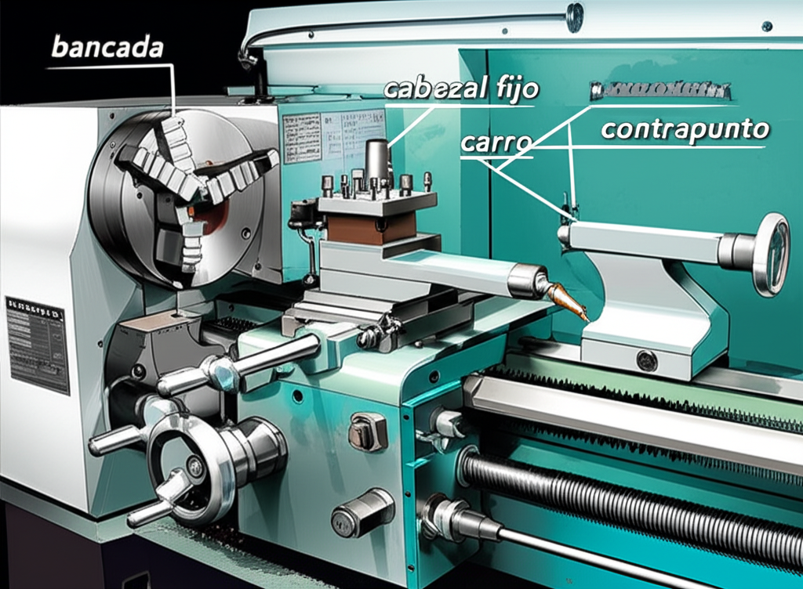

¡Bienvenido al fascinante universo del mecanizado de precisión! Si alguna vez te has preguntado cómo se fabrican las piezas metálicas cilíndricas con una perfección milimétrica, desde un simple eje hasta un componente aeroespacial complejo, la respuesta a menudo se encuentra en una máquina: el torno CNC.

Esta guía está diseñada para ti, el principiante curioso o el estudiante que da sus primeros pasos. Desmitificaremos el torno CNC, exploraremos sus componentes y te daremos la hoja de ruta para que empieces con confianza. ¡Vamos a ello!

## ¿Qué es un Torno CNC? Desmitificando el Concepto

Imagina a un alfarero moldeando arcilla en una rueda giratoria. Un torno funciona con un principio similar, pero en lugar de arcilla y manos, usamos metal (o plástico) y herramientas de corte de alta dureza.

### La Magia de la Sustracción de Material

El principio fundamental del torneado es la **sustracción de material**. La máquina hace girar una pieza de trabajo (generalmente una barra de material) a alta velocidad sobre su propio eje. Mientras gira, una herramienta de corte fija se desplaza de forma controlada y va "arrancando" virutas de material para darle la forma deseada.

A diferencia de una fresadora, donde la herramienta gira y la pieza permanece fija, en el torno, **la pieza de trabajo es la que gira**.

### CNC: El Cerebro detrás de la Precisión

Aquí es donde entra en juego la tecnología. **CNC** son las siglas de **Control Numérico por Computadora**. En lugar de mover las herramientas manualmente con manivelas, un ordenador interpreta un programa (escrito en un lenguaje llamado G-Code) y dirige los motores de la máquina con una precisión y repetibilidad asombrosas, imposibles de alcanzar a mano.

En resumen, un torno CNC es una máquina herramienta que da forma a piezas haciéndolas girar y eliminando material con herramientas de corte, todo ello controlado automáticamente por un ordenador.

## Anatomía de un Torno CNC: Conoce sus Partes Clave

Para operar un torno, primero debes conocer sus componentes principales. Pensemos en él como un cuerpo con diferentes partes que trabajan en perfecta armonía.

### El Cabezal (Headstock) y el Husillo (Spindle)

El cabezal es la "cabeza" de la máquina. Alberga el motor principal y el sistema de transmisión que hace girar al **husillo**. El husillo, a su vez, es el eje giratorio donde se sujeta la pieza de trabajo mediante un dispositivo de agarre, comúnmente un **plato de garras (chuck)**.

### La Bancada (Bed)

Es la base robusta y pesada de toda la máquina, generalmente de hierro fundido para absorber vibraciones. Sobre la bancada se deslizan los demás componentes móviles, por lo que su precisión y rigidez son cruciales para la calidad del mecanizado.

### El Carro y la Torreta (Carriage and Turret)

El carro es el conjunto que se mueve a lo largo de la bancada. Se desplaza en dos ejes principales:
*   **Eje Z:** Movimiento longitudinal (paralelo al eje de giro de la pieza).
*   **Eje X:** Movimiento transversal (perpendicular al eje de giro).

Montada sobre el carro se encuentra la **torreta**, que es el portaherramientas. Las torretas modernas pueden alojar múltiples herramientas y rotar para cambiar de una a otra automáticamente según lo indique el programa CNC.

### El Contrapunto (Tailstock)

Ubicado en el extremo opuesto al cabezal, el contrapunto sirve como apoyo para el extremo libre de piezas de trabajo largas y esbeltas. Esto evita que la pieza se doble o vibre por la presión de la herramienta de corte, garantizando un acabado uniforme.

### El Panel de Control (Control Panel)

Es la interfaz entre el operario y la máquina. Incluye una pantalla, un teclado y botones que permiten cargar programas, mover los ejes manualmente, establecer los puntos de referencia y supervisar el proceso de mecanizado en tiempo real.

## ¿Cómo Funciona un Torno CNC? Tu Primer Vistazo al Proceso

El flujo de trabajo, aunque puede parecer complejo, sigue una secuencia lógica.

### Paso 1: Del Diseño a la Realidad (CAD/CAM)

Todo comienza con una idea.
1.  **CAD (Diseño Asistido por Computadora):** Se crea un modelo 3D de la pieza deseada utilizando software como SolidWorks, Fusion 360 o AutoCAD.
2.  **CAM (Fabricación Asistida por Computadora):** El modelo 3D se importa a un software CAM. Aquí se definen las estrategias de mecanizado: qué herramientas usar, a qué velocidad girará la pieza (RPM), cuánto avanzará la herramienta (avance), etc. El software CAM genera automáticamente el **G-Code**, el lenguaje que el torno CNC entiende.

### Paso 2: Preparando la Máquina (Setup)

Con el programa listo, es hora de ir a la máquina.
1.  **Montaje:** Se sujeta la barra de material en bruto en el plato de garras del husillo.
2.  **Referenciado de Herramientas:** Se debe "informar" a la máquina de la posición exacta de la punta de cada herramienta que se va a utilizar. Este proceso, llamado "setting" o "calibración de herramientas", es vital para la precisión.
3.  **Carga del Programa:** Se transfiere el archivo de G-Code a la memoria del control CNC, generalmente a través de una memoria USB o una conexión de red.

### Paso 3: ¡Acción! El Mecanizado

Con todo listo y las puertas de seguridad cerradas, se presiona el botón "Cycle Start". La máquina cobra vida:
*   El husillo empieza a girar a las RPM programadas.
*   La torreta se posiciona con la herramienta correcta.
*   El carro se mueve a lo largo de los ejes X y Z, ejecutando las instrucciones del G-Code para cortar el material y crear la geometría final.
*   La máquina puede realizar operaciones como **refrentado** (aplanar la cara frontal), **cilindrado** (reducir el diámetro), **ranurado** o **roscado**.

## Primeros Pasos y Consejos para el Principiante

Empezar puede ser intimidante, pero con precaución y paciencia, el camino es muy gratificante.

### La Seguridad es lo Primero

*   **Siempre usa gafas de seguridad.** Las virutas de metal calientes y afiladas pueden salir disparadas en cualquier dirección.
*   **Conoce la ubicación del botón de parada de emergencia.** Es tu mejor amigo en caso de que algo vaya mal.
*   **Nunca dejes la máquina funcionando sin supervisión.**
*   **Evita la ropa suelta, joyas o pelo largo sin recoger** que puedan engancharse en las partes giratorias.

### Empieza con Materiales Blandos

No intentes mecanizar acero inoxidable en tu primer día. Comienza con materiales más "amigables" y económicos como la **cera mecanizable**, plásticos técnicos como el **Delrin (acetal)** o el **aluminio**. Son más fáciles de cortar y más indulgentes con los errores de programación.

### Aprende los Fundamentos del G-Code

Aunque el software CAM hace el trabajo pesado, entender los códigos básicos te dará un control inmenso y te ayudará a solucionar problemas. Aprende qué hacen `G00` (movimiento rápido), `G01` (movimiento de corte lineal), `M03` (encender husillo en sentido horario) y `M05` (apagar husillo).

### La Simulación es tu Mejor Amiga

Antes de cortar material real, utiliza la función de simulación gráfica de tu software CAM o del propio control CNC. Te permite ver una representación virtual del proceso de mecanizado, ayudándote a detectar colisiones o errores en el programa antes de que causen un desastre.

## El Viaje Apenas Comienza

Has completado tu primera inmersión en el mundo del torno CNC. Ahora entiendes qué es, cómo se compone y los pasos básicos para pasar de un diseño a una pieza real.

Este es solo el comienzo de un viaje de aprendizaje continuo. La práctica, la curiosidad y el estudio constante te convertirán en un operario o programador competente.

¿Tienes alguna pregunta o quieres compartir tu primera experiencia? ¡Déjanos un comentario abajo! Y no olvides explorar otros artículos de nuestro hub temático sobre **Tornos** para seguir profundizando tus conocimientos.