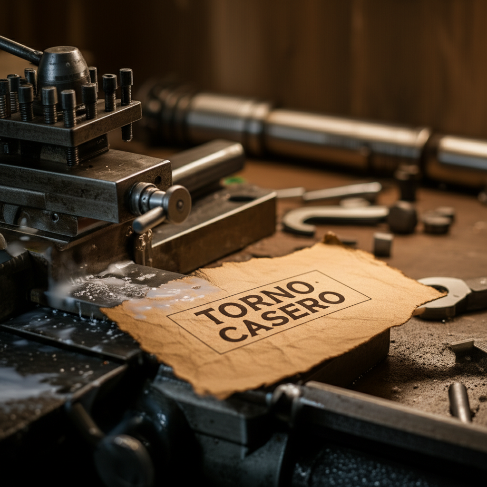

## Introducción

¿Alguna vez te has sentido atrapado en un círculo vicioso? Quieres construir proyectos increíbles, pero para eso necesitas herramientas. Y para construir esas herramientas... ¡necesitas otras herramientas! Es un dilema que paraliza a muchos inventores antes de empezar. En este artículo, vamos a romper ese ciclo. Te contaré **la historia de mi taller: cómo construí un torno para construir un taladro**, una anécdota que es en realidad una lección fundamental sobre cómo empezar tu propio espacio creativo desde la nada. No se trata solo de seguir unos planos, sino de entender una filosofía: la de crear una "máquina madre" que se convierta en el corazón de tu taller y te dé el poder de fabricar todo lo demás. Al final de esta guía, tendrás una hoja de ruta clara para dar tus primeros pasos y la confianza para construir tu primera gran herramienta.

## El Dilema del Huevo y la Gallina: ¿Qué Herramienta va Primero?

Todo inventor principiante se enfrenta a la misma pared: un catálogo infinito de herramientas y un presupuesto limitado. ¿Compro una fresadora? ¿Un taladro de columna? ¿Una sierra de cinta? La parálisis por análisis es real. La solución no está en comprarlo todo, sino en pensar estratégicamente. Aquí es donde introducimos el concepto de la **"máquina madre"**.

Una **máquina madre** es una herramienta fundamental cuya capacidad de fabricación es tan versátil que te permite crear piezas para otras máquinas. Es la que "da a luz" al resto de tu taller. Para muchos, incluyéndome a mí, esa máquina es el **torno**.

¿Por qué el torno?
*   **Crea piezas de revolución:** Es el rey creando cualquier cosa que sea cilíndrica. Ejes, poleas, tornillos, bujes, husillos... son los ladrillos fundamentales de casi cualquier otra máquina.
*   **Precisión fundamental:** Un torno, incluso uno sencillo, te enseña y te obliga a trabajar con precisión. Esta habilidad es la base de toda la mecánica.
*   **Versatilidad:** Con algunos accesorios, un torno puede fresar, taladrar y hasta rectificar piezas pequeñas. Es un verdadero todoterreno.

La idea es simple: invierte tu tiempo y recursos iniciales en una sola máquina que te dé la capacidad de *crear* en lugar de solo *ensamblar*.

## La Historia de Mi Taller: Cómo Construí un Torno para Construir un Taladro

Mi aventura no empezó en una tienda, sino en un montón de chatarra y con un plan. El objetivo era claro: construir un torno funcional que, a su vez, me permitiera fabricar las piezas para un taladro de columna preciso. Era un proyecto para demostrar que el ingenio es más importante que el dinero.

### Paso 1: El Diseño y los Materiales del Primer Torno

No busqué planos complejos. Mi primer torno fue un ejercicio de simplicidad. Los componentes clave fueron:
*   **La Bancada:** La columna vertebral de la máquina. Usé dos perfiles de acero rectangulares, pesados y rectos, que encontré en una chatarrería. La **rigidez** es más importante que cualquier otra cosa. Una bancada que se dobla o vibra hará imposible cualquier trabajo de precisión.
*   **El Cabezal Fijo:** Aquí va el motor y el plato que sujeta la pieza. Adapté un motor de una vieja lavadora (¡son sorprendentemente potentes!) y fabriqué un husillo simple con un trozo de barra de acero y dos rodamientos.
*   **El Carro Portaherramientas:** Esta es la parte que se mueve y sujeta la cuchilla de corte. Lo construí con placas de acero y unos tornillos largos (husillos) para controlar el movimiento longitudinal y transversal. ¡Pura mecánica básica!

El secreto no era tener los mejores materiales, sino entender la función de cada parte y asegurarse de que todo estuviera lo más alineado y rígido posible usando herramientas manuales.

### Paso 2: El Torno Cobra Vida

El momento de la verdad fue encenderlo por primera vez. Coloqué una barra de aluminio en el plato, acerqué la herramienta de corte y... ¡virutas! Ver salir ese primer rizo de metal brillante fue una de las mayores satisfacciones de mi vida. No era un torno industrial, tenía sus limitaciones y sus vibraciones, pero funcionaba. Podía tomar una pieza en bruto y darle una forma precisa y un acabado liso.

Había creado mi **máquina madre**. El taller había nacido. Ahora, tenía la capacidad de fabricar piezas que antes solo podía soñar con comprar. El siguiente objetivo en la lista era un taladro de columna, y ahora tenía la herramienta perfecta para hacerlo.

## Del Torno al Taladro: Usando una Máquina para Crear la Siguiente

Con el torno operativo, el proyecto del taladro de columna pasó de ser una idea a un plan de fabricación. Cada pieza crítica del taladro fue naciendo en el torno:

1.  **El Husillo del Taladro:** La parte más importante. Necesitaba ser perfectamente recta y tener un extremo cónico para alojar el **portabrocas** (también conocido como mandril, la pieza que sujeta las brocas). El torno fue esencial para mecanizar este eje a partir de una barra de acero.
2.  **Las Poleas de Transmisión:** Para poder cambiar la velocidad del taladro, necesitaba un sistema de poleas. Las torneé a partir de un bloque de aluminio, creando las gargantas para la correa con una herramienta de corte a la que di forma a mano.
3.  **Los Alojamientos para Rodamientos:** El husillo del taladro necesita girar suavemente dentro de una carcasa. Usé el torno para perforar y rectificar los agujeros en los que luego prensaría los rodamientos, asegurando una alineación perfecta.
4.  **Bujes y Separadores:** Todas esas pequeñas piezas cilíndricas que aseguran que todo encaje sin holguras fueron torneadas a medida.

El torno no solo fabricó las piezas; me obligó a planificar, medir y ejecutar con una precisión que nunca antes había alcanzado. Al final, tenía un taladro de columna robusto y preciso, construido por una máquina que yo mismo había construido.

## Conclusión

La lección más importante de esta historia es que el camino para construir el taller de tus sueños es un proceso paso a paso, donde una capacidad desbloquea la siguiente. No necesitas un garaje lleno de herramientas caras para empezar. Lo que necesitas es un plan, enfocado en construir o adquirir tu propia "máquina madre", como un torno. Esta herramienta fundamental no solo te dará piezas, sino que te enseñará los fundamentos de la precisión y el mecanizado. A partir de ahí, el único límite es tu imaginación. Recuerda: cada gran inventor empezó con una primera herramienta.

Ahora te toca a ti. ¿Cuál es la primera 'máquina madre' que te gustaría construir en tu taller? ¡Cuéntame tus ideas en los comentarios!

## Preguntas Frecuentes

### ¿Realmente se puede construir un torno funcional desde cero sin tener otras máquinas?
¡Absolutamente! Es un desafío, pero se puede lograr con herramientas manuales básicas: una sierra para metal, limas, un taladro de mano (idealmente en un soporte para mayor precisión) y mucha paciencia. La clave es usar un diseño simple y materiales accesibles. Tu primer torno no será perfecto, pero será el peldaño que necesitas para construir el siguiente, que será mucho mejor.

### ¿Qué es más importante en un primer torno casero: la potencia del motor o la rigidez de la estructura?
Sin lugar a dudas, la **rigidez de la estructura**. Puedes tener el motor más potente del mundo, pero si la bancada o el carro portaherramientas se doblan o vibran bajo la fuerza del corte, nunca conseguirás una pieza precisa. Un motor modesto en un chasis muy rígido siempre dará mejores resultados, simplemente tendrás que hacer pasadas de corte más pequeñas y lentas.

### ¿No es más fácil y barato comprar un torno pequeño de segunda mano?
A veces sí, puede ser una opción viable. Sin embargo, el valor de construir tu propia máquina va mucho más allá de tener la herramienta. Al construirla, aprendes íntimamente cómo funciona, cómo se ajusta, dónde están sus puntos débiles y cómo repararla. Ese conocimiento es invaluable y te convierte en un mejor mecánico y diseñador, en lugar de ser solo un operador de máquinas.
## Explora Este Hub de Contenido

Profundiza en temas específicos con nuestros artículos detallados:
- **['CNC: Construir vs Comprar: La Filosofía de un Maker'](../construir-vs-comprar-la-filosofia-de-un-maker/)**
- **['Anatomía de un Motor de Costura para Proyectos DIY: Tu Primera Guía'](../anatomia-de-un-motor-de-costura-para-proyectos-diy/)**

## También Te Podría Interesar

Explora otros temas en nuestro blog:
- **Descubre todo sobre [Torno](/tags/torno/)**
- **Descubre todo sobre [Proyectos CNC](/tags/proyectos-cnc/)**
