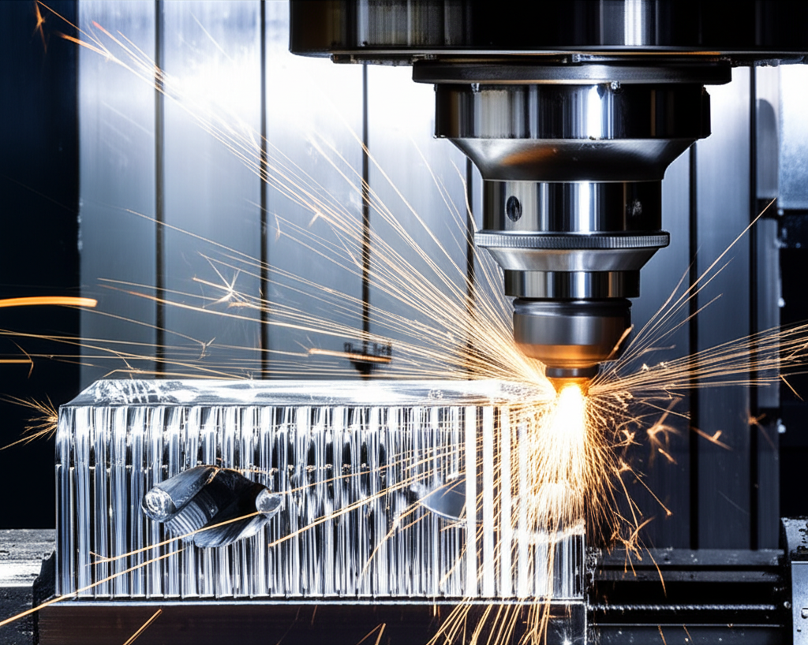

En el corazón de la fabricación moderna y la ingeniería de precisión, pocas máquinas son tan fundamentales y versátiles como la **fresadora**. Si alguna vez te has preguntado cómo se fabrican las piezas metálicas complejas de un motor, los moldes para inyección de plástico o incluso componentes aeroespaciales, la respuesta casi siempre involucra a esta poderosa máquina herramienta.

Pero, ¿qué es exactamente una fresadora y qué la hace tan indispensable? En esta guía completa, desglosaremos todo lo que necesitas saber.

## ¿Cómo Funciona Exactamente una Fresadora?

En esencia, una fresadora es una máquina herramienta que utiliza una herramienta de corte giratoria, llamada **fresa**, para eliminar material de una pieza de trabajo. Este proceso se conoce como **mecanizado por arranque de viruta**.

A diferencia de un torno, donde la pieza de trabajo gira y la herramienta permanece fija, en una fresadora ocurre lo contrario:

1.  **La fresa gira a altas velocidades.**
2.  **La pieza de trabajo se sujeta firmemente a una mesa móvil.**
3.  **La mesa mueve la pieza contra la fresa giratoria**, permitiendo cortar y dar forma al material con una precisión extraordinaria.

Este control preciso del movimiento en múltiples direcciones (o ejes) es lo que permite a la fresadora crear geometrías complejas, desde superficies planas y ranuras hasta cavidades y contornos tridimensionales.

## Las Partes Clave de una Fresadora

Aunque existen muchos tipos de fresadoras, la mayoría comparte una serie de componentes fundamentales:

*   **Bancada o Bastidor:** Es la base estructural de la máquina, robusta y pesada para absorber vibraciones y garantizar la estabilidad.
*   **Husillo (Spindle):** Es el corazón de la fresadora. Sujeta y hace girar la fresa a la velocidad requerida. Su orientación (vertical u horizontal) define uno de los tipos principales de fresadora.
*   **Mesa de Trabajo:** La superficie donde se sujeta firmemente la pieza a mecanizar. Esta mesa se puede mover en varias direcciones.
*   **Carros (Transversal y Longitudinal):** Permiten el movimiento de la mesa en los ejes X (longitudinal) e Y (transversal).
*   **Consola o Carro Vertical:** Sostiene la mesa y permite su movimiento en el eje Z (vertical), controlando la profundidad del corte.
*   **Cabezal:** Contiene el husillo y el motor que lo impulsa. En muchas fresadoras, el cabezal puede inclinarse para realizar cortes en ángulo.

## Los Ejes del Movimiento: La Clave de la Precisión

La versatilidad de una fresadora radica en su capacidad para moverse en múltiples ejes. Las configuraciones más comunes son:

*   **Eje X:** Movimiento longitudinal (de izquierda a derecha).
*   **Eje Y:** Movimiento transversal (de adelante hacia atrás).
*   **Eje Z:** Movimiento vertical (de arriba hacia abajo).

Las fresadoras más avanzadas pueden tener 4, 5 o incluso más ejes, lo que les permite crear geometrías extremadamente complejas al girar e inclinar la pieza de trabajo o el cabezal.

## Tipos de Fresadoras: Una Clasificación Esencial

Las fresadoras se pueden clasificar de varias maneras, pero las dos más importantes son según la orientación de su husillo y su sistema de control.

### Según la Orientación del Husillo

*   **Fresadora Vertical:** El husillo está posicionado perpendicularmente a la mesa de trabajo. Son las más comunes y versátiles, ideales para trabajos como planeado, ranurado y creación de cavidades.
*   **Fresadora Horizontal:** El husillo está paralelo a la mesa. Son excelentes para mecanizar piezas grandes y pesadas, realizar ranuras profundas y operaciones de corte más agresivas.

### Según el Sistema de Control

Esta es la distinción más relevante en la industria actual.

*   **Fresadora Manual (o Convencional):** El operario controla todos los movimientos de la máquina de forma manual, girando manivelas para mover los ejes. Requiere una gran habilidad y experiencia para lograr piezas precisas.
*   **Fresadora CNC (Control Numérico por Computadora):** Es la evolución tecnológica. En lugar de manivelas, un ordenador controla los motores de los ejes con una precisión micrométrica. El operario programa las instrucciones (código G) y la máquina ejecuta el trabajo de forma automática.

Las **ventajas de la fresadora CNC** son abrumadoras:
*   **Precisión y Repetibilidad:** Produce piezas idénticas una y otra vez con tolerancias muy ajustadas.
*   **Complejidad:** Puede fabricar formas geométricas que serían imposibles de hacer manualmente.
*   **Automatización:** Reduce la necesidad de intervención constante del operario, aumentando la productividad.
*   **Seguridad:** El proceso está contenido, mejorando la seguridad en el taller.

## Aplicaciones Industriales: ¿Dónde Brilla la Fresadora?

La capacidad de dar forma a metales y otros materiales con alta precisión hace que la fresadora sea indispensable en innumerables sectores:

*   **Industria Automotriz:** Fabricación de bloques de motor, pistones, y componentes de transmisión.
*   **Sector Aeroespacial:** Creación de piezas estructurales para aviones, componentes de turbinas y otros elementos críticos.
*   **Fabricación de Moldes y Matrices:** Para la inyección de plástico, la fundición de metales y el estampado de chapa.
*   **Prototipado Rápido:** Creación de prototipos funcionales para probar diseños antes de la producción en masa.
*   **Medicina:** Fabricación de implantes ortopédicos, prótesis e instrumental quirúrgico a medida.

## Conclusión: Más que una Máquina, una Solución de Fabricación

La fresadora ha pasado de ser una herramienta manual a convertirse en un pilar automatizado de la Industria 4.0 gracias al CNC. Su capacidad para transformar un bloque de material en bruto en una pieza funcional y precisa es, sencillamente, el fundamento de cómo se construye nuestro mundo moderno.

Desde la pieza más simple hasta el componente aeroespacial más complejo, la fresadora es la protagonista silenciosa. En próximos artículos, exploraremos en detalle los tipos de fresas y las operaciones de fresado más comunes.