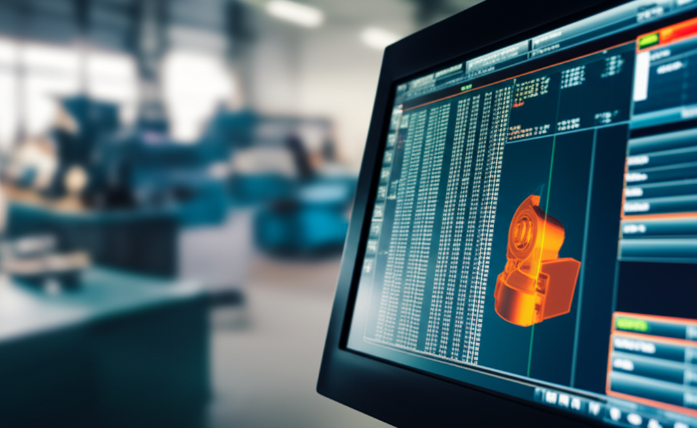

¿Alguna vez has visto una pantalla llena de líneas como `G01 X50 Y25 F150;` y has pensado que es un idioma alienígena? ¡Tranquilo, es una sensación muy común! Muchos principiantes se sienten abrumados por la cantidad de comandos que existen en el mundo CNC. Pero aquí te cuento un secreto: no necesitas memorizar cientos de códigos para empezar. De hecho, con un pequeño puñado de ellos puedes hacer casi de todo. En este artículo, vamos a desmitificar el lenguaje de las máquinas y te presentaré **los 10 códigos G esenciales que debes memorizar**. Al final de esta lectura, no solo entenderás qué significa cada uno, sino que te sentirás con la confianza suficiente para leer y comprender tus primeros programas. ¡Vamos a ello!

## ¿Qué es el Código G y por qué es tan importante?

Imagina que quieres darle instrucciones a un robot muy obediente pero que no entiende español. Necesitas hablarle en su idioma. El **Código G** es precisamente eso: el lenguaje que usamos para comunicarnos con una máquina CNC. Le dice exactamente a dónde moverse, qué tan rápido ir y qué acción debe realizar.

La "G" viene de **Geometría**, porque la mayoría de estos comandos controlan los movimientos geométricos de la máquina. Cada línea de código es una orden clara y precisa que la máquina ejecuta paso a paso. Dominar los comandos básicos es el primer gran paso para pasar de ser un espectador a ser un creador en el mundo del CNC.

## Los Códigos G de Movimiento: El Corazón de tu Programa

Los movimientos son la base de todo. Ya sea que estés cortando, grabando o simplemente posicionando la herramienta, todo se reduce a mover los ejes (X, Y, Z) de un punto a otro. Aquí están los tres fantásticos del movimiento:

### ### G00: Movimiento Rápido (¡Con Mucho Cuidado!)
Piensa en el **G00** como el comando para "teletransportarse". Su única misión es mover la herramienta de un punto A a un punto B lo más rápido posible.

*   **Uso principal:** Posicionar la herramienta sobre el punto donde comenzará el corte o moverla a una zona segura al finalizar.
*   **Regla de oro:** **NUNCA** se usa para cortar material. El movimiento es tan rápido que no está controlado con precisión para un mecanizado, por lo que podrías romper la fresa o dañar tu pieza.

### ### G01: Interpolación Lineal (El Corte Recto)
Este es tu caballo de batalla, el código que más usarás. El **G01** le dice a la máquina que se mueva en una línea recta mientras corta.

*   **Uso principal:** Cortar cualquier tipo de línea recta.
*   **Requiere un amigo:** Siempre va acompañado del parámetro **`F` (Feed rate o Avance)**. La `F` le indica la velocidad de corte. Por ejemplo, `G01 X100 F200;` significa "muévete en línea recta hasta la coordenada X 100 a una velocidad de 200 mm/minuto".

### ### G02 y G03: Interpolación Circular (Creando Curvas)
¿Y si quieres cortar un círculo o un arco? Para eso están el G02 y el G03. Son más sencillos de lo que parecen:

*   **G02:** Crea un arco en el **sentido de las agujas del reloj** (horario).
*   **G03:** Crea un arco en el **sentido contrario a las agujas del reloj** (antihorario).

Para definir la curva, necesitarás darle información adicional, como el radio (`R`) o las coordenadas del centro del arco (`I` y `J`). Por ahora, quédate con la idea principal: **G02 es para curvas a la derecha y G03 para curvas a la izquierda**.

## Los 10 Códigos Esenciales que Debes Memorizar (Y sus amigos)

Aquí tienes la lista definitiva para empezar. Si memorizas estos, tendrás el 90% del trabajo hecho para la mayoría de los proyectos de iniciación.

1.  **G00:** Movimiento rápido sin cortar.
2.  **G01:** Movimiento lineal para cortar (en línea recta).
3.  **G02:** Movimiento circular en sentido horario.
4.  **G03:** Movimiento circular en sentido antihorario.
5.  **G21:** Establece las unidades en **milímetros**. (Su primo, el G20, las pone en pulgadas). Es vital ponerlo al inicio del programa.
6.  **G90:** Modo de **coordenadas absolutas**. Todas las coordenadas se miden desde un único punto de origen (el cero pieza). Es como usar una dirección GPS.
7.  **G91:** Modo de **coordenadas incrementales**. Cada movimiento se mide desde la última posición de la herramienta. Es como dar indicaciones: "avanza 5 pasos, gira a la derecha 2 pasos".
8.  **G28:** Regreso al **punto de origen de la máquina** (Home). Es un comando de seguridad para enviar la herramienta a una posición conocida y segura.
9.  **M03:** **Encender el husillo** (la parte que gira la herramienta) en sentido horario. Generalmente se le añade el parámetro `S` para la velocidad (ej: `M03 S12000` son 12000 RPM).
10. **M05:** **Apagar el husillo**.

*Nota del Profe:* Sí, has visto bien. Los dos últimos son **Códigos M**. La "M" es de **Misceláneo**. Mientras los códigos G controlan el movimiento, los códigos M controlan las funciones de la máquina (encender/apagar cosas, cambiar herramientas, etc.). ¡Son inseparables!

## Conclusión

¡Lo lograste! Ahora conoces el núcleo del Código G. Entender la diferencia entre un movimiento rápido (**G00**) y un corte lineal (**G01**), cómo crear curvas (**G02/G03**) y cómo configurar tu espacio de trabajo (**G21/G90**) es la base de todo. Estos comandos son los ladrillos con los que construirás cualquier proyecto. No te presiones por aprender todo de golpe. Concéntrate en estos diez, practica leyéndolos en programas de ejemplo y verás cómo, poco a poco, ese "idioma alienígena" empieza a tener todo el sentido del mundo.

¿Cuál de estos códigos te parece más intimidante o cuál te ha costado más entender? ¡Comparte tu experiencia en los comentarios y construyamos conocimiento juntos!

## Preguntas Frecuentes

### ¿Tengo que memorizar TODOS los códigos G que existen?
¡Para nada! Al principio, céntrate en esta lista de 10. La gran mayoría de los programas para principiantes e intermedios se basan en estos comandos. Con el tiempo y la práctica, aprenderás otros de forma natural. Además, siempre tendrás a mano manuales o software para consultar los códigos más específicos.

### ¿Cuál es la diferencia real entre un Código G y un Código M?
Es una excelente pregunta. Piensa en esto: los **Códigos G** controlan la **G**eometría, es decir, los movimientos de la máquina en los ejes X, Y y Z. Por otro lado, los **Códigos M** controlan las funciones **M**isceláneas o de la **M**áquina, que son acciones como encender o apagar el husillo (M03/M05), activar el refrigerante o terminar el programa (M30). En resumen: G para mover, M para accionar.

### ¿Qué pasa si me equivoco y escribo mal un código?
Depende del error. Un simple error de tipeo (como `G1` en lugar de `G01`) puede que el control lo ignore o te dé una alarma. Sin embargo, un error conceptual, como usar un **G00** (movimiento rápido) para entrar a cortar en el material, es muy peligroso. Puede romper la herramienta, dañar la pieza e incluso la máquina. Por eso es fundamental **simular siempre tu programa** en un software antes de ejecutarlo en la máquina real. ¡La simulación es tu mejor amiga!
Este artículo es parte de nuestra guía principal: **[¿Qué es el Código G? La Guía Definitiva para Entender el Lenguaje de tu CNC](../que-es-el-codigo-g-la-guia-definitiva-para-entender-el-lenguaje-de-tu-cnc/)**.

## También Te Podría Interesar

Explora otros temas en nuestro blog:
- **Descubre todo sobre [Torno](/tags/torno/)**
- **Descubre todo sobre [Proyectos CNC](/tags/proyectos-cnc/)**
