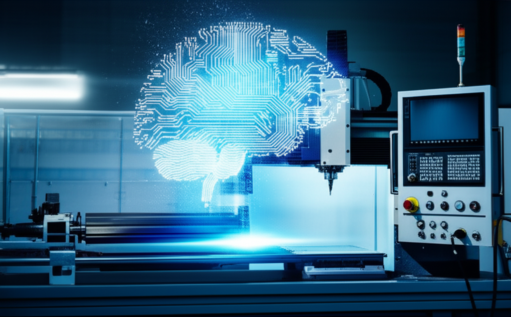

Si una máquina CNC es el cuerpo musculoso capaz de realizar trabajos de precisión increíble, el software es, sin duda, su cerebro. Elegir el software CNC adecuado es tan crucial como seleccionar la fresa correcta o calibrar los ejes de tu máquina. Es la pieza que traduce tu visión creativa en movimientos físicos y cortes perfectos.

Pero el ecosistema del software CNC puede parecer un laberinto: CAD, CAM, controladores, G-Code... ¿Por dónde empezar? En esta guía completa, desglosaremos cada componente para que puedas tomar una decisión informada y llevar tus proyectos al siguiente nivel.

## La Trinidad del Software CNC: CAD, CAM y Control

Para entender el flujo de trabajo en el mundo CNC, debemos conocer a los tres protagonistas principales. Imagina que estás construyendo una silla de madera:

1.  **El Plano (CAD):** Primero, diseñas la silla en papel.
2.  **Las Instrucciones (CAM):** Luego, escribes una lista de pasos detallados: "corta esta tabla aquí, haz un agujero allá".
3.  **El Carpintero (Control):** Finalmente, el carpintero lee tus instrucciones y usa sus herramientas para construir la silla.

El software CNC funciona de manera muy similar.

### 1. Diseño Asistido por Computadora (CAD) - La Idea

El **software CAD** (Computer-Aided Design) es tu tablero de dibujo digital. Aquí es donde nace el proyecto. Su función es crear un modelo geométrico preciso, ya sea en 2D (para cortes de perfiles, grabados) o en 3D (para piezas complejas con volumen).

*   **¿Qué hace?** Permite dibujar, modelar, dimensionar y documentar tu diseño.
*   **Salida:** Un archivo de diseño (por ejemplo, `.DXF`, `.DWG`, `.STEP`, `.STL`).
*   **Ejemplos Populares:**
    *   **Autodesk Fusion 360:** Muy popular por integrar CAD, CAM e incluso simulación en una sola plataforma. Ideal para principiantes y profesionales.
    *   **SolidWorks:** Un estándar en la industria para el diseño mecánico profesional.
    *   **AutoCAD:** El rey del diseño 2D, aunque también tiene potentes capacidades 3D.
    *   **FreeCAD:** Una excelente alternativa de código abierto y gratuita.

### 2. Fabricación Asistida por Computadora (CAM) - La Estrategia

Una vez que tienes tu diseño en CAD, necesitas traducirlo a un lenguaje que la máquina CNC entienda. Aquí es donde entra el **software CAM** (Computer-Aided Manufacturing).

El software CAM toma tu modelo CAD y te permite definir la "estrategia de mecanizado". Le dices qué herramientas usar, a qué velocidad deben girar (RPM), con qué rapidez deben avanzar (avance) y qué trayectorias deben seguir para cortar o dar forma al material. El resultado final de este proceso es el famoso **G-Code**.

*   **¿Qué hace?** Genera las trayectorias de la herramienta (toolpaths) y las convierte en G-Code.
*   **Salida:** Un archivo de texto con instrucciones de máquina (`.NC`, `.TAP`, `.GCODE`).
*   **Ejemplos Populares:**
    *   **Fusion 360:** Su entorno CAM integrado es uno de sus mayores atractivos.
    *   **Mastercam:** Uno de los softwares CAM más potentes y utilizados en entornos industriales.
    *   **Vectric Aspire / VCarve:** Muy apreciado en el mundo del CNC de madera por su facilidad de uso para trabajos en 2.5D.
    *   **Estlcam:** Una opción económica y sencilla, ideal para hobbyists.

### 3. Software de Control (o Intérprete) - La Ejecución

Ya tienes tu G-Code. Ahora necesitas un programa que lo lea y envíe las señales eléctricas a los motores de la máquina CNC para que se muevan. Ese es el trabajo del **software de control**.

Este software es la interfaz directa con tu máquina. Te permite cargar el G-Code, establecer el punto cero de trabajo (el origen), mover manualmente los ejes (jogging) y supervisar el proceso de mecanizado en tiempo real.

*   **¿Qué hace?** Interpreta el G-Code y controla el hardware de la máquina CNC.
*   **Entrada:** El archivo G-Code generado por el CAM.
*   **Ejemplos Populares:**
    *   **Mach3 / Mach4:** Un estándar de la industria durante años, especialmente para máquinas personalizadas o retrofits.
    *   **LinuxCNC:** Una solución de código abierto extremadamente potente y flexible, aunque requiere una mayor curva de aprendizaje.
    *   **GRBL (Universal Gcode Sender / Candle):** La solución más común para CNC de escritorio y hobbyists. GRBL es el firmware que se ejecuta en la placa controladora (como un Arduino), y programas como UGS o Candle actúan como la interfaz en tu ordenador.

## ¿Cómo Elegir el Software CNC Adecuado para Ti?

La respuesta correcta depende de cuatro factores clave:

1.  **Tu Nivel de Experiencia:**
    *   **Principiante:** Busca soluciones integradas y fáciles de usar como **Fusion 360 (versión personal gratuita)** o **Carbide Create**. Para el control, **GRBL** con UGS es un excelente punto de partida.
    *   **Profesional:** Probablemente necesites la potencia de programas dedicados como **SolidWorks** para el CAD, **Mastercam** para el CAM y un controlador robusto como **Mach4** o **LinuxCNC**.

2.  **La Complejidad de tus Proyectos:**
    *   **Cortes 2D y Grabados (2.5D):** Programas como **Vectric VCarve** o **Easel** son perfectos y muy intuitivos.
    *   **Mecanizado 3D y Multi-eje:** Necesitarás un CAM potente. **Fusion 360** es fantástico para empezar, mientras que **Mastercam** o **Hypermill** son la elección para mecanizados complejos de 4 y 5 ejes.

3.  **Tu Máquina y Controlador:**
    El software de control debe ser compatible con el hardware de tu máquina. Si tu controladora usa GRBL, estás limitado a interfaces compatibles con GRBL. Si tienes una tarjeta controladora específica, como las de Centroid o Acorn, deberás usar su software propietario.

4.  **Tu Presupuesto:**
    *   **Gratuito:** ¡Sí, es posible! Una combinación poderosa y sin coste es **FreeCAD (CAD) + FreeCAD Path Workbench (CAM) + LinuxCNC o GRBL (Control)**.
    *   **Suscripción:** **Fusion 360** ofrece un modelo de suscripción asequible (y una licencia gratuita para uso personal y startups) que lo convierte en una opción muy atractiva.
    *   **Licencia Perpetua:** Las soluciones de gama alta como SolidWorks, Mastercam o Vectric Aspire suponen una inversión inicial significativa, pero son herramientas para toda la vida.

## Conclusión: El Software es tu Mejor Aliado

Entender la cadena **CAD -> CAM -> Control** es fundamental para dominar el mecanizado CNC. No te dejes abrumar por la cantidad de opciones. Empieza por identificar tus necesidades, tu presupuesto y el tipo de proyectos que quieres realizar.

No existe "el mejor software CNC", sino el mejor software CNC *para ti*. La herramienta perfecta es aquella que te permite materializar tus ideas de forma eficiente, precisa y sin frustraciones.

**¿Y tú? ¿Qué combinación de software utilizas en tu taller? ¡Déjanos un comentario y comparte tu experiencia para ayudar a toda la comunidad CNC!**