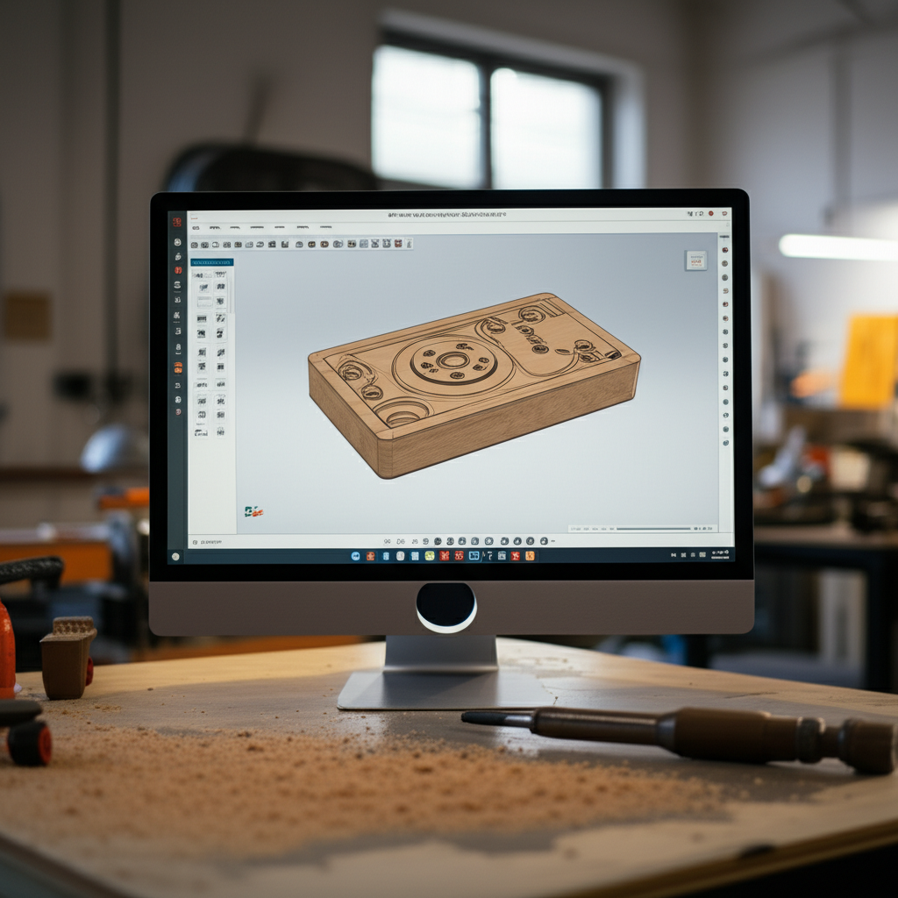

# Los 5 mejores programas de software CNC gratuitos

(Introducción)  El control numérico computarizado (CNC) abre un mundo de posibilidades para la fabricación, el diseño y el bricolaje. Sin embargo, el software CNC puede ser costoso.  Afortunadamente, existen excelentes opciones gratuitas que te permiten explorar el mundo del CNC sin gastar una fortuna. Esta lista te presenta los 5 mejores programas de software CNC gratuitos, ideales para principiantes y aficionados con diferentes necesidades y niveles de experiencia.  ¡Prepárate para llevar tus proyectos al siguiente nivel!

## 1. Universal Gcode Sender (UGS): El clásico para principiantes

UGS es un software de código abierto, fácil de usar y extremadamente popular entre los aficionados al CNC. Su interfaz intuitiva lo convierte en una excelente opción para principiantes.  Si bien carece de algunas funciones avanzadas que se encuentran en programas comerciales, su simplicidad y su capacidad de manejar archivos G-code lo convierten en una herramienta invaluable.  Es compatible con una amplia gama de máquinas CNC y ofrece funciones básicas como la simulación de trayectoria.  Su principal ventaja radica en su curva de aprendizaje suave y su sólida comunidad de apoyo en línea.

## 2. Candle: Una opción potente y versátil

Candle es otro software de código abierto que ofrece una funcionalidad más completa que UGS.  Aunque su interfaz puede parecer inicialmente más compleja, ofrece herramientas avanzadas para la creación y edición de trayectorias, incluyendo opciones de simulación más detalladas.  Es ideal para usuarios que buscan un mayor control sobre sus proyectos y que se sienten cómodos con una curva de aprendizaje más pronunciada.  Su compatibilidad con diferentes controladores CNC también lo hace una opción versátil.

## 3. GrblController: Control preciso y directo para Grbl

Si tu máquina CNC utiliza el popular controlador Grbl, GrblController es la elección perfecta.  Este software está diseñado específicamente para interactuar con Grbl, ofreciendo un control preciso y directo sobre la máquina.  Su interfaz sencilla y eficiente te permite enviar archivos G-code, controlar los ejes y monitorear el estado de la máquina en tiempo real.  Aunque limitado a máquinas Grbl, su eficiencia y simplicidad lo convierten en una herramienta esencial para este tipo de controladores.

## 4. EstlCam:  Para el diseño y la fabricación CAM

Si buscas un software que te permita realizar todo el proceso, desde el diseño hasta la fabricación CAM, EstlCam es una opción viable. Aunque es gratuito para uso no comercial,  te permitirá importar modelos 3D, generar trayectorias de herramienta y exportar archivos G-code.  Ten en cuenta que su interfaz requiere un poco más de familiarización, pero la capacidad de gestión completa del flujo de trabajo lo hace una herramienta muy atractiva para proyectos complejos.

## 5. CNCjs: Control web para máxima flexibilidad

CNCjs se destaca por su funcionamiento basado en navegador web.  Esto significa que puedes controlar tu máquina CNC desde cualquier dispositivo con conexión a internet.  Esta flexibilidad es una gran ventaja, especialmente para quienes trabajan con máquinas en diferentes ubicaciones.  Su interfaz es bastante intuitiva y te permite gestionar los archivos G-code, la configuración de la máquina y el control en tiempo real.  Recuerda que la conectividad de tu máquina es crucial para utilizar CNCjs correctamente.

(Conclusión)  Estos cinco programas de software CNC gratuitos ofrecen una variedad de funcionalidades para cubrir diferentes necesidades.  Desde la simplicidad de UGS hasta la versatilidad de Candle y las opciones específicas de GrblController, EstlCam y CNCjs,  existe una opción ideal para cada usuario, independientemente de su nivel de experiencia.  Explorar estas alternativas te permitirá adentrarte en el emocionante mundo del CNC sin incurrir en costos iniciales elevados.  ¡Recuerda siempre priorizar la seguridad y seguir las instrucciones de tu máquina CNC para evitar cualquier daño o accidente!