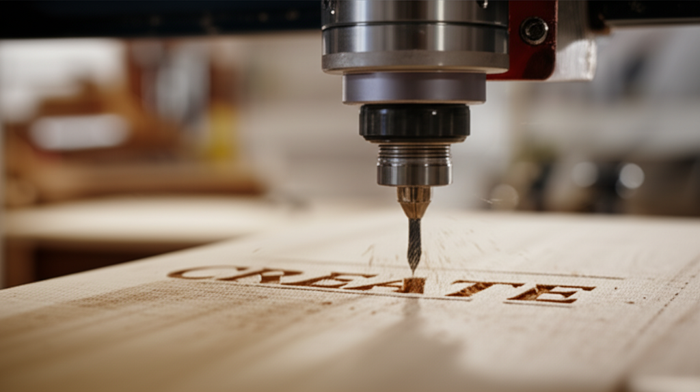

¡Hola, futuros creadores! ¿Alguna vez has visto esos letreros de madera con frases inspiradoras o nombres grabados y has pensado: "ojalá pudiera hacer algo así, pero parece demasiado complicado"? Esa sensación de que la tecnología CNC es solo para expertos es muy común, ¡pero estoy aquí para demostrarte lo contrario! Olvídate del miedo y la confusión. En este **Proyecto Paso a Paso: Cómo Hacer un Letrero Personalizado en Madera**, te llevaré de la mano desde la idea inicial hasta tener tu primera pieza terminada. No necesitas experiencia previa, solo ganas de aprender. Al final de esta guía, no solo entenderás el proceso, sino que tendrás la confianza para encender esa máquina y empezar a crear por ti mismo. ¡Vamos a ello!

## Paso 1: Reuniendo tus Herramientas y Materiales

Antes de empezar a cortar, debemos asegurarnos de tener todo listo. Piensa en esto como preparar los ingredientes antes de cocinar. Para tu primer letrero, no necesitas nada del otro mundo.

*   **Un trozo de madera:** Para empezar, te recomiendo una madera blanda y económica como el **pino**. También el **MDF** es una excelente opción porque es muy uniforme y fácil de cortar.
*   **Tu máquina CNC:** No importa si es grande o una CNC de sobremesa para aficionados. Lo importante es que esté lista para funcionar.
*   **Una fresa (o broca de corte):** Este es el "lápiz" de tu máquina. Es la herramienta que gira y corta la madera. Para un letrero con letras, una **fresa en V (V-Bit)** de 60 o 90 grados es perfecta, ya que crea esos bordes afilados y limpios en las letras.
*   **Un ordenador con software de diseño:** No te asustes, hay opciones gratuitas y muy fáciles de usar como **Easel** (de Inventables) o **Carbide Create**.
*   **Elementos de sujeción:** Unas simples **prensas o sargentos** para que la madera no se mueva ni un milímetro durante el corte.
*   **Gafas de seguridad:** ¡La seguridad es lo primero! El polvo y las pequeñas virutas de madera volarán, así que protege siempre tus ojos.

## Paso 2: El Diseño Digital - Tu Idea Toma Forma

Aquí es donde la magia comienza. Abriremos nuestro software de diseño (como Easel) y crearemos el letrero.

1.  **Define las dimensiones:** Lo primero es decirle al programa qué tan grande es tu trozo de madera. Mídelo con una regla o cinta métrica y pon las medidas exactas.
2.  **Escribe tu texto:** Usa la herramienta de texto para escribir lo que quieras en tu letrero. Puede ser tu nombre, una frase corta o una fecha especial.
3.  **Elige una tipografía:** ¡Diviértete! Escoge una fuente que te guste. Las fuentes gruesas y claras son más fáciles de cortar para los principiantes.
4.  **Establece la profundidad de corte:** El software te preguntará qué tan profundo quieres que la fresa corte. Para un primer proyecto, una profundidad de 3-5 milímetros será más que suficiente para que el texto se vea genial.
5.  **Genera el G-Code:** Una vez que estés contento con tu diseño, el software generará un archivo especial. Este archivo se llama **G-Code** y no es más que una lista de instrucciones (coordenadas y comandos) que tu máquina CNC puede entender. Es como la partitura para un músico.

## Paso 3: Preparando la Máquina y el Material

Con el diseño listo, es hora de ir a la máquina. Esta preparación es fundamental para que el resultado sea perfecto.

### Sujetar la Madera

Usa tus prensas para fijar firmemente la madera a la base de la máquina, también conocida como la "cama". Asegúrate de que no se pueda mover en absoluto. Si se mueve, ¡el corte saldrá torcido!

### Establecer el "Punto Cero"

Este es el paso más importante y el que más intimida al principio, pero es muy sencillo. El **"Punto Cero" (o Zero)** es el punto de partida de tu diseño. Tienes que decirle a la máquina dónde está la esquina delantera izquierda de tu madera (Cero X e Y) y dónde está la superficie de la madera (Cero Z).

*   **Cero X e Y:** Mueve la fresa con los controles manuales de la máquina hasta que la punta esté justo sobre la esquina inferior izquierda de tu trozo de madera. Una vez ahí, pones los contadores de X e Y a cero.
*   **Cero Z:** Con la fresa sobre la madera, bájala lentamente hasta que la punta apenas roce la superficie. Un truco es poner un folio de papel debajo; cuando sientas que el papel ya no se mueve, ¡ahí es! En ese punto, pones el contador de Z a cero.

## Paso 4: ¡A Cortar! El Momento de la Verdad

¡Todo listo! Es hora de ver cómo tu diseño cobra vida.

1.  **Carga tu archivo G-Code:** Transfiere el archivo que generaste desde tu ordenador a la máquina (normalmente por USB).
2.  **Ponte las gafas de seguridad:** ¡No lo olvides!
3.  **Enciende el husillo:** El husillo es el motor que hace girar la fresa. Oirás cómo empieza a girar a alta velocidad.
4.  **Dale a "Iniciar":** Con calma, presiona el botón para iniciar el trabajo. La máquina empezará a moverse y a cortar la madera siguiendo las instrucciones de tu diseño.
5.  **¡Observa y no te vayas!** Especialmente en tus primeros proyectos, quédate cerca y observa cómo trabaja la máquina. Si algo suena raro o parece ir mal, ten siempre a mano el botón de parada de emergencia.

## Paso 5: El Toque Final que Marca la Diferencia

Una vez que la máquina termine, ¡felicidades! Ya tienes tu letrero grabado. Pero podemos hacerlo aún más profesional.

*   **Lijado suave:** Pasa suavemente una lija fina (grano 220, por ejemplo) por la superficie para quitar cualquier rebaba o astilla que haya quedado. Ten cuidado de no lijar dentro de las letras grabadas.
*   **Limpieza:** Usa un cepillo o aire comprimido para quitar todo el polvo del grabado.
*   **Pintura o barniz (opcional):** Para un contraste increíble, puedes pintar el interior de las letras con pintura acrílica negra o de otro color. Una vez seca, puedes aplicar una capa de barniz o aceite para proteger la madera y darle un acabado espectacular.

## Conclusión

¡Lo has logrado! Has pasado por todo el proceso: desde una idea en tu cabeza, pasando por el diseño digital, la preparación de la máquina y el corte, hasta el acabado final. Los pasos clave son siempre los mismos: **diseñar, preparar, y mecanizar**. Lo que antes parecía un mundo complejo, ahora es un proceso claro que puedes repetir una y otra vez. Este primer letrero es solo el comienzo de un viaje increíble. No te desanimes si algo no sale perfecto a la primera; cada error es una lección.

¿Cuál crees que es el mayor desafío para ti al empezar? ¡Comparte tu experiencia o tus dudas en los comentarios y te ayudaré!

## Preguntas Frecuentes

### ¿Qué tipo de madera es mejor para mi primer proyecto CNC?
Para empezar, te recomiendo maderas blandas y económicas como el **pino**, ya que es muy fácil de cortar. Otra opción fantástica es el **MDF**, un tablero de fibra de densidad media que es muy barato, plano y no tiene vetas, lo que garantiza un corte muy limpio y predecible, ideal para aprender.

### ¿Necesito un software de diseño muy caro y complicado?
¡Para nada! Existen programas gratuitos y muy intuitivos diseñados para principiantes. **Easel** (de Inventables) es genial porque combina diseño y control de la máquina en un solo lugar y es muy visual. **Carbide Create** es otra excelente alternativa gratuita. Ambos son más que suficientes para hacer letreros y muchos otros proyectos.

### La máquina empezó a cortar y hizo un ruido fuerte, ¿es normal?
Sí, hasta cierto punto. El sonido de la fresa cortando madera puede ser ruidoso, especialmente si el corte es profundo o rápido. Sin embargo, si escuchas un **chirrido agudo muy fuerte, vibraciones excesivas o un sonido de "golpeteo"**, podría ser una señal de que algo no va bien. Lo más común es que la velocidad de corte o la profundidad sean demasiado agresivas para esa madera o fresa. En ese caso, para la máquina y revisa tu configuración. ¡Es mejor ser precavido!