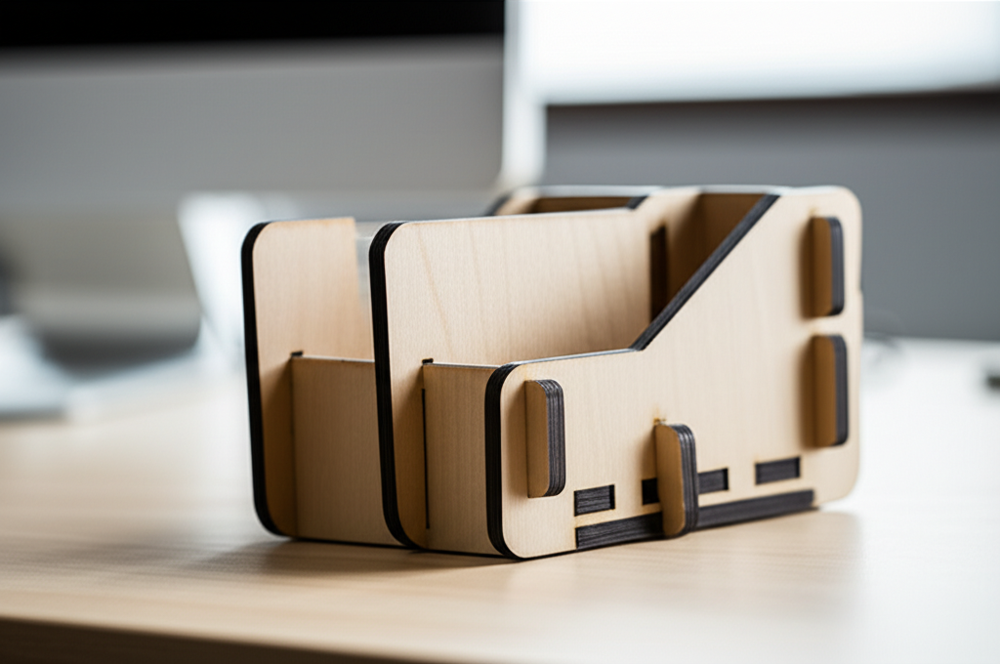

## ¡Hola, futuro maker!

¿Alguna vez has mirado tu flamante máquina CNC pensando: "Y ahora, ¿qué hago?"? Es una sensación muy común. Tienes la herramienta, la motivación, pero dar el salto de la teoría a un objeto físico puede parecer un abismo. ¡No te preocupes! Hoy vamos a cruzar ese puente juntos. En este tutorial, te guiaré paso a paso en un **proyecto práctico: crea un organizador de escritorio con encajes**. No solo terminarás con algo útil y tangible para tu espacio de trabajo, sino que también entenderás los conceptos básicos del corte 2D y la magia de los encajes a presión. Al final, verás que crear con CNC es mucho más accesible de lo que imaginas. ¡Vamos a ello!

## Paso 1: El Diseño y los Materiales

Antes de encender la máquina, todo empieza con una idea y un plan. Para nuestro organizador, usaremos un diseño 2D simple que se corta en una sola plancha de material.

### ¿Qué es un diseño vectorial?

Piensa en un **diseño vectorial** (archivos como `.SVG` o `.DXF`) como un conjunto de instrucciones de dibujo, no como una foto. Le dice a la máquina "dibuja una línea de aquí hasta aquí" o "crea un círculo de este tamaño". Esto es fundamental para el CNC. Para este proyecto, puedes descargar un diseño listo para usar o, si te sientes aventurero, dibujar unas cuantas cajas y ranuras en un software de diseño como Inkscape (gratuito) o Adobe Illustrator.

### La clave: Los Encajes a Presión (Press-Fit)

El secreto de este proyecto es que **no necesita pegamento ni tornillos**. Las piezas se unen gracias a unas ranuras y lengüetas diseñadas con precisión, conocidas como **encajes**. Para que funcionen, el ancho de la ranura debe ser casi idéntico al grosor de tu material.

*   **Material Recomendado:** Contrachapado de abedul o MDF de 6 mm de grosor. Son estables y se cortan muy limpiamente.
*   **Mide tu material:** ¡Paso crucial! Usa un calibre o pie de rey para medir el grosor real de tu madera. Un contrachapado de "6 mm" puede medir en realidad 5.8 mm o 6.2 mm. Deberás ajustar tu diseño a esta medida exacta para que los encajes queden perfectos.

## Paso 2: Del Diseño al Código con el Software CAM

Aquí es donde ocurre la magia. El software **CAM (Fabricación Asistida por Computadora)** es el traductor entre tu dibujo vectorial y tu máquina CNC. Convierte las líneas de tu diseño en un lenguaje que la máquina entiende, llamado **G-Code**.

El G-Code no es más que una serie de coordenadas y comandos, como "muévete al punto X10 Y25", "baja la fresa 5 mm" o "enciende el husillo". El CAM se encarga de generar todo este código por ti.

Los pasos básicos en cualquier software CAM son:

1.  **Importar el diseño vectorial.**
2.  **Definir el material:** Le dices al software las dimensiones de tu plancha de madera (ancho, alto y, muy importante, el grosor que mediste antes).
3.  **Seleccionar la herramienta:** Eliges la **fresa** (la broca de corte) que vas a usar. Para este proyecto, una fresa recta de 3 mm o 1/8 de pulgada de diámetro es ideal.
4.  **Crear las trayectorias de herramienta (Toolpaths):** Le dices a la máquina *cómo* debe cortar las líneas de tu diseño.

## Nuestro Proyecto Práctico: Crea un Organizador de Escritorio con Encajes

Para este organizador, solo necesitamos una trayectoria de herramienta principal: un **corte de perfil**.

### La Trayectoria de Perfil Exterior

Esta es la operación que cortará todas las piezas. Al configurarla, debes asegurarte de decirle al software que corte **por fuera de la línea de diseño**. ¿Por qué? Porque la fresa tiene un diámetro. Si cortara justo *sobre* la línea, tus piezas serían más pequeñas de lo planeado (exactamente la mitad del diámetro de la fresa por cada lado).

### El Secreto de los Encajes Perfectos: "Dogbones"

Aquí tienes un truco de profesional. Una fresa redonda no puede crear una esquina interior perfectamente a 90 grados. Siempre dejará un pequeño radio. Si intentas encajar una pieza con una esquina cuadrada en ese hueco redondeado, no entrará del todo.

La solución se llama **"dogbone" (hueso de perro)**. Es un pequeño corte circular que se añade en las esquinas interiores para "vaciar" ese material sobrante. La mayoría de los programas CAM tienen una opción para añadirlos automáticamente. ¡Esto garantiza que tus encajes entren suavemente y queden firmes!

## Paso 4: Configuración y Corte en la Máquina CNC

¡Llegó el momento de hacer virutas! Pero antes, la seguridad y la preparación son lo primero.

*   **Seguridad:** Ponte siempre **gafas de seguridad**. Asegúrate de que tu sistema de aspiración de polvo esté listo y de que sabes dónde está el botón de parada de emergencia.
*   **Fijar el material:** Sujeta firmemente tu plancha de madera a la base de la máquina con mordazas o cinta de doble cara. ¡No queremos que nada se mueva a mitad del corte!
*   **Establecer el "Cero":** Tienes que decirle a la máquina dónde empieza el trabajo. Esto se hace moviendo la fresa hasta la esquina inferior izquierda de tu material (Cero de X e Y) y luego bajándola con cuidado hasta que apenas toque la superficie de la madera (Cero de Z).
*   **¡A cortar!** Carga tu archivo G-Code en el software de control de la máquina, haz una última revisión y dale a "Iniciar". Ahora relájate y observa cómo tu CNC da vida a tu diseño.

Una vez terminado el corte, lija suavemente los bordes y ensambla tu organizador. ¡La satisfacción de ver cómo las piezas encajan a la perfección es increíble!

## Conclusión

¡Felicidades! Acabas de completar uno de los ritos de iniciación más importantes en el mundo del CNC: pasar de una pantalla a un objeto funcional. Hemos visto cómo un **diseño vectorial** se transforma en **G-Code** a través del software **CAM**, la importancia de configurar bien las trayectorias de corte y el truco de los **dogbones** para lograr uniones perfectas. Este proyecto demuestra que no necesitas diseños complejos para crear algo útil y aprender los fundamentos. La clave está en entender cada paso del proceso. Ahora tienes una base sólida para explorar proyectos cada vez más ambiciosos.

¿Cuál fue la parte que más te intimidaba de este proceso? ¡Cuéntamelo en los comentarios y vamos a resolverlo juntos!

## Preguntas Frecuentes

### ¿Qué pasa si mis encajes quedan muy sueltos o muy apretados?
Es un problema muy común y suele deberse a dos cosas: el grosor real del material no es exactamente el que pusiste en el software, o el diámetro real de tu fresa es ligeramente diferente. La mejor solución es hacer siempre un pequeño corte de prueba con un par de ranuras antes de lanzar el proyecto completo. Así puedes ajustar el diseño (haciendo las ranuras 0.1 mm más anchas o estrechas) hasta que el ajuste sea perfecto.

### ¿Necesito un software CAM muy caro para empezar?
¡Para nada! Existen opciones gratuitas y muy capaces. **Easel** es fantástico para principiantes y viene incluido con muchas máquinas. **Fusion 360** de Autodesk tiene una licencia gratuita para aficionados y su módulo CAM es increíblemente potente. Lo importante no es la herramienta, sino aprender los conceptos de trayectorias, velocidades y avances.

### ¿Qué tipo de fresa es mejor para cortar madera en este tipo de proyectos?
Para empezar con contrachapado o MDF, una **fresa recta de dos filos de 3mm (o 1/8")** es una excelente opción todo terreno. Corta limpiamente y es lo suficientemente robusta. A medida que avances, querrás explorar fresas de compresión (que evitan el astillado en ambas caras de la madera), pero para este organizador, una fresa recta estándar funcionará de maravilla.