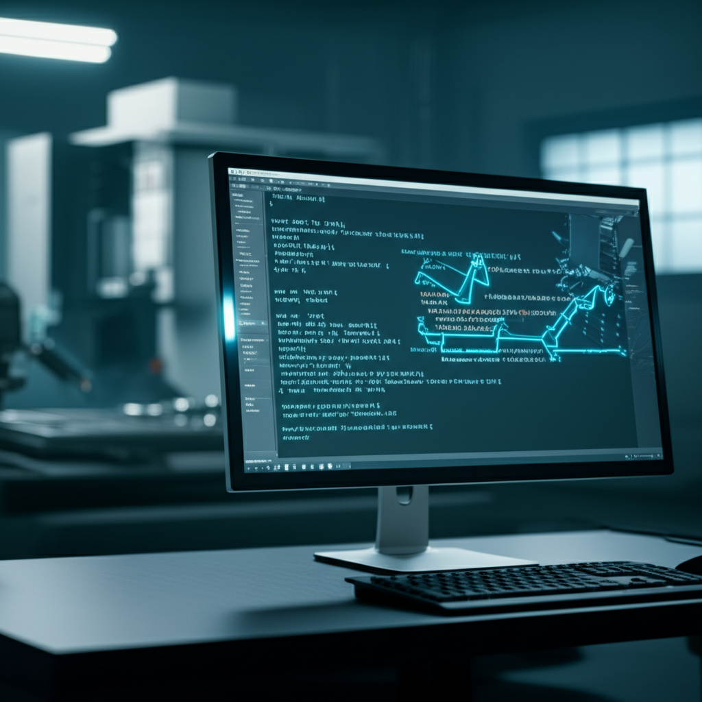

¡Hola, futuro maker! Si alguna vez has mirado una máquina CNC en acción, maravillado de cómo se mueve con tanta precisión, es probable que te hayas preguntado: "¿Cómo sabe exactamente a dónde ir, qué tan rápido moverse o cuándo encender la herramienta?". La respuesta es más sencilla de lo que crees y se llama **Código G**. Muchos principiantes se sienten intimidados por esas líneas de letras y números, pensando que es algo solo para programadores expertos. ¡Nada más lejos de la realidad! En esta guía, vamos a desmontar ese mito. Te prometo que al final de este artículo, no solo entenderás **qué es el Código G**, sino que serás capaz de leer líneas básicas y perderle el miedo para siempre. ¡Vamos a encender motores!

## ¿Qué es el Código G? La Guía Definitiva para Entender el Lenguaje de tu CNC

Imagina que quieres darle a un chef una receta para hacer un pastel. Le darías una lista de instrucciones paso a paso: "precalienta el horno a 180°", "mezcla la harina y el azúcar", "hornea durante 30 minutos". El Código G es exactamente eso, pero para una máquina de **Control Numérico por Computador (CNC)**.

Es un lenguaje de programación que le dice a la máquina qué hacer, cómo hacerlo y en qué orden. Cada línea de código es una instrucción específica. Le dice a los motores dónde moverse en un mapa imaginario de 3 ejes (**X, Y, Z**), a qué velocidad debe girar la herramienta (el husillo) y muchísimas otras cosas. En resumen, el **Código G es el idioma universal que hablan las máquinas CNC** para convertir un diseño digital en un objeto físico.

## La Anatomía de un Comando de Código G: Desglosando una Línea

A primera vista, una línea como `G01 X50 Y25 F1500;` puede parecer un jeroglífico. ¡Pero no te preocupes! Es como una frase con sujeto, verbo y predicado. Vamos a separar sus partes para que veas lo lógico que es.

Una línea de código típica se compone de varios "bloques" o "palabras", cada una con una letra y un número.

### Los Códigos "G" (Movimientos Preparatorios)

Estos son los "verbos" de nuestro lenguaje. Le dicen a la máquina **el tipo de movimiento** que debe realizar. Son el corazón de cualquier programa. Los más comunes que verás una y otra vez son:

*   `**G00**` (Movimiento Rápido): Le dice a la máquina: "Muévete a este punto lo más rápido que puedas". Se usa para desplazarse por el aire, no para cortar, ya que no se controla la velocidad de forma precisa.
*   `**G01**` (Movimiento Lineal): Es la orden de corte principal. Significa: "Muévete en línea recta desde donde estás hasta este nuevo punto, a una velocidad controlada".
*   `**G02**` y `**G03**` (Movimiento Circular): Se usan para cortar arcos o círculos. `G02` se mueve en el sentido de las agujas del reloj y `G03` en sentido contrario.

### Las "Letras" que Acompañan (Los Parámetros)

Si los códigos `G` son los verbos, las demás letras son los complementos que dan los detalles de la acción.

*   `**X, Y, Z**`: Son las **coordenadas cartesianas**. Piensa en ellas como un mapa 3D. `X` es el movimiento de izquierda a derecha, `Y` es de adelante hacia atrás, y `Z` es de arriba hacia abajo. `X10 Y20` le dice a la máquina que se mueva a la posición 10 en el eje X y 20 en el eje Y.
*   `**F**`: Viene de "Feed Rate" o **Velocidad de Avance**. Define a qué velocidad se moverá la máquina mientras corta (cuando se usa `G01`, `G02` o `G03`). Por ejemplo, `F1500` podría significar moverse a 1500 milímetros por minuto.
*   `**S**`: Viene de "Spindle Speed" o **Velocidad del Husillo**. Le dice a la máquina a cuántas revoluciones por minuto (RPM) debe girar la fresa. `S18000` le ordena girar a 18000 RPM.
*   `**M**`: Son **Códigos Misceláneos** o auxiliares. Son como los interruptores de la máquina. Por ejemplo, `M03` enciende el husillo, `M05` lo apaga y `M08` activa el refrigerante.

Entonces, volviendo a nuestro ejemplo `G01 X50 Y25 F1500;`:
*   `**G01**`: Vamos a cortar en línea recta.
*   `**X50 Y25**`: El destino es la coordenada X=50, Y=25.
*   `**F1500**`: La velocidad de corte será de 1500 unidades por minuto.

¡Ves qué fácil! Simplemente le hemos dicho: "Corta en línea recta hasta el punto (50, 25) a una velocidad de 1500".

## Un Ejemplo Práctico: ¡Leamos Nuestro Primer Programa!

Ahora que conoces las partes, leer un bloque de código es pan comido. Aquí tienes un programa súper simple para cortar un cuadrado de 50x50 mm. He añadido comentarios (el texto entre paréntesis) para que sepas qué hace cada línea.

gcode
(Iniciamos el programa y configuramos la máquina)
G21 ; (Le decimos que todas las unidades serán en milímetros)
G90 ; (Usaremos coordenadas absolutas, es decir, medidas desde el punto cero)
T1 M6 ; (Le pedimos que coja la herramienta número 1)
S12000 M03 ; (Encendemos el husillo a 12000 RPM)

(Ahora empiezan los movimientos)
G00 Z5 ; (Movimiento rápido para levantar la fresa 5mm por encima del material)
G00 X0 Y0 ; (Movimiento rápido hasta la esquina de inicio del cuadrado, X0 Y0)

(¡Hora de cortar!)
G01 Z-2 F500 ; (Bajamos la fresa 2mm dentro del material a 500 mm/min)
G01 X50 F1500 ; (Cortamos el primer lado del cuadrado hasta X50)
G01 Y50 ; (Cortamos el segundo lado hasta Y50)
G01 X0 ; (Cortamos el tercer lado hasta X0)
G01 Y0 ; (Cerramos el cuadrado volviendo al inicio)

(Fin del trabajo)
G00 Z5 ; (Levantamos la fresa para que no toque la pieza)
M05 ; (Apagamos el husillo)
M30 ; (Fin del programa y reseteo)

Al seguir estas instrucciones, la máquina ha dibujado un cuadrado perfecto. ¡Acabas de leer tu primer programa CNC!

## ¿Tengo que Escribir Todo Esto a Mano?

Aquí viene la mejor noticia: **en la mayoría de los casos, no**.

Hoy en día, usamos programas de **Software CAM (Fabricación Asistida por Computador)** como Fusion 360, VCarve, Easel o muchos otros. En estos programas, tú dibujas tu pieza de forma visual, eliges las herramientas y las estrategias de corte, y el software se encarga de generar automáticamente todo el Código G por ti.

Entonces, ¿por qué es importante aprender a leerlo? Porque **entender lo básico te da el control**. Te permite:
*   **Verificar el trabajo:** Puedes echar un vistazo rápido al código para asegurarte de que la máquina va a hacer lo que esperas.
*   **Solucionar problemas:** Si algo va mal, podrás identificar la línea de código que está causando el error.
*   **Hacer ajustes rápidos:** A veces solo necesitas cambiar una velocidad o una profundidad sin tener que volver a generar todo el archivo desde el software CAM.

## Conclusión

¡Felicidades! El misterioso Código G ya no es un enigma para ti. Ahora sabes que es simplemente un conjunto de instrucciones, el lenguaje que le da vida a tu máquina CNC. Hemos visto que se compone de comandos de movimiento como `**G01**` y parámetros que le dan los detalles, como las coordenadas `**X, Y, Z**` y la velocidad `**F**`. Y lo más importante, has aprendido que no necesitas escribirlo a mano para empezar, pero entenderlo te convertirá en un operador mucho más seguro y competente.

Ahora que has dado el primer paso, el mundo del CNC está a tu alcance. ¿Cuál ha sido tu mayor desafío hasta ahora? ¡Comparte tu experiencia en los comentarios!

## Preguntas Frecuentes

### ¿El Código G es el mismo para todas las máquinas CNC?
En su mayoría, sí. Los comandos básicos como `G00`, `G01`, `G02`, `G03` y las coordenadas son casi universales. Sin embargo, algunos fabricantes de máquinas tienen sus propios "dialectos" o códigos `M` específicos para funciones especiales. Siempre es bueno revisar el manual de tu máquina, pero lo que has aprendido aquí te servirá para el 95% de las situaciones.

### ¿Necesito ser programador para usar una CNC?
¡Para nada! Como hemos visto, el software CAM hace el trabajo pesado de escribir el código. Tu trabajo es el de un operario y diseñador. Saber leer Código G es una habilidad extra que te dará mucha confianza, pero no necesitas un título en informática para empezar a crear cosas asombrosas.

### ¿Qué pasa si hay un error en el Código G?
Depende del error. Si es un error de sintaxis (una letra o número que no tiene sentido), la mayoría de los controladores CNC modernos se detendrán y te mostrarán una alarma antes de empezar. Si el error es lógico (por ejemplo, le dices que baje demasiado rápido o demasiado profundo), la máquina intentará hacerlo, lo que podría dañar la pieza, la fresa o incluso la máquina. Por eso es tan valioso poder leer el código y detectar posibles problemas antes de pulsar el botón de "Play".
## Explora Este Hub de Contenido

Profundiza en temas específicos con nuestros artículos detallados:
- **[Los 10 Códigos G Esenciales que Debes Memorizar (Para Principiantes)](../los-10-codigos-g-esenciales-que-debes-memorizar-g00-g01-g02-etc/)**
- **['Códigos M: Cómo Controlar el Husillo, el Refrigerante y Más Allá del Movimiento'](../codigos-m-como-controlar-el-husillo-el-refrigerante-y-mas-alla-del-movimiento/)**
- **['Tu Primer Programa en Código G: Cómo Escribir un Cuadrado Simple desde Cero'](../tu-primer-programa-en-codigo-g-como-escribir-un-cuadrado-simple-desde-cero/)**

## También Te Podría Interesar

Explora otros temas en nuestro blog:
- **Descubre todo sobre [Torno](/tags/torno/)**
- **Descubre todo sobre [Proyectos CNC](/tags/proyectos-cnc/)**
