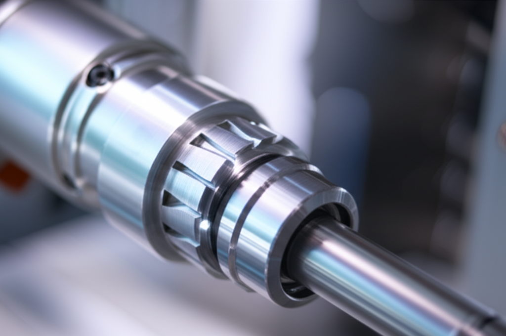

---
---
title: "Qué es el mecanizado CNC para principiantes"
date: "2025-06-30T09:23:41.025977"
description: "Todo lo que necesitas saber sobre qué es el mecanizado cnc para principiantes para empezar en el mundo del CNC."
tags: ['CNC', 'mecanizado', 'principiantes']
author: "Erick Garcia"
draft: false
featured_image: "featured.png"
---

Bienvenido al fascinante mundo del mecanizado CNC!  Si estás leyendo esto, probablemente te estés preguntando: ¿qué es exactamente el mecanizado CNC y por qué todo el mundo habla de él?  No te preocupes, estás en el lugar correcto.  En este artículo, desmitificaremos el mecanizado CNC y te daremos una comprensión básica de este proceso de fabricación tan potente y versátil.  Prepárate para descubrir un universo de posibilidades.

## ¿Qué es el Mecanizado CNC?

En esencia, el mecanizado CNC (Control Numérico Computarizado) es un proceso de fabricación donde una máquina herramienta, controlada por un programa informático, remueve material de una pieza de trabajo para crear una pieza con una forma y dimensiones precisas.  Imagina una máquina que puede tallar, perforar, fresar o roscar metal, madera, plástico o incluso compuestos con una precisión increíble, todo siguiendo instrucciones digitales.  ¡Eso es el mecanizado CNC!

## Componentes Clave de un Sistema CNC

Para entender cómo funciona, es importante conocer los componentes principales:

* **La Máquina Herramienta:**  Esto puede ser un torno, una fresadora, un centro de mecanizado, o una variedad de otras máquinas.  Cada una está diseñada para diferentes tipos de operaciones.
* **El Controlador CNC:**  El "cerebro" del sistema.  Este es el ordenador que interpreta el código del programa y controla los movimientos de la máquina.
* **El Software CAM (Computer-Aided Manufacturing):**  Este software traduce los diseños CAD (Computer-Aided Design) en un lenguaje que la máquina CNC puede entender, generando el programa de mecanizado.
* **La Pieza de Trabajo:** El material bruto del que se creará la pieza final.
* **Herramientas de Corte:**  Estas son las brocas, fresas, etc., que remueven el material de la pieza de trabajo.

##  Ventajas del Mecanizado CNC

El mecanizado CNC ofrece numerosas ventajas sobre los métodos de fabricación tradicionales:

* **Precisión:**  Las máquinas CNC ofrecen una precisión y repetibilidad excepcionalmente altas.
* **Eficiencia:**  Automatiza el proceso de fabricación, lo que acelera la producción y reduce los costos de mano de obra.
* **Flexibilidad:**  Permite la fabricación de piezas complejas y personalizadas con facilidad.
* **Automatización:**  Reduce al mínimo la intervención humana, minimizando errores.
* **Reproducibilidad:**  Puede crear múltiples piezas idénticas con una alta consistencia.

## Tipos de Mecanizado CNC

Existen varios tipos de mecanizado CNC, cada uno con sus propias aplicaciones:

* **Fresado CNC:**  Utilizado para crear superficies planas, contornos complejos y ranuras.
* **Torneado CNC:**  Ideal para crear piezas cilíndricas, como ejes y pernos.
* **Electroerosión por hilo CNC (WEDM):**  Ideal para cortar metales muy duros o piezas con formas complejas.
* **Rectificado CNC:**  Para conseguir acabados superficiales muy finos y precisos.

## Primeros Pasos en el Mecanizado CNC

Si te interesa aprender más sobre el mecanizado CNC, te recomiendo:

* **Cursos online:** Busca cursos introductorios al mecanizado CNC en plataformas online.
* **Libros y manuales:** Existe una gran cantidad de recursos disponibles para principiantes.
* **Simuladores:**  Puedes practicar con simuladores CNC antes de trabajar con maquinaria real.
* **Buscar un mentor:**  Conectar con alguien con experiencia en el campo puede ser invaluable.

El mecanizado CNC puede parecer complejo al principio, pero con dedicación y práctica, puedes dominar este campo fascinante y gratificante. ¡No tengas miedo de empezar!  Recuerda que cada paso que des te acerca a la creación de piezas increíbles.

## Profundiza en el Tema ##

* [Cómo configurar tu software CNC por primera vez](/posts/como-configurar-tu-software-cnc-por-primera-vez/)
* [Los 5 mejores programas de software CNC gratuitos](/posts/los-5-mejores-programas-de-software-cnc-gratuitos/)
* [Tu primer corte en madera MDF paso a paso](/posts/tu-primer-corte-en-madera-mdf-paso-a-paso/)
---