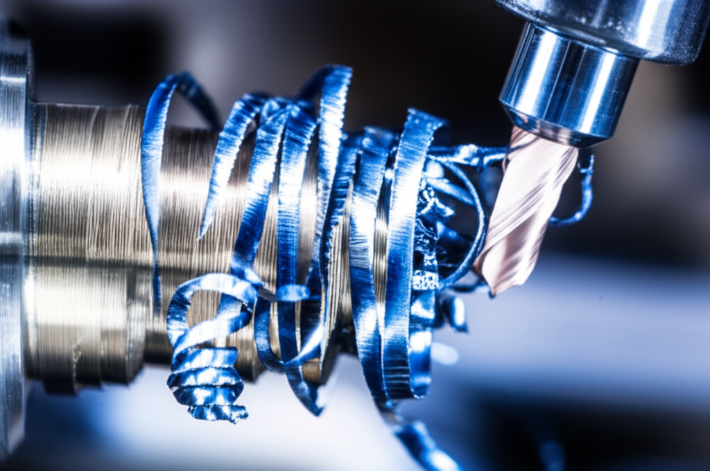

# Roscado en Torno para Principiantes: Guía Completa con Consejos de Experto

Hola a todos, soy Erick Garcia, Maestro Tornero Digital con 25 años de experiencia.  En este artículo, les guiaré a través del proceso de roscado en torno, una técnica fundamental en el mecanizado que, aunque pueda parecer intimidante al principio, es perfectamente accesible para principiantes.  Prepárense para transformar sus habilidades en el taller.

El roscado en torno consiste en crear roscas (hélices) en un cilindro o una barra de metal,  utilizadas para unir piezas mediante tornillos o pernos.  Es una operación precisa que requiere práctica, pero con la guía correcta, cualquiera puede dominar esta técnica.

## Herramientas Esenciales para Roscar en Torno

Antes de empezar, asegúrate de tener las siguientes herramientas:

* **Torno:** Obviamente, necesitarás un torno en buen estado de funcionamiento.
* **Juego de plaquitas de roscar:** Existen diferentes tipos de plaquitas, cada una diseñada para un tipo de rosca específico (métrica, Whitworth, etc.).  Investiga el tipo de plaquita adecuada para tu proyecto.
* **Portaplaquitas:**  El soporte que sujeta la plaquita de roscar al torno.
* **Juego de calibradores de roscas:**  Para verificar la precisión de la rosca.
* **Micrómetro:** Para medir con precisión las dimensiones de la pieza.
* **Llave dinamométrica (opcional):**  Para ajustar la fuerza de apriete de las herramientas.
* **Aceite de corte:**  Fundamental para lubricar y refrigerar la pieza durante el proceso de roscado.

## Pasos para Roscar en un Torno: Una Guía Paso a Paso

1. **Preparación:**  Asegúrate de que la pieza está firmemente sujeta en el torno.  Realiza un buen centraje para evitar vibraciones.  Planifica con anticipación el tipo de rosca que vas a crear (métrica, Whitworth, etc.) y las dimensiones exactas.

2. **Preparación del torno:** Selecciona la velocidad adecuada para el material que estás trabajando.  Recuerda que una velocidad muy alta puede causar daños a la pieza o a la herramienta.

3. **Desbaste (opcional):**  Si la pieza requiere un desbaste previo, realiza esta operación antes de comenzar el roscado.  Esto asegurará una superficie limpia y uniforme para la rosca.

4. **Roscado:**  Ajusta el portaplaquitas con la plaquita de roscar correcta.  Realiza un primer pase ligero para definir el perfil de la rosca.  Luego, realiza pases sucesivos, aumentando ligeramente la profundidad de corte en cada uno.  Recuerda usar aceite de corte para refrigerar y lubricar.

5. **Verificación:**  Una vez finalizado el roscado, verifica la precisión de la rosca con los calibradores.  Si es necesario, realiza ligeros ajustes hasta conseguir la tolerancia deseada.

6. **Acabado:**  Limpia la pieza con un cepillo de alambre o un paño limpio.

## Consejos para Evitar Errores Comunes:

* **Velocidad de corte:**  Una velocidad de corte demasiado alta puede provocar que la plaquita se rompa o que la rosca quede dañada.  Busca la velocidad adecuada para tu material y herramienta.
* **Profundidad de corte:**  Realiza pases ligeros para evitar dañar la pieza.
* **Lubricación:**  El aceite de corte es esencial para mantener la plaquita fría y prevenir que se pegue a la pieza.
* **Afilado de la plaquita:**  Una plaquita desgastada o desafilada puede producir roscas defectuosas.  Asegúrate de que la plaquita está afilada y en buen estado.
* **Práctica:**  La práctica hace al maestro.  No te desanimes si tus primeras roscas no son perfectas.  Con la práctica, mejorarás tu técnica y obtendrás resultados precisos.

## Tipos de Roscas: Una Breve Introducción

Existen diferentes tipos de roscas, incluyendo:

* **Roscas métricas:**  Sistema de roscas basado en el milímetro.
* **Roscas Whitworth:**  Sistema de roscas basado en pulgadas.
* **Roscas UNC y UNF:**  Roscas americanas unificadas (Unified National Coarse y Fine).

Es importante conocer las diferencias entre estos tipos para seleccionar la herramienta y los parámetros adecuados.

## Conclusión

El roscado en torno puede parecer complejo al principio, pero con la práctica y siguiendo estos pasos, puedes dominar esta habilidad esencial. Recuerda la importancia de la seguridad y siempre utiliza las herramientas y equipo adecuados. ¡No dudes en compartir tus experiencias y preguntas en los comentarios!