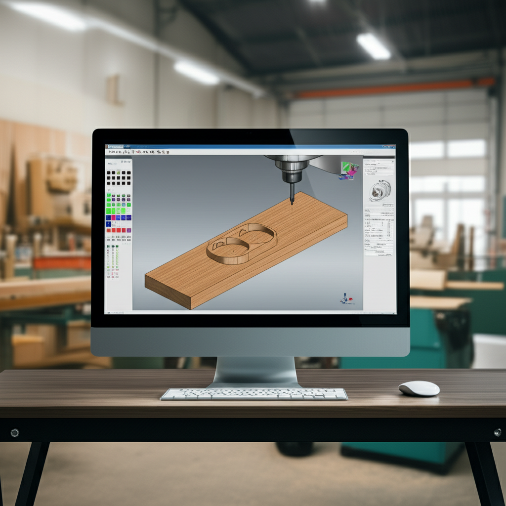

# Software CAD/CAM Gratuito para tu Fresadora

Encontrar software CAD/CAM gratuito y eficiente puede ser un desafío.  Las opciones completamente gratuitas a menudo tienen limitaciones en cuanto a funcionalidades, soporte y compatibilidad con máquinas específicas.  Esta lista presenta algunas opciones populares, pero es crucial evaluar tus necesidades y las limitaciones de cada programa antes de elegir uno.  Recuerda siempre revisar las licencias y términos de uso.

**Consideraciones importantes:**

* **Limitaciones de la versión gratuita:** Muchas opciones ofrecen versiones gratuitas con funciones limitadas o marcas de agua en los resultados.
* **Compatibilidad:** Asegúrate de que el software sea compatible con tu tipo de fresadora (ej. 3 ejes, 4 ejes, etc.) y su controlador.
* **Curva de aprendizaje:** Algunos programas tienen interfaces más intuitivas que otros.  Considera tu nivel de experiencia.
* **Soporte:** La disponibilidad de soporte técnico puede variar significativamente entre las opciones gratuitas.


**Lista de Software CAD/CAM Gratuito (en orden alfabético):**


| Software          | Descripción                                                                     | Ventajas                                       | Desventajas                                                | Licencia                     |
|----------------------|---------------------------------------------------------------------------------|-------------------------------------------------|-------------------------------------------------------------|-----------------------------|
| **(Software A)**    |  (Descripción breve, e.g.,  Software de código abierto para diseño 2D/3D)       | (e.g., Completamente gratuito, buena comunidad online) | (e.g., Interfaz compleja, poca documentación en español) | (e.g., GPL, MIT, etc.)       |
| **(Software B)**    |  (Descripción breve, e.g., Software enfocado en el mecanizado de piezas simples) | (e.g., Fácil de usar, ideal para principiantes)       | (e.g., Limitaciones en el número de herramientas, pocas funciones avanzadas) | (e.g., Freeware, Trial)     |
| **(Software C)**    |  (Descripción breve, e.g.,  Herramienta online para diseños básicos)           | (e.g., No requiere instalación, acceso desde cualquier dispositivo) | (e.g., Funcionalidades muy limitadas, dependencia de internet) | (e.g., SaaS, Freemium)     |
| **(Software D)**    |  (Descripción breve, e.g.,  Software con funcionalidades CAD limitadas pero buen CAM) | (e.g., Generación de código G eficiente)          | (e.g., Modelado CAD básico, curva de aprendizaje pronunciada) | (e.g., Freeware, Trial)     |


**Nota:**  Reemplaza "(Software A)", "(Software B)", etc. con los nombres reales de los softwares y completa las columnas restantes con información precisa y relevante.  Incluye enlaces a las páginas web de cada software si es posible.


**Conclusión:**

La mejor opción de software CAD/CAM gratuito dependerá de tus necesidades específicas y de tu nivel de experiencia. Te recomiendo probar varias opciones antes de comprometerte con una en particular.  Recuerda que invertir en un curso o tutorial puede mejorar significativamente tu experiencia y productividad.
```


Recuerda reemplazar los placeholders `(Software A)`, `(Software B)`, etc., con ejemplos de software CAD/CAM gratuito,  y completar las columnas de la tabla con información precisa y útil.  Considera incluir enlaces a las páginas web oficiales de cada software.  Ejemplos de software gratuito (aunque con limitaciones) que podrías incluir son:  FreeCAD (con su complemento CAM),  algunos softwares online con versiones limitadas, etc.  No todos los softwares gratuitos serán adecuados para todas las fresadoras y necesidades.