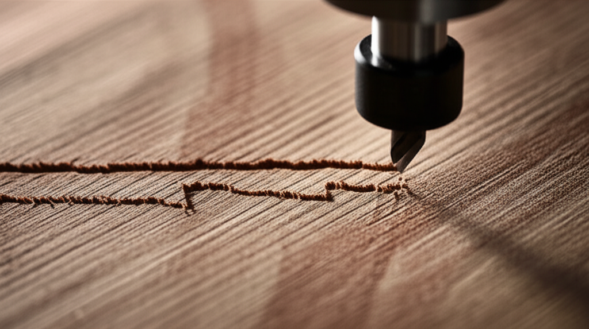

## Introducción

¿Te ha pasado? Estás a mitad de tu primer proyecto importante, la emoción a tope, y de repente, ¡zas! La máquina parece perderse, el corte se desvía y tu pieza perfectamente diseñada acaba en la basura. O quizás notas un temblor extraño y el acabado de tu trabajo es áspero y lleno de marcas. ¡Tranquilo! Estos problemas, conocidos como **pasos perdidos y vibraciones**, son el pan de cada día para quienes empezamos. Son increíblemente frustrantes, pero la buena noticia es que casi siempre tienen una solución sencilla. En este tutorial, vamos a desmitificar estos dos fantasmas del taller. Te prometo que al terminar de leer, entenderás por qué ocurren y, lo más importante, sabrás exactamente qué hacer para solucionarlos y recuperar la confianza en tu máquina.

## ¿Qué Son los "Pasos Perdidos" y por Qué Ocurren?

Imagina que le das a tu máquina una orden: "muévete 10 milímetros a la derecha". Para hacerlo, el cerebro de la máquina (el controlador) le dice a un motor que gire una cantidad exacta de "pasos". Un **paso perdido** ocurre cuando el controlador envía la orden de moverse, por ejemplo, 200 pasos, pero el motor, por alguna razón, solo logra moverse 198.

Ese pequeño error, casi invisible al principio, se va acumulando. El resultado es un desastre: círculos que no cierran, líneas que no están rectas y proyectos arruinados.

Las causas más habituales son:
*   **Mecánica forzada:** Alguna parte de la máquina está demasiado apretada o sucia, y el motor no tiene la fuerza suficiente para vencer esa resistencia.
*   **Parámetros muy agresivos:** Estás intentando cortar demasiado rápido o demasiado profundo. La máquina simplemente no puede seguir el ritmo.
*   **Tensión incorrecta de las correas:** Si tu máquina usa correas, una correa muy floja puede "saltar" dientes, perdiendo pasos. Una muy tensa puede forzar demasiado los motores.
*   **Problemas eléctricos:** A veces, los **drivers** (las pequeñas placas que dan energía a los motores) no están bien configurados o se sobrecalientan.

## El Misterio de las Vibraciones: Tu Peor Enemigo

Las **vibraciones** son exactamente lo que parecen: un temblor o sacudida en la máquina, la pieza de trabajo o la herramienta de corte (la fresa). Aunque un poco de vibración es normal, una vibración excesiva es una señal de alerta.

¿Por qué es tan mala?
*   **Acabados de mala calidad:** Deja marcas horribles en la superficie de tu pieza.
*   **Desgaste de la herramienta:** Una fresa que vibra se desgasta mucho más rápido e incluso puede romperse.
*   **Fuerza la máquina:** A la larga, puede aflojar tornillos y causar un desgaste prematuro de los componentes.

Las causas más comunes de la vibración son:
*   **Fijación deficiente:** La pieza de material no está bien sujeta a la mesa de trabajo.
*   **Máquina inestable:** La propia máquina CNC está sobre una superficie que no es rígida o no está bien nivelada.
*   **Tornillería floja:** Con el uso, los tornillos de la estructura de la máquina pueden aflojarse.
*   **Fresa inadecuada o desgastada:** Una fresa sin filo o que no es la correcta para el material "golpea" en lugar de cortar, generando mucha vibración.
*   **Parámetros de corte incorrectos:** Una velocidad del husillo (el motor que gira la fresa) demasiado baja o una velocidad de avance demasiado alta puede causar temblores.

## Guía Práctica para la Solución de Problemas Comunes: Pasos Perdidos y Vibraciones

¡Manos a la obra! Si te enfrentas a uno de estos problemas, sigue esta lista de chequeo. Es la misma que yo uso para diagnosticar cualquier fallo.

### Paso 1: La Revisión Mecánica (El Chequeo Físico)

Antes de tocar cualquier software, revisa tu máquina. Con la máquina **apagada y desenchufada**, haz lo siguiente:

1.  **Aprieta los tornillos:** Revisa y aprieta todos los tornillos de la estructura de la máquina. Te sorprendería cuántos problemas se solucionan con esto.
2.  **Revisa la tensión de las correas:** Si tu máquina las usa, presiónalas en su punto medio. No deben estar ni fofas ni tensas como una cuerda de guitarra. Deben tener una ligera flexibilidad.
3.  **Mueve los ejes a mano:** Con cuidado, mueve los ejes X, Y y Z de un extremo a otro. ¿El movimiento es suave y constante? ¿O notas puntos donde se atasca o requiere más fuerza? Si se atasca, busca suciedad en las guías o rodamientos que necesiten lubricación.

### Paso 2: Revisa tus Parámetros de Corte

Aquí es donde la mayoría de los principiantes fallan. Querer ir demasiado rápido es la receta para el desastre.

*   **Velocidad de Avance (Feed Rate):** Es la velocidad a la que la máquina se mueve mientras corta. Si tienes pasos perdidos o vibraciones, **reduce la velocidad a la mitad** y prueba de nuevo.
*   **Profundidad de Pasada (Depth of Cut):** Es cuánto material quita la fresa en cada pasada hacia abajo. Si es demasiada, la fuerza requerida es enorme. Intenta con pasadas menos profundas.
*   **Velocidad del Husillo (Spindle Speed):** Es la velocidad a la que gira la fresa (en RPM). Cada material y fresa tiene una velocidad óptima. Una velocidad muy baja puede causar vibraciones.

**Mi consejo de Profe:** Empieza siempre con los valores recomendados por el fabricante de la fresa o con valores muy conservadores. ¡Es mejor hacer un corte lento y bueno que uno rápido y malo!

### Paso 3: Revisa tu Herramienta (La Fresa)

La fresa es el punto de contacto con el material. Si está en mal estado, todo lo demás fallará.

*   **¿Está afilada?** Una fresa sin filo no corta, sino que arranca el material. Esto genera calor, vibración y fuerza los motores.
*   **¿Es la correcta?** No puedes usar una fresa para madera blanda para cortar aluminio. Asegúrate de que la herramienta es la adecuada para el trabajo.
*   **¿Está bien sujeta?** Comprueba que la fresa está bien apretada en la boquilla (collet) del husillo. Una fresa floja es extremadamente peligrosa y causa vibraciones terribles.

## Conclusión

¡Lo ves! Los pasos perdidos y las vibraciones, aunque intimidan, casi siempre se deben a tres cosas: **la mecánica de la máquina, los parámetros de corte o el estado de la herramienta**. La próxima vez que tu proyecto se tuerza, respira hondo y sigue la lista de chequeo que hemos visto. Revisa lo físico primero, luego ajusta tus velocidades y, finalmente, asegúrate de que tu fresa esté en perfecto estado. Recuerda que cada error es una lección. La paciencia y la observación son tus mejores herramientas en el mundo del CNC.

Y ahora te toca a ti. ¿Te has enfrentado a pasos perdidos o vibraciones? ¡Cuéntame tu experiencia en los comentarios y cómo lo solucionaste!

## Preguntas Frecuentes

### ¿Pueden los "pasos perdidos" dañar mi máquina CNC?
En general, el acto de perder pasos en sí mismo no daña los motores. El verdadero peligro es la **causa** de esos pasos perdidos. Si ocurren porque la fresa choca violentamente contra una brida de sujeción o intenta cortar demasiado material de golpe, esa colisión sí puede dañar la fresa, el husillo o doblar alguna parte mecánica de la máquina.

### Mi máquina vibra solo al cortar ciertos materiales, ¿es normal?
Sí, es bastante común. Materiales más duros como el aluminio o maderas densas requieren más fuerza para ser cortados que un simple MDF o plástico. Esta mayor resistencia puede provocar vibraciones si tus parámetros (velocidad, profundidad) no son los adecuados para ese material específico. La solución es ser más conservador: reduce la velocidad de avance y la profundidad de pasada hasta que el corte sea suave.

### ¿Cómo sé si una correa está bien tensada?
Una buena regla general, conocida como la "prueba del pulgar", es presionar la correa en el centro de su tramo más largo. Debería poder flexionarse un poco (quizás medio centímetro) sin demasiado esfuerzo. Si no se mueve nada, está demasiado tensa y puede forzar los motores y rodamientos. Si se siente muy floja y laxa, está demasiado suelta y los dientes del motor podrían saltársela, causando pasos perdidos.
