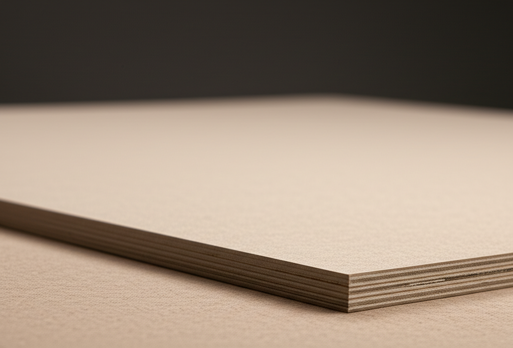

¡Bienvenido al emocionante mundo del mecanizado CNC!  Si estás leyendo esto, probablemente estés listo para dar el salto y realizar tu primer corte en madera MDF.  No te preocupes si te sientes intimidado,  es más fácil de lo que piensas.  Este tutorial paso a paso te guiará a través del proceso, desde la preparación hasta el corte final, asegurándote de que tengas una experiencia exitosa y divertida.  ¡Prepárate para convertir tus diseños digitales en realidad!

## Preparando el terreno: El diseño y el material

Antes de encender la máquina, es crucial tener un diseño bien definido y el material adecuado.  Para tu primer proyecto, te recomiendo empezar con un diseño simple, como un cuadrado o un círculo.  Esto te permitirá familiarizarte con el proceso sin la complejidad de diseños intrincados.  Puedes usar software de diseño CAD como Fusion 360 (con una versión gratuita para principiantes) o Inkscape (gratuito y de código abierto) para crear tu diseño.  Asegúrate de guardar tu diseño en un formato compatible con tu software CAM (Computer-Aided Manufacturing), como .dxf o .svg.

En cuanto al material, el MDF (Medium Density Fiberboard) es una excelente opción para principiantes. Es relativamente económico, fácil de trabajar y ofrece un acabado liso.  **Recuerda elegir un espesor de MDF apropiado para tu diseño.** Un MDF demasiado delgado podría romperse durante el corte, mientras que uno demasiado grueso podría sobrecargar tu máquina.  Para empezar, un MDF de 6mm o 9mm es ideal.  Inspecciona cuidadosamente tu placa de MDF antes de comenzar, buscando imperfecciones o nudos que puedan afectar el corte.

## Del diseño digital al código G: El software CAM

Ahora que tienes tu diseño y tu material, necesitas traducir tu diseño digital en instrucciones que la máquina CNC pueda entender: el código G.  Para esto, necesitarás un software CAM.  Existen muchas opciones disponibles, algunas gratuitas y otras de pago.  **Investiga y elige una opción que se adapte a tu nivel de experiencia y presupuesto.**

El proceso en el software CAM generalmente implica:

* **Importar el diseño:** Carga el archivo .dxf o .svg que creaste en tu software CAD.
* **Seleccionar la herramienta:** Especifica el tipo de herramienta (p.ej., fresa de extremo de 6mm) y sus características (diámetro, longitud, etc.).
* **Configurar los parámetros de corte:**  Esto es crucial.  Ajusta la velocidad de avance, la profundidad de pasada y el número de pasadas.  **Comienza con valores conservadores para evitar daños en la herramienta o el material.**  Tu software CAM probablemente tenga opciones para simular el corte, lo que te permite verificar si la configuración es adecuada antes de ejecutarla en la máquina.
* **Generar el código G:** Una vez que estés satisfecho con la configuración, genera el código G.  Este código contendrá todas las instrucciones que la máquina necesita para realizar el corte.

## Preparando la máquina CNC: El momento de la verdad

Con el código G listo, es hora de preparar la máquina.  **Asegúrate de que la máquina esté correctamente nivelada y que la herramienta esté firmemente sujeta.**  Realiza una prueba de punto cero (homing) para asegurar que la máquina se encuentra en la posición correcta.  Sujeta la placa de MDF firmemente a la mesa de la máquina CNC, utilizando abrazaderas o cinta de doble cara de alta resistencia.  **La sujeción adecuada es esencial para evitar vibraciones y cortes imprecisos.**

## Ejecutando el código G y el corte

Con todo en su lugar, puedes cargar el código G en tu máquina CNC.  **Observa atentamente el proceso de corte**.  Escucha cualquier sonido inusual o vibración excesiva.  Si algo parece fuera de lo común, detiene la máquina inmediatamente.

Después del corte, retira cuidadosamente la pieza de MDF de la máquina.  Inspecciona el resultado y disfruta de tu primer corte CNC en MDF. ¡Felicidades!

## Limpieza y mantenimiento

Una vez finalizado el trabajo, limpia la máquina y la herramienta.  **El mantenimiento regular es clave para la longevidad de tu máquina.**  Consulta el manual de tu máquina para obtener instrucciones específicas de limpieza y mantenimiento.

Recuerda que la práctica hace al maestro.  No te desanimes si tu primer corte no es perfecto.  Con cada proyecto, ganarás experiencia y confianza.  ¡Sigue experimentando y disfrutando del apasionante mundo del mecanizado CNC!