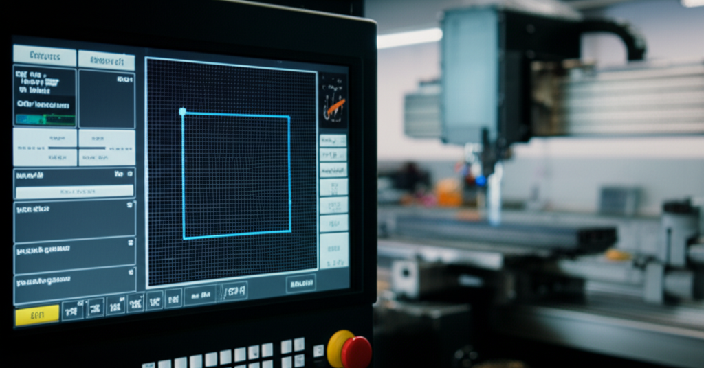

¡Hola, futuro experto en CNC! Si alguna vez has visto una pantalla llena de códigos como `G01`, `X50`, `Y20` y has pensado que parece un idioma alienígena, ¡estás en el lugar correcto! Muchos principiantes se sienten abrumados al principio, pensando que necesitan ser genios de la programación para darle órdenes a una máquina CNC. Nada más lejos de la realidad. Hoy vamos a desmitificar juntos este proceso. En este tutorial, te llevaré de la mano para que escribas **tu primer programa en Código G: cómo escribir un cuadrado simple desde cero**. Te prometo que al final de este artículo, no solo entenderás qué significa cada línea de código, sino que te sentirás con la confianza suficiente para empezar a experimentar por tu cuenta. ¡Vamos a ello!

## Antes de Empezar: Los Conceptos Clave que Necesitas

Antes de lanzarnos a escribir código, necesitamos entender tres ideas muy sencillas. Piensa en esto como aprender a leer un mapa antes de empezar un viaje.

### ¿Qué es el Código G?

Imagina que el **Código G** es simplemente una lista de instrucciones, como una receta de cocina para tu máquina CNC. Cada línea le dice a la máquina exactamente qué hacer: "muévete aquí", "corta en línea recta", "sube la herramienta", "baja la herramienta". Las letras como `G` y `M` son **comandos**, y los números que las acompañan (como `X`, `Y`, `Z`) son las **coordenadas** o parámetros que le dicen *dónde* o *cómo* hacerlo.

### El Plano Cartesiano (Ejes X e Y): Tu Mapa

¿Recuerdas las clases de matemáticas del colegio? ¡Aquí es donde son útiles! Tu área de trabajo en la CNC es un **plano cartesiano**.
*   **Eje X:** Es el movimiento de izquierda a derecha.
*   **Eje Y:** Es el movimiento de adelante hacia atrás.
*   **Origen (0,0):** Es tu punto de partida, generalmente la esquina inferior izquierda de tu material.

Cada punto en tu área de trabajo tiene una "dirección" única, como `X10 Y20`.

### Coordenadas Absolutas (G90)

Para este tutorial usaremos **coordenadas absolutas**, que se activan con el comando `G90`. Esto es lo más fácil para empezar. Significa que cada coordenada que escribas (`X50 Y50`, por ejemplo) es la **dirección final** a la que quieres que vaya la herramienta, medida siempre desde el punto de origen (0,0). Es como usar un GPS: siempre le das la dirección de destino, no las instrucciones de "gira a la derecha en 200 metros".

## Preparando el Terreno: Comandos Iniciales Esenciales

Todo buen programa de Código G empieza con un pequeño bloque de configuración. Este bloque le da a la máquina las reglas básicas del juego antes de empezar a moverse.

Aquí tienes los comandos básicos que usaremos:
*   `%`: Este símbolo suele indicar el inicio y el final de un programa.
*   `G21`: Le dice a la máquina que todas las unidades que vamos a usar son **milímetros**.
*   `G90`: Activa el modo de **coordenadas absolutas** que acabamos de ver.
*   `F`: Significa "Feedrate" o **velocidad de avance**. Define qué tan rápido se moverá la herramienta cuando está cortando. Por ejemplo, `F200` significa moverse a 200 milímetros por minuto.

Nuestro bloque de inicio se vería así:
gcode
%
G21 G90

¡Sencillo! Ya le hemos dicho a la máquina que vamos a hablarle en milímetros y con direcciones absolutas.

## ¡Manos a la Obra! Tu Primer Programa en Código G para un Cuadrado

Ahora sí, vamos a la parte divertida: escribir el código para dibujar un cuadrado de 50mm x 50mm. Nuestro punto de partida (la esquina inferior izquierda del cuadrado) será el origen `X0 Y0`.

Aquí está el código completo. No te asustes, ahora lo explicaremos línea por línea.

gcode
%
G21 G90          ; Usar milímetros y coordenadas absolutas

G00 Z5           ; 1. Levantar la herramienta a una altura segura
G00 X0 Y0        ; 2. Moverse rápido al punto de inicio (esquina inferior izquierda)

G01 Z-1 F100     ; 3. Bajar la herramienta para empezar a cortar
G01 X50 Y0 F200  ; 4. Cortar la primera línea hacia la derecha
G01 X50 Y50      ; 5. Cortar la segunda línea hacia arriba
G01 X0 Y50       ; 6. Cortar la tercera línea hacia la izquierda
G01 X0 Y0        ; 7. Cortar la última línea para cerrar el cuadrado

G00 Z5           ; 8. Levantar la herramienta de nuevo
M30              ; 9. Fin del programa
%

### Explicación Paso a Paso

*   **Paso 1: `G00 Z5;`**
    *   `G00` es un comando de **movimiento rápido**. Se usa para moverse por el aire, sin cortar.
    *   `Z5` le dice que suba la herramienta a 5mm por encima del material (eje Z es la altura). Esto es por seguridad, para no arañar el material al movernos.

*   **Paso 2: `G00 X0 Y0;`**
    *   Todavía en movimiento rápido, nos posicionamos en la coordenada `X0 Y0`, que será la primera esquina de nuestro cuadrado.

*   **Paso 3: `G01 Z-1 F100;`**
    *   `G01` es el comando de **movimiento de corte lineal**. ¡Aquí empieza la acción!
    *   `Z-1` le dice que baje la herramienta 1mm dentro del material.
    *   `F100` establece una velocidad de bajada de 100mm/minuto.

*   **Paso 4: `G01 X50 Y0 F200;`**
    *   Le ordenamos moverse a la coordenada `X50 Y0`. Como ya estábamos en `X0 Y0`, la máquina se moverá en línea recta hacia la derecha, creando el lado inferior del cuadrado.
    *   `F200` establece la velocidad de corte para este y los siguientes movimientos.

*   **Paso 5: `G01 X50 Y50;`**
    *   Ahora nos movemos al punto `X50 Y50`. La coordenada X no cambia, solo la Y. Esto dibuja la línea vertical derecha.

*   **Paso 6: `G01 X0 Y50;`**
    *   Nos movemos a `X0 Y50`, dibujando el lado superior del cuadrado.

*   **Paso 7: `G01 X0 Y0;`**
    *   Volvemos al punto de partida, `X0 Y0`, cerrando nuestro cuadrado.

*   **Paso 8: `G00 Z5;`**
    *   Misión cumplida. Usamos `G00` otra vez para levantar la herramienta rápidamente y salir del material.

*   **Paso 9: `M30;`**
    *   Este comando `M` le dice a la máquina: "Hemos terminado". Finaliza el programa y, en muchas máquinas, rebobina el código al principio.

¡Y ya está! Has escrito tu primer programa funcional en Código G.

## Conclusión

¡Felicidades! Acabas de dar un paso de gigante. Hoy has aprendido que el Código G no es un lenguaje críptico, sino una serie de instrucciones lógicas. Hemos visto cómo establecer las unidades y el sistema de coordenadas, la diferencia crucial entre un movimiento rápido (`G00`) y un movimiento de corte (`G01`), y cómo trazar una forma simple como un cuadrado línea por línea. Este conocimiento es la base de todo lo que harás en el mundo CNC. No te detengas aquí, la práctica es la clave para ganar confianza y fluidez.

¿Cuál ha sido tu mayor desafío hasta ahora? ¿Te ha quedado alguna duda? ¡Comparte tu experiencia en los comentarios!

## Preguntas Frecuentes

**¿Qué pasa si me equivoco en una coordenada?**
No te preocupes, es un error muy común. Si, por ejemplo, en lugar de `G01 X50 Y50` escribes `G01 X50 Y60`, simplemente el cuadrado saldrá deformado (será un rectángulo). Por eso es muy útil usar un simulador de Código G antes de ejecutarlo en una máquina real para visualizar el resultado y corregir errores.

**¿Por qué movemos la herramienta hacia arriba (Z5) al principio y al final?**
Esto se conoce como "movimiento a una altura de seguridad". Lo hacemos para evitar que la herramienta choque o arañe la superficie del material o las abrazaderas que lo sujetan mientras se mueve rápidamente de un punto a otro sin cortar. Es una práctica de seguridad fundamental.

**¿Necesito poner siempre el punto y coma (;) al final de cada línea?**
El punto y coma se usa para marcar el final de un bloque de código y, a veces, para añadir comentarios que la máquina ignorará. En muchos controladores CNC modernos no es estrictamente obligatorio, pero es una muy buena práctica que hace tu código más legible y compatible entre diferentes máquinas.
Este artículo es parte de nuestra guía principal: **[¿Qué es el Código G? La Guía Definitiva para Entender el Lenguaje de tu CNC](../que-es-el-codigo-g-la-guia-definitiva-para-entender-el-lenguaje-de-tu-cnc/)**.

## También Te Podría Interesar

Explora otros temas en nuestro blog:
- **Descubre todo sobre [Torno](/tags/torno/)**
- **Descubre todo sobre [Proyectos CNC](/tags/proyectos-cnc/)**
