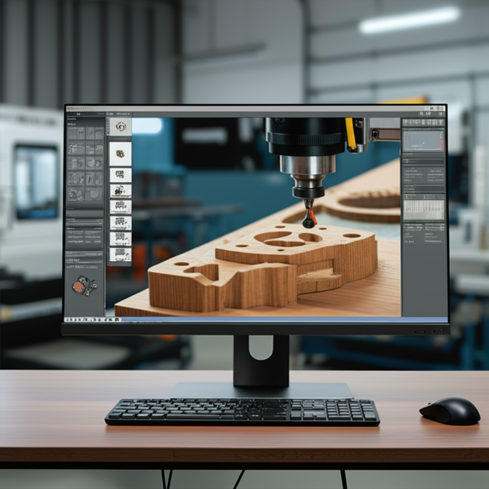

# Tutorial: Cómo configurar tu software CNC por primera vez

**Misión:**  Este tutorial te guiará a través del proceso de configuración inicial de tu software CNC, preparando tu máquina para su primer uso.  Al final de este tutorial, serás capaz de conectar tu software a tu máquina CNC y ejecutar un programa de prueba simple.

**Materiales:**

*   Computadora con sistema operativo compatible (Windows, MacOS o Linux, dependiendo de tu software CNC).
*   Software CNC instalado (asegúrate de tener la versión correcta para tu máquina).  Este tutorial asume que ya has instalado el software. Si no, consulta la documentación específica del software.
*   Máquina CNC conectada a la computadora (vía USB, Ethernet o puerto paralelo, según el modelo).
*   Cable de conexión adecuado para tu máquina CNC y computadora.
*   Manual de usuario de tu máquina CNC y software.
*   Un archivo G-code de prueba (descarga uno simple en línea para principiantes, busca "G-code simple prueba").

**Seguridad:**

*   **Siempre** desconecta la máquina CNC de la corriente eléctrica antes de realizar cualquier conexión física.
*   Nunca toques las partes móviles de la máquina CNC mientras está encendida.
*   Utiliza gafas de seguridad y protección auditiva.
*   Asegúrate de que el área de trabajo esté limpia y libre de obstrucciones.
*   Familiarízate con las funciones de emergencia de tu máquina CNC.
*   Si no estás seguro de algún paso, consulta el manual de usuario o busca ayuda de un experto.

**Pasos:**

1. **Conexión Física:** Conecta tu máquina CNC a la computadora usando el cable apropiado. Asegúrate de que la conexión esté firme.

2. **Enciende la Máquina CNC:** Enciende tu máquina CNC y tu computadora.  Espera a que ambas estén completamente encendidas y listas.

3. **Abre el Software CNC:** Abre el software CNC que has instalado en tu computadora.

4. **Configuración del Puerto:**  En el software CNC, deberás configurar el puerto de comunicación correcto para tu máquina.  Esto generalmente se encuentra en las opciones de "Configuración", "Ajustes" o "Preferencias".  El puerto dependerá de cómo esté conectada tu máquina (USB, Ethernet, etc.). Busca en el manual de tu máquina o software la información para seleccionar el puerto correcto.

5. **Configuración de la Máquina:**  Configura los parámetros de tu máquina CNC en el software. Esto incluye información crucial como:
    *   **Tipo de Máquina:** (Router, láser, etc.)
    *   **Unidades:** (mm o pulgadas)
    *   **Pasos por unidad:** (Este valor es específico de tu máquina y se encuentra en su documentación)
    *   **Límites de viaje:**  Define los límites de movimiento de cada eje para evitar colisiones.

6. **Prueba de Conexión:** Envía una pequeña prueba (G-code) a la máquina para verificar la conexión. Un simple movimiento en un eje es suficiente. Si la máquina responde correctamente, continúa al paso 7. De lo contrario, verifica tu configuración y conexiones.

7. **Carga el Archivo G-code:** Carga el archivo G-code de prueba que has descargado anteriormente.

8. **Simulación (Opcional):**  Algunos software CNC permiten la simulación del programa G-code antes de ejecutarlo en la máquina real. Esto es recomendable para evitar errores y daños.

9. **Ejecución:** Si estás seguro de la configuración, ejecuta el programa G-code. Observa atentamente el proceso.

10. **Verificación:** Después de la ejecución del programa, verifica que el resultado sea el esperado. Si todo funciona correctamente, ¡felicidades! Has configurado tu software CNC con éxito.

**Consejos:**

*   Lee atentamente el manual de usuario de tu máquina y software CNC.
*   Comienza con programas G-code simples para probar la configuración.
*   Realiza siempre una simulación antes de ejecutar un programa en la máquina real (si tu software lo permite).
*   No dudes en buscar ayuda en línea o en foros de CNC si tienes problemas.

**Conclusión:**

Configurar tu software CNC por primera vez puede parecer desalentador, pero siguiendo estos pasos y tomándote tu tiempo, podrás dominar este proceso y empezar a disfrutar de las capacidades de tu máquina. Recuerda siempre priorizar la seguridad y consultar los manuales correspondientes. ¡Felicitaciones por dar tu primer paso en el mundo del CNC!