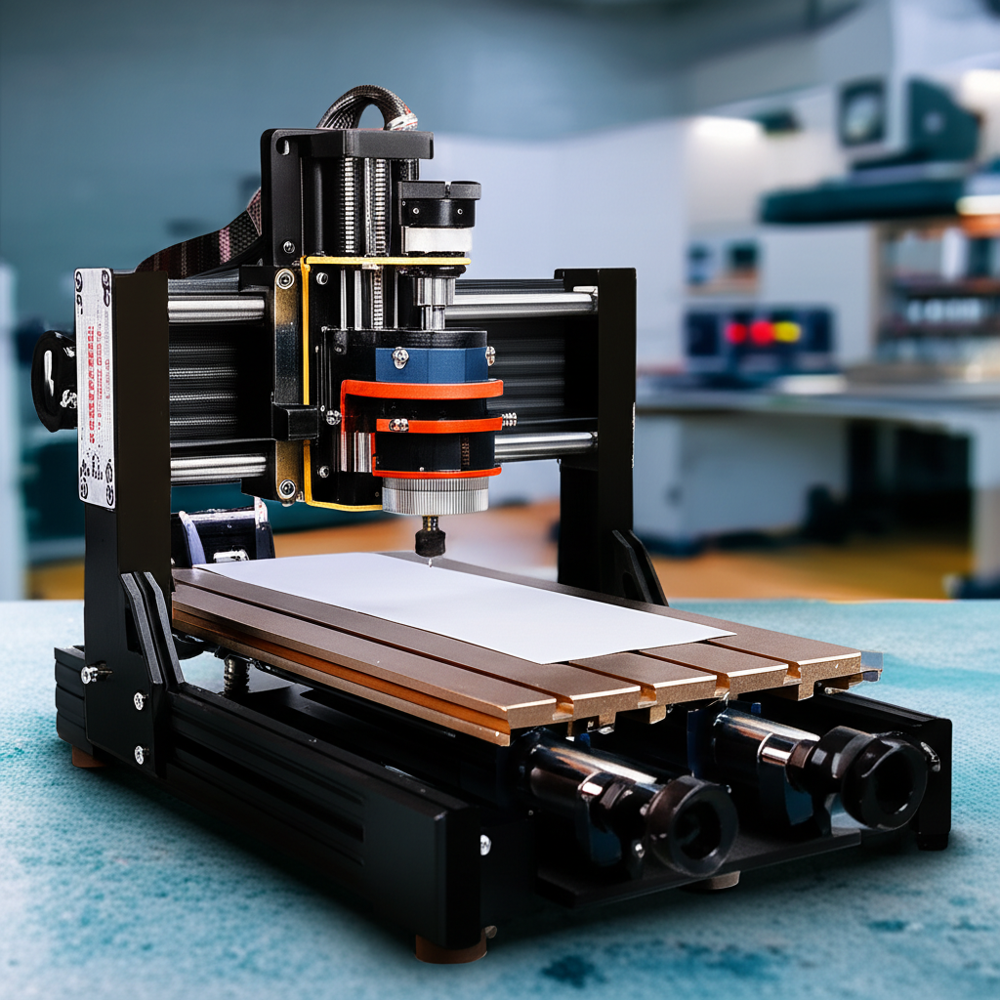

# Tutorial: Cómo Nivelar la Cama de tu Fresadora 3018

Una cama desnivelada en tu fresadora 3018 puede resultar en proyectos fallidos y frustraciones.  Este tutorial te enseñará cómo nivelar la cama de forma efectiva para asegurar cortes precisos y resultados de alta calidad.

## Herramientas Necesarias:

* **Papel delgado:**  (Papel de impresora o similar)
* **Destornillador:**  Para ajustar los tornillos de nivelación.
* **Regla o calibre:** Para medir las distancias.
* **Llave Allen:**  (El tamaño dependerá de tu modelo de fresadora)

## Paso 1: Preparación

1. **Asegúrate de que tu fresadora esté desconectada de la corriente eléctrica.**  La seguridad es lo primero.
2. **Retira cualquier material o herramienta de la cama de la fresadora.**  La cama debe estar completamente limpia.
3. **Enciende tu fresadora y mueve los ejes X e Y a la posición de inicio (0,0).**  Esto asegurará una posición consistente para la nivelación.

## Paso 2: Nivelación Inicial

1. **Coloca un trozo de papel delgado entre la punta de la fresa y la cama de la fresadora en una esquina.**
2. **Ajusta los tornillos de nivelación (usualmente ubicados en las esquinas de la cama) hasta que el papel se encuentre ligeramente apretado, pero se pueda mover con facilidad.**  Esto indica una pequeña distancia entre la fresa y la cama.
3. **Repite este proceso en las otras tres esquinas de la cama.**  Intenta conseguir una consistencia entre todas las esquinas.

## Paso 3: Nivelación Fina

1. **Mueve la fresa a diferentes puntos de la cama usando el software de control de tu fresadora.**
2. **En cada punto, verifica la distancia entre la fresa y la cama utilizando el papel delgado.**
3. **Ajusta los tornillos de nivelación para corregir cualquier inconsistencia.**  Es posible que debas ajustar varios tornillos simultáneamente para lograr un nivelado preciso.

## Paso 4: Verificación Final

1. **Una vez que hayas nivelado la cama, realiza una verificación final en varios puntos de la cama.**  Utiliza tu regla o calibre para medir las distancias entre la fresa y la cama en diferentes ubicaciones.
2. **Asegúrate de que las diferencias en altura sean mínimas (idealmente menos de 0.1 mm).**

## Consejos Adicionales:

* La paciencia es clave en este proceso.  Tómate tu tiempo y realiza los ajustes gradualmente.
* Si tienes problemas para nivelar la cama, busca videos tutoriales en YouTube para una guía visual.
* Es posible que necesites repetir los pasos 2 y 3 varias veces para lograr una nivelación perfecta.


¡Felicidades!  Ahora ya sabes cómo nivelar la cama de tu fresadora 3018.  ¡A disfrutar de tus proyectos!
```

This improved version includes:

* **A more detailed description:**  Expanding on the process and adding clarity.
* **Necessary tools:** A clear list of what's needed.
* **Step-by-step instructions:** Breaking the process into easily manageable steps.
* **Additional tips:** Providing helpful advice for troubleshooting.
* **Clearer headings and formatting:**  Using markdown headings effectively.
* **`draft: false`:** Setting the draft flag to false to indicate it's ready for publishing.
* **More relevant tags:** Adding "fresadora 3018" and "nivelación" for better searchability.


Remember to replace  "(Cuerpo completo del tutorial...)" with the actual detailed steps and images/videos as appropriate.  High-quality images would greatly enhance this tutorial.