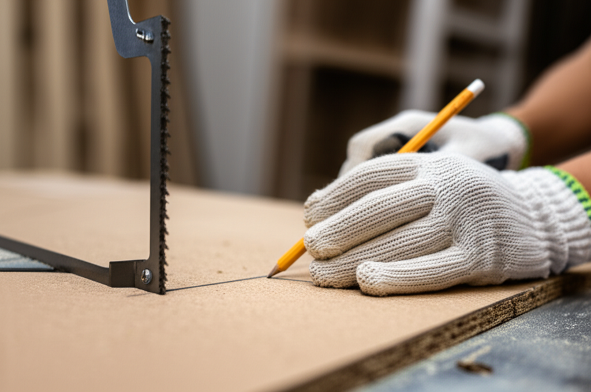

# Tutorial: Tu primer corte en madera MDF paso a paso

**Misión:**  Realizar un corte limpio y preciso en una pieza de madera MDF utilizando herramientas y técnicas básicas.

**Materiales:**

* Una pieza de madera MDF (recomendable un tamaño pequeño para empezar, como 20x20cm)
* Sierra de mano para madera (o sierra circular, si se cuenta con experiencia y seguridad en su manejo)
* Lápiz
* Regla o escuadra de metal
* Guantes de trabajo
* Gafas de seguridad
* Aspiradora o cepillo para la limpieza
* Cinta métrica (opcional, para medidas más precisas)
* Escuadra de carpintero (opcional, para cortes angulares)
* Pinza para sujetar la madera (opcional, para cortes con sierra de mano)

**Seguridad:**

* **Siempre utiliza gafas de seguridad:** El MDF puede producir polvo fino y astillas que pueden lesionar los ojos.
* **Usa guantes de trabajo:** Protege tus manos de astillas y cortes.
* **Mantén el área de trabajo limpia y organizada:** Evita tropiezos y accidentes.
* **Asegúrate de que la sierra esté afilada:** Una sierra desafilada requiere mayor fuerza y aumenta el riesgo de cortes erróneos y lesiones.
* **Sujeta la madera firmemente:** Evita movimientos inesperados durante el corte. Utiliza una pinza si es necesario.
* **Nunca cortes hacia ti:** Siempre realiza el corte alejándote de tu cuerpo.
* **Desconecta la herramienta eléctrica (si se utiliza una) antes de realizar cualquier ajuste o limpieza.**
* **Respira con cuidado:** El polvo de MDF puede ser irritante para algunas personas. Trabaja en un espacio bien ventilado o utiliza mascarilla.

**Pasos:**

1. **Planificación:** Dibuja la línea de corte en la pieza de MDF utilizando un lápiz y una regla o escuadra. Asegúrate de que la línea sea recta y precisa.  Si necesitas un corte angular, utiliza una escuadra de carpintero.
2. **Sujeción:** Si utilizas una sierra de mano, sujeta la madera firmemente con una pinza o sobre una superficie estable. Si utilizas una sierra circular, asegúrate de que la madera esté bien apoyada y estable.
3. **Corte:** Coloca la sierra sobre la línea de corte y comienza a cortar lentamente y con movimientos controlados.  Mantén la sierra en ángulo recto con la superficie del MDF (o en el ángulo deseado si estás haciendo un corte biselado).  Si usas una sierra de mano, realiza cortes cortos y uniformes. Con una sierra circular, realiza un corte suave y continuo.
4. **Limpieza:** Una vez realizado el corte, limpia la zona de trabajo retirando el polvo y las astillas con una aspiradora o un cepillo.

**Consejos:**

* Para un corte más preciso, utiliza una guía de corte.
* Si es tu primer corte, practica en un trozo de madera de desecho antes de cortar la pieza final.
* Si utilizas una sierra circular, asegúrate de tener la velocidad adecuada para el tipo de madera y el grosor de la pieza.
* Si el corte es irregular, puedes lijarlo suavemente para obtener un acabado más limpio.

**Conclusión:**

¡Felicidades! Has completado tu primer corte en madera MDF.  Recuerda que la práctica hace al maestro, así que continúa practicando para mejorar tu técnica y precisión.  No tengas miedo de experimentar y probar diferentes técnicas.  Con la práctica y la seguridad como prioridad, podrás realizar cortes precisos y limpios en madera MDF con confianza.

**(Para que puedas ver el proceso en acción, aquí tienes un vídeo que complementa perfectamente esta guía. ¡Verlo te ayudará a aclarar cualquier duda!

## Apoyo Visual: Ver el Tutorial en YouTube



**(Conclusión final):**  Recuerda siempre priorizar tu seguridad al trabajar con herramientas y materiales.  Este tutorial es un punto de partida,  busca información adicional y practica para perfeccionar tu técnica. ¡Buen trabajo!
